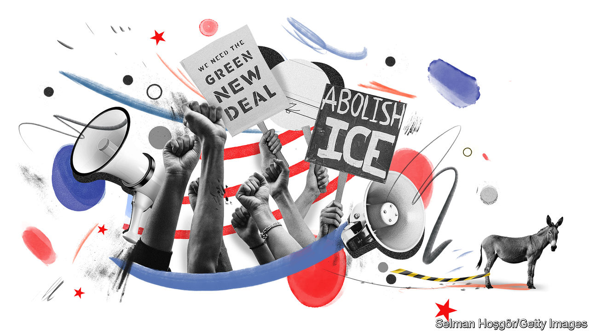
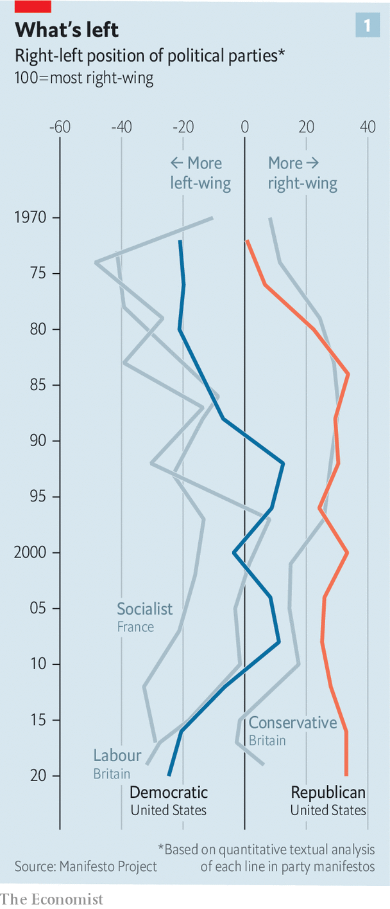
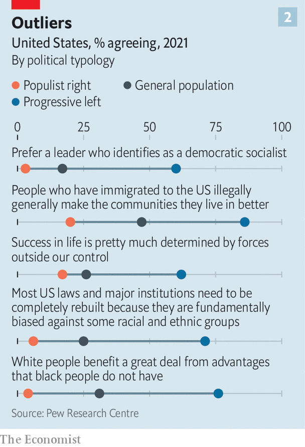
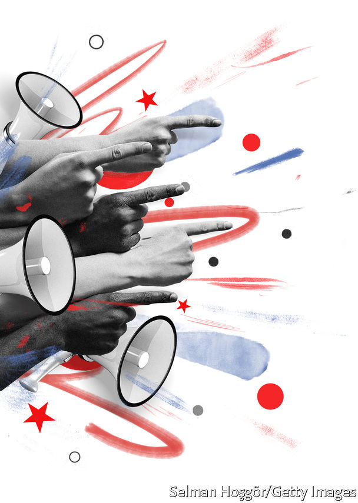
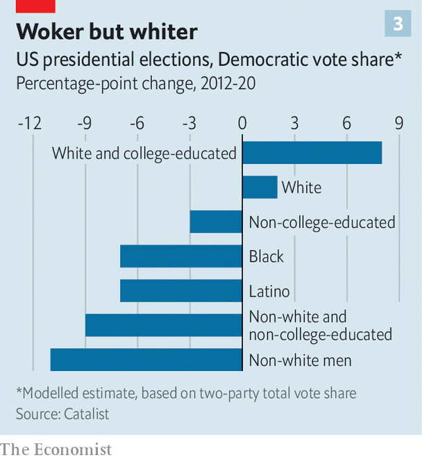

###### Peak progressive

# Democrats in America are realising they must moderate or die 

##### The prospect of defeat in the mid-terms and beyond is moving many away from their most radical ideas 

 

> Jul 14th 2022 

Perhaps no place has been a haven for counter-culture quite like San Francisco. The Bay Area has hosted psychedelic enthusiasts, beat writers and gay-rights activists. Now another variety of counter-culture may have sprung up in the city. Unexpectedly for the epicentre of leftism in America, however, it is one of mass discontent with progressive excesses.

In February, San Franciscans took the remarkable step of recalling three members of the local board of education who resembled a caricature of wokeness. Despite keeping schools closed for an exceptionally long period, thus harming the least-advantaged children, the board found time to recommend renaming 44 closed schools—including those named after Abraham Lincoln and George Washington—on social-justice grounds. Then on June 7th, Chesa Boudin, the progressive district attorney of San Francisco, lost his own recall election. Mr Boudin’s compassion for the incarcerated and calls for less punitive punishment were not too radical for the city three years ago. By 2022 that had changed, amid a nationwide rise in homicides and local disaffection over petty crime, open-air drug taking and homelessness.

London Breed, the city’s moderate-leaning mayor, has begun forcefully arguing for more police—not fewer, as was once voguish in progressive circles. “The reign of criminals who are destroying our city, it is time for it to come to an end,” she said in December. “And it comes to an end when we take the steps to be more aggressive with law enforcement…and less tolerant of all the bullshit that has destroyed our city.”

Look elsewhere in America, and a similar backlash is emerging. On matters like crime, immigration and schooling, voters—even in left-leaning cities—are eschewing progressive slogans and policies that came to prominence in the fervid summer of 2020 when George Floyd was murdered, covid-19 was raging and Democrats were dreaming of a Rooseveltian transformation of America. 

These are all signs that Democrats are passing peak progressive. The calls are not just coming from within cities, but from working-class and non-white voters—the ostensible beneficiaries of progressive policies. Many expanded redistribution programmes are popular. But the ambitions of the Biden administration have been deflated by the realities of governance. A premature learned helplessness seems to have already cast a pall over its congressional leaders. The reality is setting in that the party faces serious losses in the mid-term elections which will cripple the chance for meaningful legislation.

Amazingly, it will probably lose to a party that still embraces Donald Trump despite his attempt to subvert democracy, as the ongoing hearings from the January 6th congressional committee have forensically detailed. The Republican Party has articulated no political agenda other than grievance. That means that the Republican message is relatively simple to express: that Democrats are economically incompetent socialists who are trying to open borders, demonise police, indoctrinate children and ruin America. That message will probably win in 2022. It could even carry Mr Trump back into the White House in 2024. Suddenly the clamours for a course correction start to make sense.

Slam it to the left

The drift of the Democratic Party towards its progressive faction has been apparent for a long time. Joe Biden, whose personal policies have shifted with the party’s political winds for decades, is as good a weathervane as any. The lifelong moderate, who once decried mandatory busing to integrate schools in the 1970s and enthusiastically supported welfare reform and tough-on-crime policies in the 1990s, reversed himself completely and ran well to the left of Barack Obama in 2020. Yet he was still the relative moderate of the primary field. That shift registers on political scientists’ seismographs, too. Data from the Manifesto Project, a corpus of political-party platforms from 50 countries, show that the Democratic Party platform has moved substantially to the left since 2008—shifting from the centre-right to catch up with left-wing parties in Europe like Britain’s Labour and France’s Socialist Party (see chart 1). 

 


“We are winning the battle of ideas, but we are not winning the battle of execution,” says Ro Khanna, a progressive congressman from California who co-chaired Bernie Sanders’s campaign in 2020. He notes that a minimum wage of $15 an hour was once contentious within the party. Now it is uncontroversial. “We passed that out of the House, but it hasn’t passed out of the Senate.” A number of progressive goals on taxation, unionisation and protecting the right to abortion have suffered the same fate, Mr Khanna observes. They were all passed in the House of Representatives, only to die ignominiously in the Senate because of the presence of conservative Democrats and the filibuster, a parliamentary hurdle that currently requires the support of ten Republicans to advance most kinds of legislation. 

For further proof, look only at the scope of Build Back Better—Mr Biden’s signature legislative proposal which would have spent $4trn to mitigate climate change and create new social-welfare programmes partially balanced with higher taxes on the wealthy and corporations. It was the sum total of almost all progressive hopes and dreams. But, after months of negotiations, it came apart after Joe Manchin, a Democratic senator from West Virginia, rejected it. Something much more modest is currently being scraped together from its ashes, which may or may not pass before the mid-term elections.

 


Even getting this far is a remarkable coup for a small faction of the party. Progressives—the highly engaged, highly educated voters with very liberal views on race, immigration and economic policy—make up only 12% of Democrats, according to a dissection of political typology done by the Pew Research Centre. Nearly 70% are white, the least racially diverse of any of the other groups. They are very unlike other Democrats. Fully 60% think favourably of democratic socialists (see chart 2). And consciousness of systemic racism is a powerful organising principle: 76% agree that “white people benefit a great deal from advantages that black people do not have”—the most of any Democratic-leaning group.

Despite their size, the ideas of progressive Democrats have had an outsize influence over the trajectory of policy—and the party’s external perception. There are a few reasons for this. Understandable disaffection with inequality, added to frustration with leaders such as Mr Obama and Hillary Clinton (who were derided as neo-liberals), led young voters to embrace populist figures like Mr Sanders and Elizabeth Warren. Progressives are highly over-represented among the young meritocratic elite who stuff campaign offices, advocacy groups and media outfits. 

Shake it to the right

Since 2018 the celebrity status given to Alexandria Ocasio-Cortez, one of the champions of the movement, and a group of like-minded legislators known as “the Squad” has, for better and worse, raised the profile of their ideas—such as “abolish ice”, “defund the police”, “democratic socialism”, “a Green New Deal”, “Medicare for all”. The ten sitting House members of the Justice Democrats, a progressive supergroup that includes the Squad (a bit like the Avengers), all represent lopsidedly blue districts: in 2020 they went for Mr Biden by a margin of 75% to 24%.

 


Democrats have been here before. In 1989, soon after Republicans had won a third consecutive presidential election, two political scientists, William Galston and Elaine Kamarck, wrote an essay titled “The Politics of Evasion”. Democrats then were dodging their fundamental problems by embracing several delusions, they wrote. The first is the belief that they “have failed because they have strayed from the true and pure faith of their ancestors”. This was “the myth of liberal fundamentalism”. The second is the belief that Democrats need not alter public perceptions of their party but can regain the presidency by getting current non-participants to vote—“the myth of mobilisation”. The third is the belief that there is “nothing fundamentally wrong with the Democratic Party”. 

That hope for an ascendant progressive majority just beyond the next election is resurgent again. So much so that this year Mr Galston and Ms Kamarck released another study called “The New Politics of Evasion”. “We’re all living in fear of what the progressives might do to screw up this moment,” says Ms Kamarck. Their messaging has been disastrous for the party as a whole, she says. “And you know, some of them don’t care. Some of them work on the theory that it is better to lose now, go down fighting and come back? Well, there’s no goddamn comeback.”

It is perhaps no surprise that the backlash would start in cities, where noble ideas must clash with daily reality. “San Franciscans in general are progressive at heart…but once you start implanting these things at a local level, you have to do it correctly,” says Mary Jung, a former chair of the San Francisco Democratic Party who led the recall campaign against Mr Boudin. Ms Jung recalls being alarmed after having lunch with a woman recently released after a light sentence for murdering her father and dismembering his body. Similar stories doomed Mr Boudin’s efforts to keep his job, including one of a man arrested four times without charge before eventually killing two pedestrians while driving a stolen car intoxicated.

The progressive school-board members brushed off the mounting evidence of learning loss among pupils and even tried to rebrand it as “learning change”. “I think the school-closure situation was something that exposed the real lack of values within the progressive movement in San Francisco,” says Siva Raj, who helped run the recall campaign. “There is so much focus on performative bullshit and very little focus on actually delivering outcomes.” 

One of the most influential organisers for the campaign was Kit Lam, a former anti-corruption officer from Hong Kong, whose children suffered from remote learning. Mr Lam found that many Chinese-speaking parents were irate that the board eliminated selective admissions to Lowell High School, the city’s best secondary school, because it allegedly “perpetuates the culture of white supremacy and racial abuse towards Black and Latinx students”. Mr Lam asks, “What is it now? Merit is racist? Doing mathematics is racist?” 

Those grassroots concerns ultimately could not be papered over with appeals to equity or other progressive values. “They were trying to make people believe that what they were seeing with their own eyes wasn’t real. And that’s just no way to govern in a democracy. It’s gaslighting,” says Rafael Mandelman, a member of the San Francisco board of supervisors. 

Parallels can be seen in other places, too. One year after Floyd’s murder, voters in Minneapolis defeated a referendum to eliminate the police department and replace it with a new department of public safety. City councillors in Austin, Texas, cut the police budget by one-third in 2020, then scrambled to add funding later as homicides spiked. In New York City, voters passed over many progressive champions to elect Eric Adams, a showboating former police captain, as their next mayor. Liberal-leaning suburbanites helped Mr Biden win the state of Virginia by ten points in 2020. Just one year later, fears that schools were being overrun by progressive indoctrination led them to elect Glenn Youngkin, a Republican, as governor. 

Erstwhile progressive icons are talking differently. Stacey Abrams is running again to be governor of Georgia on a platform of raising salaries for law-enforcement officers. In his bid to be governor of Texas, Beto O’Rourke, who during his presidential run in 2020 pitched a plan to spend $5trn fighting climate change, is now endorsing oil and gas production in the state, saying critical race theory should not be taught in schools and criticising Mr Biden’s border policy. Others also seem to grasp that the path in a difficult election year is to moderate or to die. The president himself has shifted, the weathervane twisting with the winds, by making more frequent pronouncements that police should be funded, borders should be secured and that energy production should be boosted to reduce petrol prices.

 


That may not be enough to quell the damage. In theory, a muscular progressive agenda of bigger social-welfare benefits and public-jobs programmes should be winning over the working class. Instead they have been defecting to the Republicans for nearly a decade. While this erosion has been widely noticed among whites without college degrees, the same trend is wreaking havoc among Hispanic and black voters, many of them socially conservative. Rather than the Democratic Party wooing economically marginalised people of colour and marshalling them to lead the progressive revolution, the proletariat is being lost (see chart 3).

Spice up your life

The warning signs are flashing brightest for Hispanic voters, who were supposed to be the key to the permanent Democratic majority of the future. Between 2016 and 2020, Mr Trump improved his margins among Hispanic voters by a remarkable eight points, the largest shift among any major ethnic group. A hardline immigration policy and the campaign to build a wall hardly deterred Hispanic voters in border states like Texas and Florida, which swung even more strongly Republican. 

It is a troubling sign that—even when polled after Trump supporters had stormed the Capitol on January 6th 2020—more Hispanic voters say that they are more concerned with Democrats embracing socialism and leftist policies than they are with Republicans embracing fascist, anti-democratic policies.

The progressive rejoinder is that they are on the very cusp of achieving their aims. Although they have quietly left behind many of their culture-war maxims—to the point that none of the new candidates endorsed by the Justice Democrats even mention defunding the police on their campaign websites—they think their economic prescriptions are durable. “The narrative has shifted about what people deserve in America. And I think 99.9% of Democrats are with us. There’s one Democrat in the Senate that wasn’t with us,” says Pramila Jayapal, a congresswoman who chairs the influential Congressional Progressive Caucus, referring to Mr Manchin. She, like many, still sees the alienation as a result of economics, not culture. Embracing free trade was, she says, “the beginning of…the losing of the working class.” She thinks they can be won back. “I just think we have to really push forward with some of these populist policies.” 

With just one or two more Democrats in the Senate, progressives hope to blast away the filibuster and then enact other permanent structural reforms. “The return to normalcy and institutionalism of the current structure will not produce bold, progressive outcomes,” argues Mr Khanna, the progressive congressman from California. “The reason is that there are some anti-democratic structures within our political system: the filibuster, gerrymandering and massive amounts of money allowed into the political process.”

Ever since Mr Obama assembled his multiracial coalition in 2008 and won overwhelming congressional majorities, Democrats have been trying to build it back. It did not work out that way in 2016, and it does not appear to have worked in 2020, either. The theory that legislative results would speak for themselves has not been borne out—whether for Mr Obama’s Affordable Care Act or for Mr Biden’s passage of a gargantuan stimulus called the American Rescue Plan that may have unhelpfully hastened inflation. 

The possibility of a humiliating loss to a Republican Party that is unrepentantly descending into anti-democratic conspiracy and that lacks a coherent policy agenda weighs heavily on Democrats and anxious international allies. Given the sorry state of Mr Biden’s approval ratings—by some measures, the worst at this point of a first term of any president since the 1950s—and woeful perceptions of the economy, it is unlikely that the tentative steps that Democrats are taking back towards the median voter will be enough to avert the serious electoral losses that they are facing. It is only after a serious drubbing that the descent from peak progressive will gain speed. Better it be in 2022 than in 2024. ■


