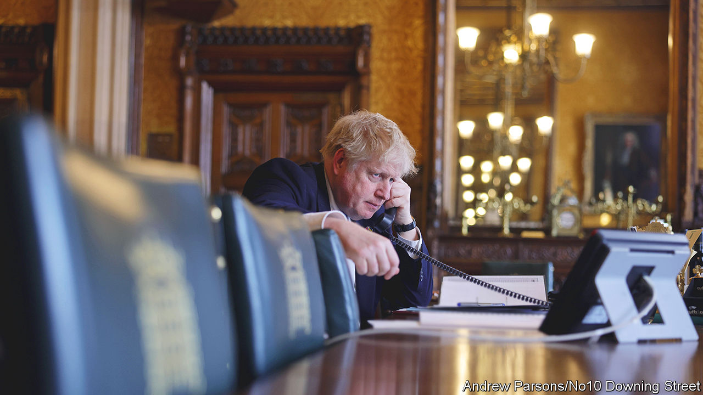

###### The interregnum

# Boris Johnson still has plans for his last weeks in office 

##### They offer him a final chance to shape his legacy 

 

> Jul 14th 2022 

Amid widespread threats of industrial action this summer, it was a strike by his colleagues that forced Boris Johnson from office. By the morning of July 7th some 50 members of his government had quit in just 36 hours. Parliamentary committees found they had no one to question. The Department for Education had no education ministers. In one Whitehall office, a game of cricket was under way.

By the end of the day something resembling order had been restored. Mr Johnson’s promise to step down allowed him to cobble together a caretaker government, which will run the country until a new prime minister takes office in early September. How will he use that time?

Britain’s unwritten constitution imposes few constraints on an outgoing prime minister. Hannah White of the Institute for Government, a think-tank, points to the cabinet manual, which offers guidance on “customary” behaviour for governments that have failed a vote of no confidence or are about to face a general election. But one that has revolted against its leader, yet retains command of Parliament, is bound only by what the political weather allows.

The result is that a defenestrated prime minister can have a startlingly free hand during the interregnum. In 2019 Theresa May, Mr Johnson’s predecessor, raced to sketch out a legacy after three years of Brexit strife. Teachers, doctors and soldiers were given pay rises; an overhaul to mental-health provision was promised. The most consequential move of Mrs May’s premiership—committing Britain to net-zero carbon emissions by 2050—came after she had announced her resignation.

The timing of Mr Johnson’s overthrow, close to the start of Parliament’s summer recess on July 21st, leaves little prospect of passing new laws. The Online Safety Bill, which seeks to regulate the internet, may be put on hold. The Northern Ireland Protocol Bill, which would allow the government to override part of the Brexit withdrawal treaty, will be debated, but there is no time for it to pass during his tenure.

Instead, Mr Johnson’s focus will be on promoting the projects he wants to be remembered for. Expect a final attempt to heave some benefits of Brexit—like reform of insurance regulation to free up capital for investment—into view. He will also seek to remind his successors of his mission to “level up” the deprived parts of Britain. On this, he is unafraid of being seen as a back-seat driver, say allies. Above all, Mr Johnson will try to ensure that Britain’s support for Ukraine endures. At a cabinet meeting on July 12th he warned that the international coalition backing Ukraine was “at risk of fraying”, urging “colleagues around this table [to] remain robust”. 

Beyond that, Mr Johnson is likely to be inundated with opportunities to give speeches on the war. And at 58, he will have time to ponder the rest of his career. A planned biography of Shakespeare was put on hold when he entered office. One ally says a return to writing the  column that made his name is unlikely. “I would be nervous if I was the Master of Balliol though,” he quips. ■

