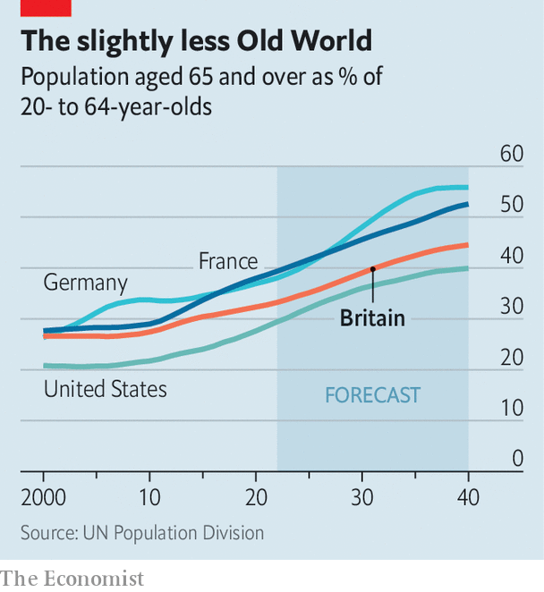
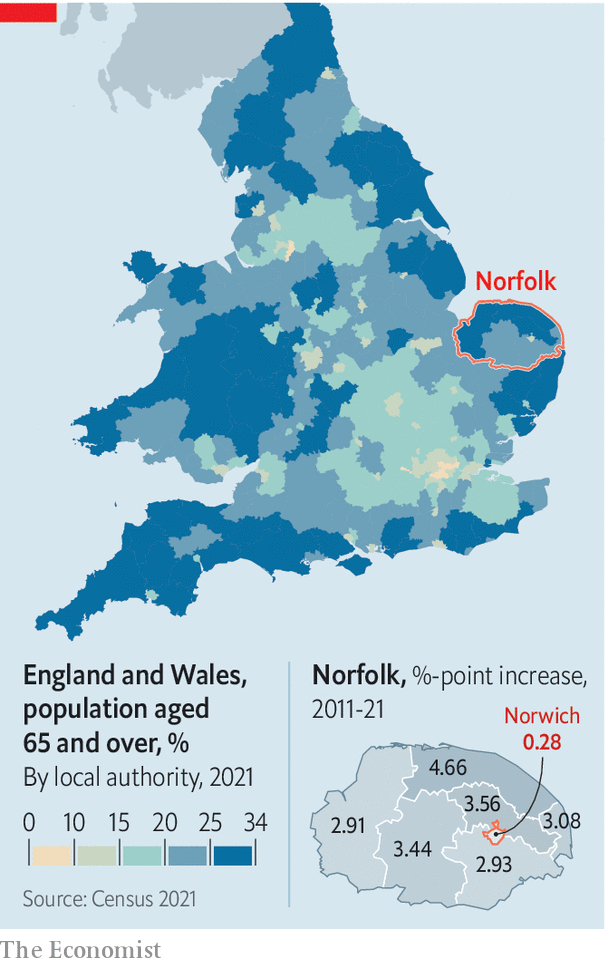

###### Demographic change

# Britain is ageing slower than other countries, and in a good way 

##### Crucially, cities are forever young 

 

> Jul 14th 2022 

Demography moves slowly, but it has a scary inexorability. The first release of data from the 2021 census of England and Wales has caused alarm by showing a rise in the number of old people and a fall in the number of very young children. Paul Morland, author of “The Human Tide”, warned in the  newspaper that Britain is entering a “population winter”. He even suggested that the state should encourage procreation by taxing childless people. 

England and Wales are indeed ageing. Just over half of the overall population increase of 3.5m between 2011 and 2021 was driven by growth in the number of people aged 65 or over. But demography is less of a drag on Britain’s prospects than the doomsayers suppose, at least for now. The country is not enduring a population winter but enjoying a balmy population autumn. 

 


Britain is not ageing as quickly as other rich countries. Nor will it in the next few years. Its old-age dependency ratio—the number of people aged 65 or over relative to the number aged 20 to 64—has risen gently since the year 2000, from 27 to 33 per 100. Over the past two decades Britain has become less like France and Germany and more like America (see chart). 

One reason is mass immigration, says Sarah Harper of the Oxford Institute of Population Ageing: 29% of births in England and Wales in 2020 were to women born outside the United Kingdom. Another reason is the post-war baby boom, which was m-shaped. Births in England and Wales spiked in 1947, then fell, then surged again. The second-highest year for births since the war was 1964, when 876,000 babies were born. That huge cohort, now aged 58, has a few more years to go before it gets its bus pass. 

As a result, Britain is still a few years away from a demographic crunch. And the recent slump in the birth rate helps in the short term. The number of babies born in England and Wales has dropped from a peak of 730,000 in 2012 to 625,000 in 2021, relieving pressure on health and education budgets. The Office for Budget Responsibility, a fiscal watchdog, estimates that total age-related spending (including items like health care, education and pensions) will fall from 26.8% of gdp in the 2021-22 fiscal year to 25.9% in 2031-32. Then it will begin to rise remorselessly. The shortage of babies will harm Britain in the end.

The other reason not to panic yet is that the most economically important parts of Britain are not ageing much, and in some cases not at all. Thanks to immigrants, students and relatively high birth rates, as well as out-migration of older people, cities such as Birmingham and Manchester have almost exactly the same proportion of over-64s as they did a decade ago. Some youthful parts of London—such as Barking and Dagenham, and Tower Hamlets—have become even younger. Meanwhile some rural areas are ageing quickly. 

 


Take the area around Norwich, in Norfolk (see map). The city, which contains the growing University of East Anglia, has aged only slightly since 2011. But the areas around it, which were white-haired a decade ago, are now extremely so. With 15% of its inhabitants aged 65 or over, Norwich is younger than America. With 33%, North Norfolk is older than Japan. 

Life in the two places is very different. Claire Brooks, who runs the Walnut Tree Shades, a pub and music venue in Norwich, says that her clientele is becoming younger, partly because older people continue to avoid crowded places. In North Norfolk, Tim Adams, the leader of the district council, says that seaside hotels are being converted into care homes. 

In some ways growing age-segregation is bad. It could encourage political polarisation, since age strongly predicts voting patterns. Norwich has one Labour mp and not one Conservative city councillor; the rest of Norfolk is strongly Tory. Places with lots of retired folk may not care much about, say, job growth. The Resolution Foundation, a think-tank, estimates that wages, salaries and self-employment account for only 57% of pre-tax income in North Norfolk, compared with 69% in Norwich and more than 80% in bits of London. 

But the pattern might also help to sustain productivity. One of the main purposes of a city is to allow the most productive brains to knock together, sparking innovation. From that perspective, the more Britain’s cities are dominated by young adults, the better it is for everyone.■

