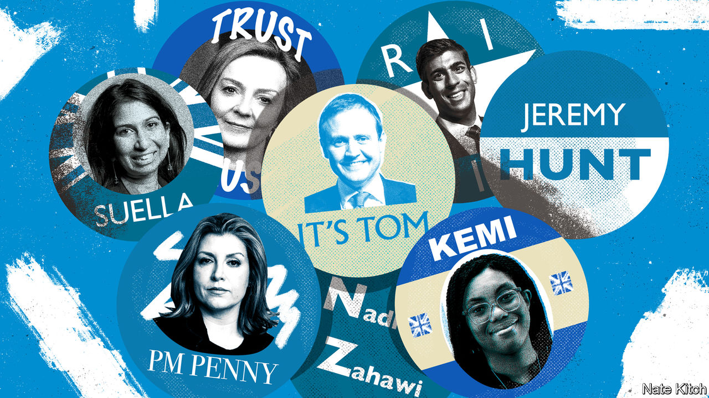

###### Bagehot

# Britain’s prime minister becomes a rotten presidency 

##### MPs alone, not party members, should choose the next prime minister 

 

> Jul 14th 2022 

Boris johnson can claim to be Britain’s first president. The votes of 92,153 members of the Tory party, not those of its mps, put Mr Johnson in Downing Street in 2019. As the debate about his place in history starts, the fact that he was the first prime minister to be directly elected by voters, even if by only a handful of them, is barely mentioned. 

After Mr Johnson’s announcement on July 7th that he would step down, the Conservative Party is sticking with this method to find his successor. Since 2001 Conservative mps have reduced themselves to choosing two candidates and then letting the 180,000-strong membership of the Conservative Party have the final say over their leader, even when they are also choosing the head of the government. That risks turning the role of prime minister into a rotten presidency. 

An ersatz presidential race will take place in July and August. Two Conservative candidates will roam the country begging for the votes of a tiny, self-selecting electorate. Candidates will unleash campaign slogans, smear each other and face off at hustings, just like any other presidential election. Where suffrage was once limited to propertied men, today it is limited to those who paid £25 ($30) to join the Conservative Party. Imagine a National Trust membership—except, rather than free entry to stately homes, you may get to choose the prime minister every few years. 

The problem is not the electorate. Conservative mps often think their membership is nuts. Thankfully, they are wrong. Although they may be older, richer and more male than the electorate as a whole, views of Tory members are roughly in line with bog-standard centre-right opinion. They are a bit more forthright than mps when it comes to law and order, and a bit more left-wing than the typical Tory mp on economics, according to one study. But they are not rabid headbangers waving “Eat The Poor” placards. 

Likewise, mps do not have a monopoly on wisdom. They often lack it. In 2016 Theresa May was chosen by her fellow mps after the slapstick implosion of her rivals meant there was no one left to run against; she won by default, without the need for a vote among party members. In less than a year, she had blown her majority. 

A neo-Gothic palace by the Thames is a terrible place to gauge the mood of voters. In contrast, Conservative members are canny. In 2005 David Cameron was a far-sighted choice. The former Conservative leader pledged a socially liberal, tieless form of Conservatism to compete with the slick managerialism of Labour. Likewise, choosing Mr Johnson as party leader was a gamble that paid off, in the short term. The Tories began 2019 with the worst polling in decades; they ended it with their biggest majority in 30 years. 

The problem with the system is the principle rather than the end-product. For starters, an mp could have the support of only a minority of the parliamentary party and still become prime minister, if they are able to charm enough Rotary Club members from Witney. Across the chamber, Labour activists thrust Jeremy Corbyn onto an unwilling Labour parliamentary party twice. Misery ensued. Safeguards do exist: Conservative mps can remove their leader with a simple confidence vote. But far better to pick someone with guaranteed support in the first place. 

Defenders of the system argue that mps will put only well-qualified candidates in front of the membership. But Conservative mps prefer victory to competence. If a candidate proves surprisingly popular with members, mps—aware that their careers depend on backing the right person—will follow. There is no point in backing someone good if you know they will be beaten by inept rivals who have spent years greasing up association members in Solihull. 

Indeed, rather than allow a thoughtful interrogation of their colleagues, Tory mps have opted to rattle through their part of the voting process. The final two candidates will have been chosen by mps by July 21st. Not only must Conservative members then make the final decision on who to pick. They must also stress-test any future prime minister, grilling them on everything from tax policy to Ukraine. In opposition, this method is fine. The winner of any contest, whether members’ ballot, trial by combat or a coin-toss, is put before voters in a general election before they can lead a government. Picking prime ministers should be a different matter. It is not right that the votes of the upstanding members of Richmond’s local Tory party association determine who gets handed the nuclear codes. 

Take back control

Outsourcing the decision of who enters Downing Street is a dereliction of duty by mps. One of the more compelling arguments for leaving the eu was that it would compel mps to pay attention to the laws they pass, rather than rubber-stamping a directive from the eu’s legislative machine. But if mps do not feel qualified to pick a prime minister, they should not feel qualified to vote on a law. 

Creating a de facto presidency is a recipe for constitutional stress. Candidates to become prime minister end up appealing to a narrow caucus of self-selecting members, rather than lawmakers chosen by the electorate at large. This is a path to polarisation. And government in Britain is supposed to be a collective endeavour, with an executive ruled by a cabinet and held in check by Parliament. One of the least appealing parts of Mr Johnson’s reign was his presidential manner. 

Competing mandates poison the British constitution. Brexit turned into a mess partly because the principle of direct democracy crashed into the concept of parliamentary democracy. mps wrestled with a policy that the majority thought was a terrible idea; on the Labour benches, mps sat behind a man they thought was useless. A presidential prime minister, claiming a separate mandate, is the last thing the country needs. Parliamentary democracy is a fine thing. mps should, to coin a phrase, take back control. Why not start with who lives in 10 Downing Street? ■


