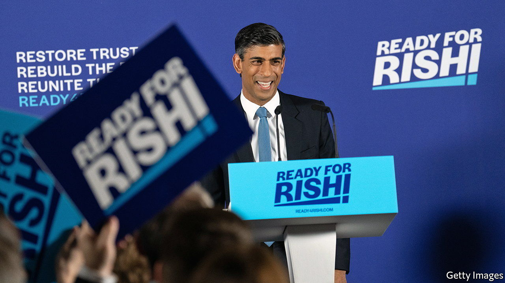
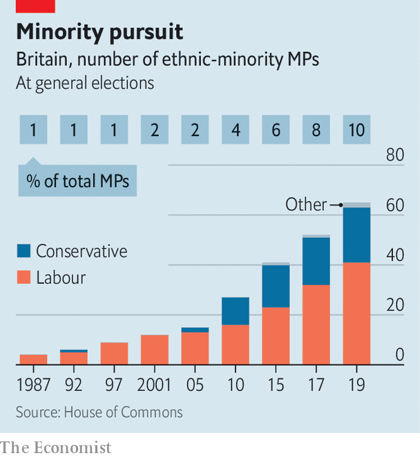

###### A fresh narrative

# Conservative candidates reveal “the British dream” 

##### A diverse leadership contest and a confident new story of integration 

 

> Jul 14th 2022 

“Let me tell you a story about a young woman almost a lifetime ago who boarded a plane armed with hope for a better life and a love of her family.” So began Rishi Sunak, in a video to launch the former chancellor’s campaign to become the new leader of the Conservative Party and Britain’s next prime minister.

“I’m a father, an immigrant, a self-made businessman,” declared Nadhim Zahawi, the current chancellor, who arrived in Britain aged 11 as a refugee from Iraq. Suella Braverman, the attorney-general, spoke of her mother, who came from Mauritius, and her father, from Kenya. “They loved Britain. It gave them hope, it gave them security, this country gave them opportunity.” Sajid Javid, a former health secretary, tells the story of his father, who arrived from Pakistan with £1 ($1.20) in his pocket. 

The ethnic diversity of the candidates for the Conservative Party’s leadership election has been striking. The field is now being whittled down—Mr Zahawi and Mr Javid are already out of the race—but of the 11 who declared they would run, six are of black or Asian heritage. Just as notable is the bright and confident story that these candidates tell of immigration: what Mr Zahawi, borrowing from an American tradition, calls “the British dream”. 

Britain, this story goes, is a special place where anyone can see their children prosper if they try. “In any other country, I might have been left behind, forgotten about, my future vanishing before I’d even finished school,” Mr Zahawi once remarked. There is some truth in this: in 2019 88% of Britons said they’d be “comfortable” with an ethnic-minority prime minister, higher than any country in the eu. 

 


This is part of a Tory tradition of “inclusive meritocracy” that stretches from Benjamin Disraeli to Margaret Thatcher, says Sunder Katwala of British Future, a think-tank that specialises in integration. But it is also a transformation for the Conservative Party (see chart). In the 2005 general election just two non-white Tories won seats. By 2019 it had 22 such mps—just 6% of the parliamentary party, a much lower proportion than in the Labour Party, but a cohort that seems to have sought out the top jobs. Merit was given a helping hand: David Cameron, a former leader, helped non-white candidates into safe Tory seats.

The British dream downplays the obstacles faced by ethnic minorities. Racism, in the Conservative story, tends to be described as acts of individual hatred rather than a systemic phenomenon. Kemi Badenoch, an insurgent candidate whose family were from Nigeria, is the Conservative Party’s most prominent critic of the Black Lives Matter movement.

It also seems to shape an increasingly sharp distinction in immigration policy. Priti Patel, the home secretary, who was born in London to a Ugandan-Indian family, has liberalised visa rules for skilled migrants, making Britain more accessible to the middle classes from countries such as India and the Philippines, while instigating a programme of deportations to Rwanda for those who cross the English Channel in dinghies. The British dream is open, but the huddled masses need not apply. ■

