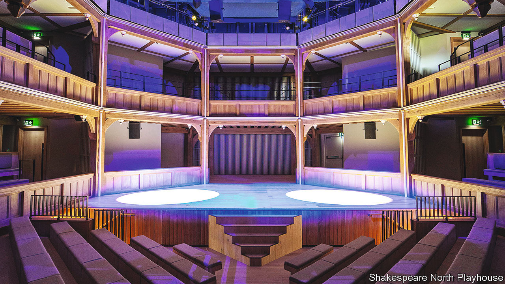

###### The play’s not the only thing

# Shakespeare and the revival of Prescot 

##### A new theatre raises the question of how to value culture 

 

> Jul 14th 2022 

Prescot, near Liverpool, is thought to be the site of the only Elizabethan-era indoor playhouse outside London. The original may have been rather unimpressive, constructed at the end of the 16th century and decommissioned not more than two decades later. The theatre opening there on July 15th, a timber-framed replica of a 17th-century cockpit playhouse, is meant to have greater impact. 

The idea is for the Shakespeare North Playhouse to become one corner of a theatrical triangle along with Stratford-on-Avon, where the Royal Shakespeare Company has its base, and Shakespeare’s Globe in London. (The bard was linked to local nobility in Prescot: the Earl of Derby was the patron of the theatre troupe that would eventually become his company at the Globe.) The venue is central to plans to revive Prescot, which is in one of the most deprived bits of Britain. It is expected to bring in 140,000 visitors and add £5.4m ($6.4m) to the local economy each year. Shakespeare-themed businesses are cropping up; a pub called “The Bard” now graces the high street.

Under Boris Johnson the government has been keen on using cultural attractions to advance its “levelling up” agenda, to reduce inequalities between the south-east and the rest of the country. Advocates of art as a catalyst for regeneration point to examples such as the Baltic Centre for Contemporary Art, which opened in Gateshead in 2002, and Glasgow’s renaissance after it was named the cultural capital of Europe in 1990. 

But when it comes to winning funding for projects, cultural institutions can be at a disadvantage. As well as creating jobs and luring tourists, these venues claim many intangible benefits. Melanie Lewis, the boss of the new theatre in Prescot, lists social activities to reduce loneliness among the elderly, educational programmes for local children and, most unquantifiable of all, enhanced pride in the city. 

Pricing such benefits is tricky, especially if admission is free (as it is at most national museums). One technique is to ask people how much they would be willing to pay for something. The answers can be used to assess what people get out of a cultural asset and to test out hypothetical scenarios that might inform funding decisions. But it is hard to imagine the benefits of something that hasn’t yet been built. nimbys could even use the intangible value of existing cultural heritage to stymie construction. 

In 2021 the government launched a multi-year research project into how to value the benefits of culture and heritage. But the real constraint on new projects is tight budgets. Most arts funding in England comes from local government; the bulk of the money to pay for the theatre in Prescot was from local authorities. A wobbly economy, and a new prime minister who is less wedded than Mr Johnson to the idea of levelling up, may mean fewer curtains going up. The course of cultural regeneration never did run smooth.

