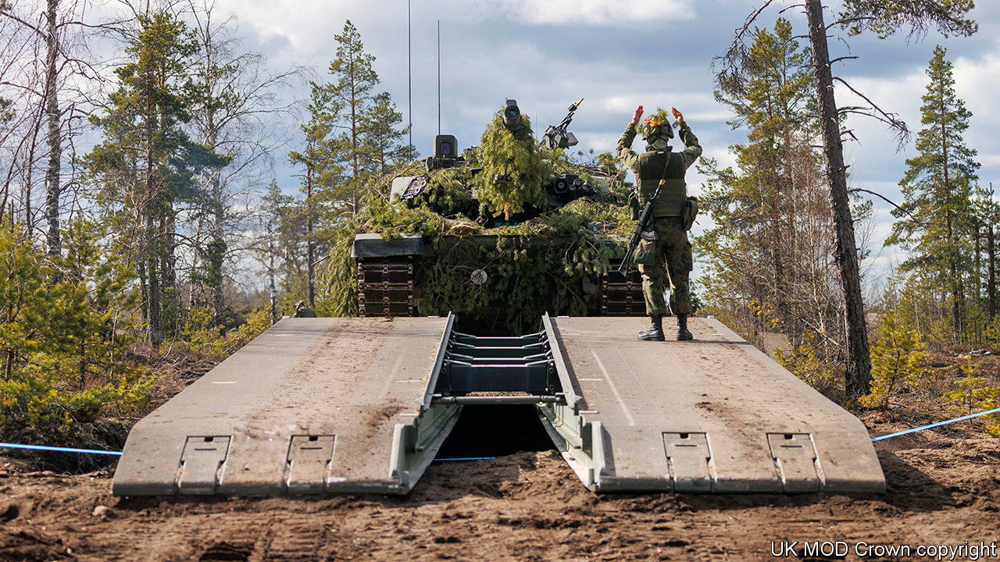
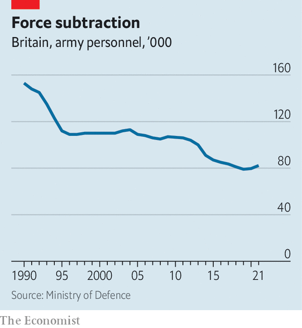

###### Pick your battles

# The British Army has a new focus and outdated equipment 

##### Its top general sets his sights on Russia. But his forces desperately need investment 

 

> Jul 11th 2022 

In 1905 britain’s new secretary of state for war, Richard Haldane, asked a deceptively simple question: “What is the army for?” The guerrilla fighting of the Boer war was over; trouble loomed in Europe. Haldane built an expeditionary force that was thrown into France less than a decade later. Now, with the army in the throes of another identity crisis, its top general wants to settle that question anew.

On June 28th General Sir Patrick Sanders, who earlier that month had become chief of the general staff (the head of the army, one rung below the chief of the defence staff, who oversees all three services), addressed the Royal United Services Institute (rusi), a think-tank in London. “This is our 1937 moment,” he said, pointing to Russia’s invasion of Ukraine. “From now the army will have a singular focus—to mobilise to meet today’s threat and thereby prevent war in Europe.” The process will be known as Operation mobilise.

The intention is to end debates about the purpose of the army that have raged since Britain largely concluded its Afghan war in 2014. During the covid-19 pandemic the army built hospitals and drove oxygen tankers. A defence review last year lavished attention on a new Ranger Regiment designed to train and accompany local forces, such as African governments fighting jihadists. The army, it said, would have global hubs as far afield as Brunei—part of the government’s “tilt” to the Indo-Pacific to counter China’s growing power and to build ties with zippy Asian economies.

General Sanders now promises “ruthless prioritisation”, on the assumption that the army would have to fight along nato’s eastern front, or on the alliance’s northern or southern flanks in the Arctic and Mediterranean. Some missions will be pruned. “I think the idea that the army is going to the Pacific to fight the Chinese is now off the table completely,” says William F. Owen, an expert who has advised the army and edits . Fashionable areas like information warfare and cyberwarfare, which General Sanders oversaw in his previous job, may be subordinated to basic soldiering. “To put it bluntly,” he observed at rusi, “you can’t cyber your way across a river.”

However, planning to fight Russia and being prepared to do so are two different things. When Russia invaded Ukraine and annexed Crimea in 2014, General Sir Nick Carter, one of General Sanders’s predecessors, ordered the army to shape up. Instead, in the years that followed, austerity-driven defence cuts were relentless. “The army just kept stripping out actual warfighting capability until it had basically none,” says Anthony King, a professor at Warwick University who recently completed an official review of the army’s culture. 

 


Many officers blame cuts to the army’s size. It has shrunk relentlessly since the end of the cold war (see chart), from 150,000 troops in 1991 to just over 82,000 last year. That is barely enough to cobble together the single division promised to nato in the event of war. But size is a red herring, argues Mr Owen. “Manpower is what burns the wages and social-security bill,” he says. The true constraint on combat power is equipment and training.

Neither is reassuring. The army’s fleet of vehicles is a “depressing state of affairs”, says Rupert Jones, who retired as a major-general last year. “The reality is the British army was and remains pretty hollow… equipment is criminally outdated.” The army’s 3rd division—its flagship, and the only one that could fight abroad at scale—is in dire shape, according to insiders, not just under strength but also lacking in sufficient working armour. “The British army works off about 50 tanks,” says Mr King. “[They] are extremely old, and they break down all the time.”

The army’s cupboard is also bare in terms of heavy artillery, drones, air-defence systems and other capabilities that have proved indispensable to both sides in Ukraine. Moreover, in arming that country, Britain has run down its own stocks of anti-tank missiles and other weapons. If publicly available figures are correct, its ammunition holdings would last for two weeks at Ukrainian rates of consumption, and just two days at Russian ones, notes Jack Watling of rusi. These problems cannot be fixed without more investment. On June 30th Boris Johnson, Britain’s prime minister, promised that defence spending would rise to 2.5% of gdp by the end of the decade, up from just over 2% today—but Mr Johnson will not be around for long.

The problem is not just cash but also dysfunctional procurement. Last year the army was forced to cancel a botched upgrade programme for its Warrior infantry fighting vehicles, leaving a gaping hole in its plans. Ajax, an armoured vehicle designed to reconnoitre ahead of armoured brigades and gather data from other platforms, has yet to enter service after 12 years and costs running at over £3.2bn ($3.9bn).

As Russia’s hapless performance in Ukraine shows, having advanced weapons is not the same as knowing how to use them. General Jones recalls that when he was a young officer in Germany his unit spent up to five months each year on exercises and practised 20 or so river and other obstacle crossings—precisely the sort of experience required to fight Russia in the complex terrain of eastern Europe. All that stopped long ago, he says, largely because of the expense of such training. Mr Watling says that soldiers are rarely given permission to launch drones on exercises, so have little experience of coping with one overhead.

In recent years, the army has also been battered by a series of scandals concerning the behaviour of troops. Last month one of General Sanders’s first acts in the job was to cancel a planned deployment of paratroopers to the Balkans after a video emerged showing soldiers participating in an orgy at a base. Then on July 12th the bbc, Britain’s national broadcaster, published damning evidence suggesting that the sas, the army’s renowned special-forces unit, might have murdered dozens of detainees in Afghanistan (Britain’s defence ministry said these were “unjustified conclusions”).

As it grapples with these problems, the army is also attempting to predict what sort of war it might have to fight. Major-General James Bowder, in charge of this effort, known as Project Wavell, says that the future battlefield will be a frenetic “contest of kill chains”, where armies will struggle to manoeuvre without being hit unless they constantly attack the enemy’s command, control and logistics. Urban warfare is a priority. Towns and cities, he says, will be sanctuaries from enemy surveillance and citadels from which to strike back. These assumptions will be tested in a series of war games over the next six months.

In theory Project Wavell is about the army of the 2030s. But the sense of urgency is implicit in General Sanders’s analogy with 1937, the year of Japan’s invasion of Manchuria, two years before the outbreak of the second world war in Europe. The army would be ready for the worst, he promised in his speech: “I will have an answer to my grandchildren should they ever ask what I did in 2022.”■

