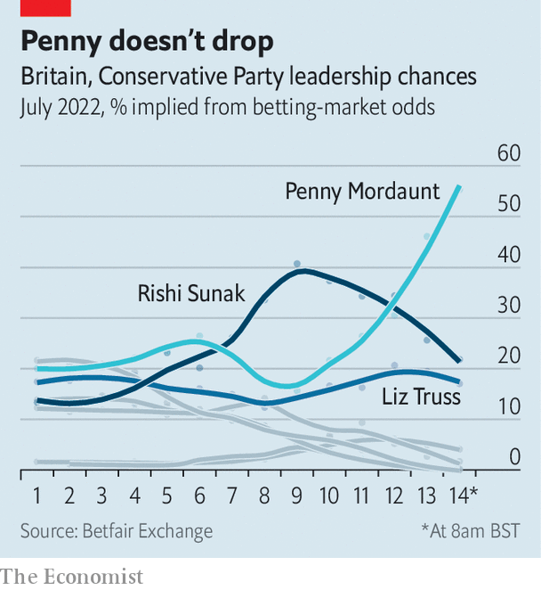

###### Trust exercise

# The Conservative Party after Boris Johnson 

##### The race to be the next prime minister is formally under way 

 

> Jul 12th 2022 


The conservative party is a machine for winning and holding power. It has a remarkable capacity for reinvention, changing before change is forced upon it at the ballot box. Boris Johnson’s successor will be the party’s fourth leader, and Britain’s fourth prime minister, since it entered government in 2010. Before 2024 is out, they will be pursuing an unprecedented fifth general election victory.

 that is now under way is still in its early days. By the afternoon of July 14th, Tory mps had whittled down the field from an initial 11 candidates ; the last two contenders left standing by mps will appear in hustings over the summer, before a ballot of party members leads to the unveiling of a new prime minister on September 5th. A leadership contest is not a manifesto for government: the candidates’ platforms are not addressed to the wider British public. Yet all the same the early days of a contest reveal where the centre of gravity lies within a party, and where it thinks its route to power lies.

 


The contours of the party after Mr Johnson seem to be to the right of where they were on economics and culture. Some of his most controversial policies have become a new consensus among mps. But there are also signs—most obviously in the rise of Penny Mordaunt, a former defence secretary who has swiftly become the bookmakers’ favourite (see chart)—of how this steelier tone can be reconciled with the party’s hopes of winning the next election. “There has been a shift [to the right],” says one centrist minister. “But it is the genius of the Tory party to harness it and get it into a vaguely acceptable place.”

Like a body expelling an illness, the entire field  Mr Johnson’s jocular and scandal-prone style of government. All candidates boast of their integrity, seriousness and grip; none seeks to be his heir. Rishi Sunak, the former chancellor who picked up the most endorsements among mps in the first ballot on July 13th, promises an end to “comforting fairy tales”. Kemi Badenoch, an insurgent from the right of the party, declares that voters are “exhausted by platitudes and empty rhetoric”. Inexperience is a virtue: Tom Tugendhat, a former soldier who has never held ministerial office, promises a “clean start”. 

Ms Mordaunt is the greatest beneficiary of a party hankering for change. She is the “antidote to Boris” and a “cleanskin”, according to supporters at a garden party she co-hosted in Westminster on July 13th, complete with jugs of Pimms, a brass band and sponge cake. “We’ve had three years of celebrity-tosser-on-a-high-wire politics,” says one. A naval reservist who fell out of favour under Mr Johnson, Ms Mordaunt urged mps to pick a leader based not on ideology but “because you trust their motives”. Unlike flighty Mr Johnson, says another ally, she gets the provincial habits of the volunteer party. 

Mr Johnson’s vision of an activist state improving the lot of the poor northern towns he won in 2019 is also not widely shared. This is a contest in which everyone claims to be a small-state conservative. Ms Badenoch pledges a “limited government focused on essentials”. The serving chancellor, Nadhim Zahawi, who was knocked out of the race on July 13th, promised to cut departmental budgets by 20%.

Yet in other ways Mr Johnson has transformed his party. The opening days of the contest were marked by frenzied promises of tax cuts as a gulf opened up between Mr Sunak, who says tax cuts must wait until inflation is brought under control, and many of his rivals, who said they should start now and in dramatic fashion. Ms Mordaunt wants to cut fuel duty in half; Liz Truss, the foreign secretary, promises a reduction in corporation tax and national insurance, a payroll tax. Such pledges revealed a Johnsonesque aversion to hard choices. “We can’t simply be accountants trying to balance the books the whole time. We have got to look to growth as well,” said Kwasi Kwarteng, a cabinet minister who backs Ms Truss. 

Some of Mr Johnson’s most radical policies will survive him. In his final months in office, the government agreed a deal to  to Rwanda. Ms Truss prepared legislation that would allow Britain unilaterally to rewrite the bit of the eu withdrawal treaty that bears on Northern Ireland. Such policies were regarded by much of the party’s liberal wing as an abrogation of Britain’s obligations. Now they are its new norm: Mr Tugendhat, probably the most liberal candidate in the race, was swift to endorse them. 

Suella Braverman, the attorney-general, sought to shift the dial even further to the right, promising to shred the Northern Ireland protocol entirely and to leave the European Convention on Human Rights. She has since been knocked out of the contest, but historically such campaigns can force others to make pledges they later regret, says Tim Bale, an historian at Queen Mary University of London.

Rows over culture, race and gender identity scarcely featured in the leadership contest of 2019, when Mr Johnson triumphed. The world has since changed, and these issues now course through the party’s veins. Ms Badenoch, a disciple of Thomas Sowell, an American academic, has made confronting “zero-sum identity politics” the centrepiece of her campaign. Candidates skirmish over who is best-placed to resist transgender activism; Ms Mordaunt spent the first days of the campaign denying sympathy for that cause. 

Whether this terrain is one on which the Tories can fight and win the next general election is less clear. Unfunded tax cuts are likely to fuel inflation, which is already squeezing living standards, and to force the Bank of England to tighten monetary policy more. The National Health Service, which Mr Cameron and Mr Johnson both regarded as the route to success, is suffering severe backlogs; it has barely intruded on the contest. Culture wars animate the public less than they do mps. The Labour Party has a commanding lead in the polls.

Although the peril faced by the Tories has not featured much in public debate thus far, these hard electoral realities weigh more heavily in private. A formula of personal trustworthiness and lower taxes differentiates Ms Mordaunt from both Mr Johnson and one of her main rivals. “No-one really knows what she thinks,” said one half-hearted supporter, as the band struck up the theme from “The Great Escape”. “But Rishi will lose me my seat.” That instinct for reinvention still exists.■

