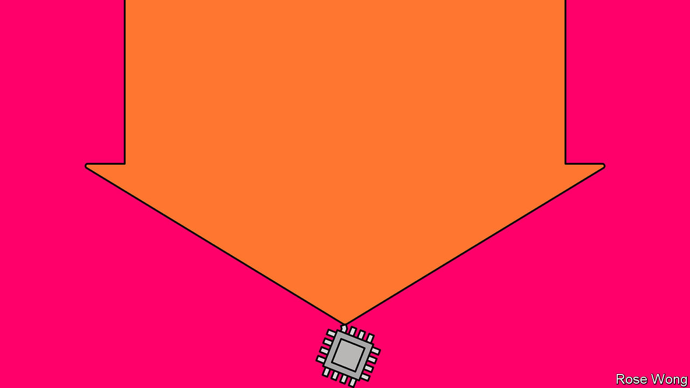
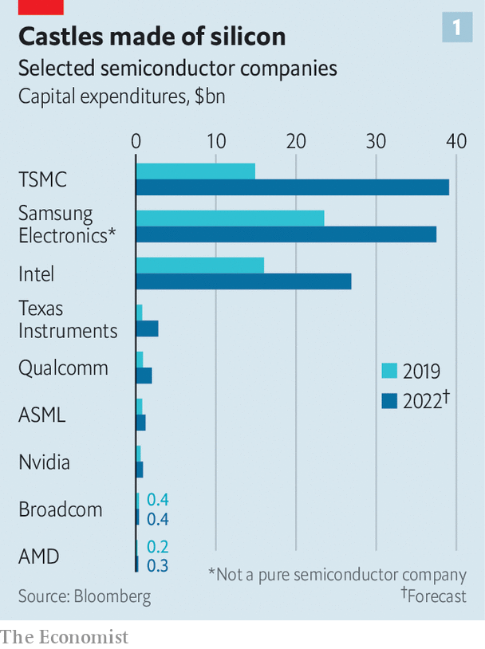
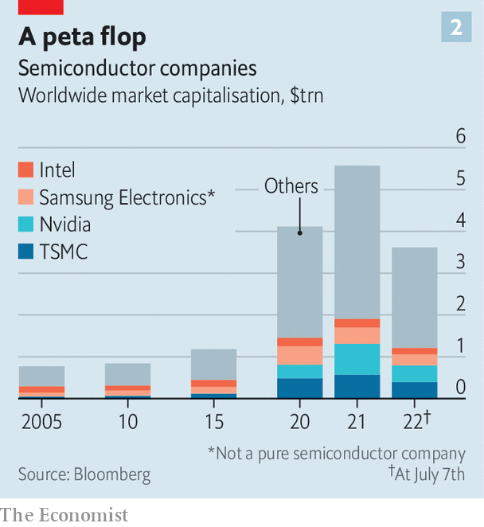
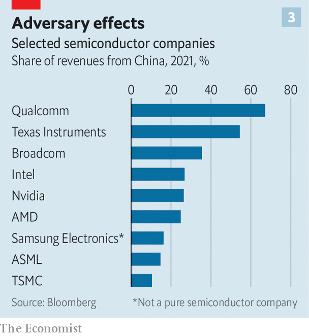

###### When the chips are way down

# After a turbocharged boom, are chipmakers in for a supersize bust? 

##### Surging supply and softening demand are bringing the pandemic’s superstar industry back to Earth 

 

> Jul 10th 2022 

In 2021 graphics cards were . Video-game devotees and cryptocurrency miners queued overnight to get their hands on the latest high-end offering from Nvidia or amd, two American chipmakers. And graphics processors were far from the only sizzling semiconductors. An  of chips disrupted the production of everything from smartphones to cars and missiles, just as demand for all manner of silicon-bearing devices boomed. Last year the chip industry’s revenues grew by a quarter, to $580bn, according to idc, a research firm. Chipmakers’ market values soared. , a giant Taiwanese contract manufacturer, became the world’s tenth-most-valuable company.

 


With demand expected to grow ever more insatiable, the time-honoured —the consequence of the lag between demand and new supply, which takes a year or two to build up—appeared to be a thing of the past. Chip firms opened up their wallets (see chart 1). tsmc and its two main competitors, America’s Intel and Samsung of South Korea, invested $92bn between them last year, a rise of 73% relative to 2019—and pledged a further $210bn or so all told over the next two years. 

Now it seems that, far from being banished, the chip cycle may instead have speeded up. Chips of all sorts are looking wobbly. On July 14th tsmc said it would be investing less than it had envisaged. Samsung has warned of stalling profits and is said to be considering dropping prices for memory chips in the second half of 2022. In June Micron Technology, an American memory-chip maker, forecast sales of $7.2bn in the third quarter, a fifth lower than expected. TrendForce, a firm of analysts, expects memory prices to fall by a tenth in the next three months. By one estimate, prices of graphics chips have dropped by half since January, as the  and gamers spend more time in non-virtual reality. In the euphemistic words of David Zinsner, Intel’s chief financial officer, the rest of the year is looking “a lot noisier than it was even a month ago”. 

 


As the turbocharged boom risks turning into a supersize bust, the share prices of the world’s chipmakers have slumped by about a third this year (see chart 2), half as much again as the  of big American firms. Added to that, geopolitical tensions risk  and . The pandemic’s superstar industry suddenly appears a lot less stellar.

Start with supply. One way that firms have been adding capacity is by installing new kit in existing fabs (as  are known). In the second half of 2021 global spending on equipment to etch chips onto silicon wafers jumped by about 75% compared with pre-covid levels, estimates Malcolm Penn of Future Horizons, another research firm. It takes a year or so for such investments to translate into new output, so late 2022 could see a production glut.

Firms can also build all-new fabs, which takes a bit longer. According to semi, one more research group, 34 of these came online worldwide in 2020 and 2021. Another 58 are scheduled to open between 2022 and 2024. That would raise global capacity by roughly 40%. Intel has six fabs in the works, including a $20bn leading-edge “megafab” in Ohio, and factories in Arizona and Magdeburg, Germany. Samsung’s plans include a large modern fab in Texas. tsmc is building a similar one in Arizona. Most of these are expected to begin producing chips by 2025.

 


There was always the risk that demand might have faded by then. But the hunger for chips has waned faster than expected. The clearest signs are in the market for personal computers (pcs), which account for about 30% of overall demand for chips of all varieties. After a pandemic boost as working and schooling from home became the norm, global pc shipments will fall by 8% this year, reckons idc. That is partly because some of those pandemic purchases had simply been pulled forward. Sales of smartphones, another 20% of demand, are expected to ebb, too. In April smartphone shipments in China, the world’s biggest market, were a third lower than in the same month last year. The slowdown in pc and phone sales will be sharper still if the world economy dips into .

Data centres and carmaking consume around one-tenth of the world’s chips apiece. Demand is not forecast to fall this year. But signs of softness can be seen. Chinese orders for server chips, which power data centres, have dropped off. Many , for their part, have double- or triple-ordered chips to avoid the sort of shortages that forced them to cut output last year. Stacy Rasgon of Bernstein, a broker, points out that in the past few quarters shipments of automotive chips have been about 40% higher than what you would expect based on the number of cars shipped and the number of chips in a typical car. Big stockpiles in the car industry may mean a sudden drought of new orders.

The downward pressure on prices may be compounded by another powerful force. Political considerations, both domestic and international, increasingly influence chip supply and demand. On the supply side, last year’s crunch spooked governments and reminded those in the West that 75% of all semiconductors come from Asia. Many now want to bring the manufacture, especially of leading-edge chips deemed of strategic importance, within their borders. In America, Congress is wrangling over the chips Act, which, if enacted, would hand the industry up to $52bn over five years in subsidies and research-and-development (r&amp;d) grants.  offers €43bn ($43bn) until 2030. India, Japan and South Korea have similar schemes. So does , which launched a semiconductor policy in 2014. 

State largesse could lead to more overcapacity. And interventionism may further dent the outlook. A chip industry fragmented along national borders would risk wasteful duplication, driving up costs for consumers. A report by bcg, a consultancy, and the Semiconductor Industry Association, a lobby group, finds that in a scenario where semiconductor production is self-sufficient within regions chip prices would increase by between 35% and 65%. 

America’s government seems intent on constricting demand in another way. It is using export controls to deny Chinese buyers access to semiconductors and the tools needed to make them. The urge is understandable: China is an authoritarian challenger to the American-led, rules-based global order. Awkwardly for chipmakers, China is also the world’s biggest chip market. tsmc and Intel have already lost Chinese customers as a result of American restrictions. Others, such as Qualcomm, note in their annual reports that Chinese clients are developing their own chips or switching to local suppliers, in part because of geopolitical tensions. American chipmakers warn that their large r&amp;d budgets would be difficult to sustain if they lost Chinese custom. 

Political considerations are a headache for others in the semiconductor value chain, too. On July 5th Bloomberg reported that asml, the  in the market for the $100m lithography machines used to etch high-end chips, was under pressure from America’s government to stop selling its gear to Chinese firms. China accounts for 15% of asml’s sales; its share price fell by 7% on the news. The market values of asml’s American suppliers, such as Azenta and mks Instruments, also slid. Other American toolmakers, such as Applied Materials, kla and Lam Research, derive a third of their revenue from Chinese customers. All are in talks with American authorities to limit their sale of high-tech tools to China.

The chip bust may be softened if the drive for silicon self-reliance sputters. Continuous subsidies would be needed to keep American fabs at the cutting edge. That, in turn, would require sustained interest from easily distracted policymakers. This month Intel said it would push back the opening of its fabs in Ohio, blaming delays in passing the chips Act. tsmc has said it may need to slow the construction of its Arizona fab for the same reason. In April Morris Chang, former chairman of tsmc, bluntly called America’s attempt to reshore chip production an “exercise in futility”, pointing to high costs and the lack of engineering expertise. 

Indeed, take out the state intervention and dips in chip cycles have been getting shallower of late, notes Ajit Manocha, who heads semi. That may be in part because the industry has become more consolidated. In the 1980s 20-odd firms jostled in the market for memory chips. Today it is dominated by three: Micron, Samsung and sk Hynix. At the cutting edge of microprocessor-making, Intel, Samsung and tsmc are the only firms capable of churning out the most advanced kit, down from nearly 30 firms in 2001. Fewer firms control a greater share of capital expenditure and can rein it back in if supply outstrips demand. This will require the chipmakers to rediscover capital discipline—something they have not had to exercise in a while. ■


