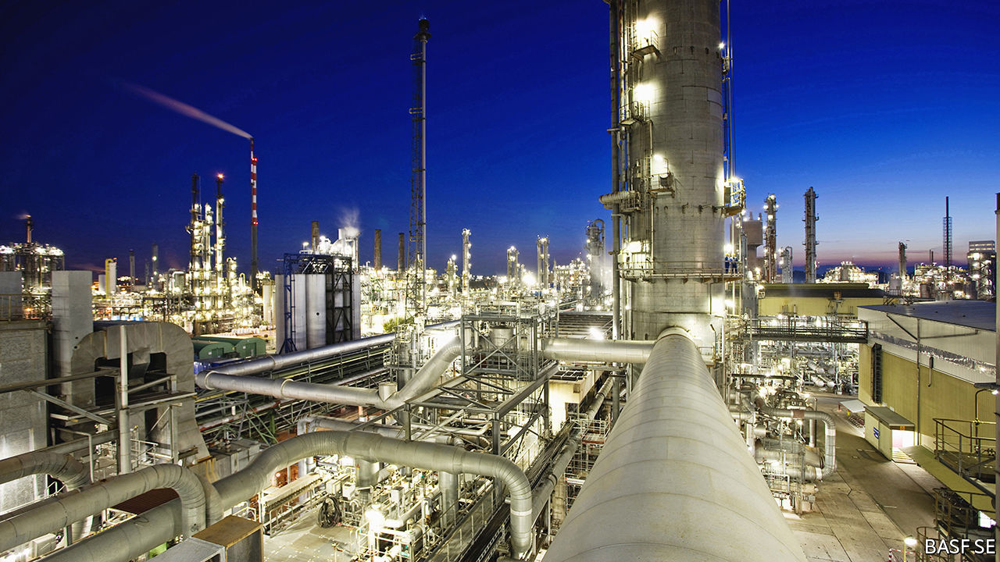
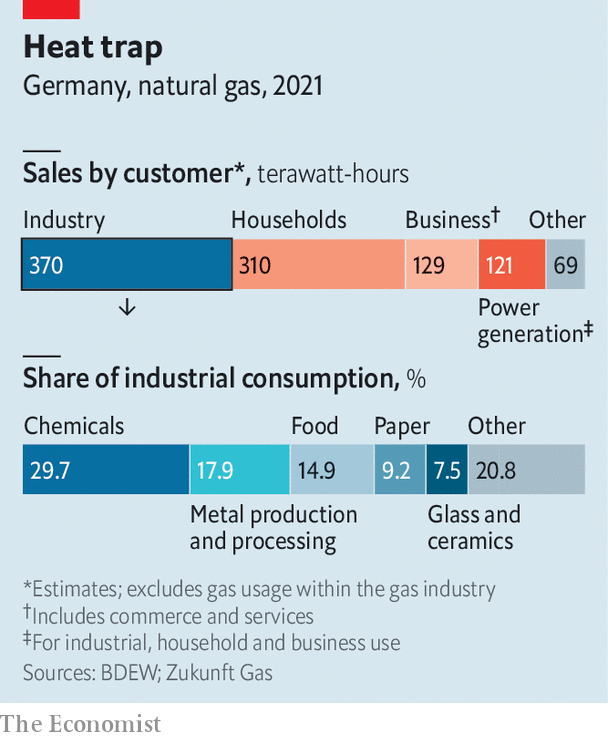

###### The high cost of low pressure

# Can Deutschland AG cope with the Russian gas shock? 

##### Probably yes in the short term. In the longer run, German business will need to adapt 

 

> Jul 14th 2022 

Founded in 1763 by Frederick the Great, Königliche Porzellan-Manufaktur still uses traditional methods to make its high-end porcelain. As in the past, kpm vases and cups are blasted with heat in furnaces: first at 1,000°C, then at 1,400°C. Hardly the cutting edge of German manufacturing—but emblematic. kpm’s fortunes are, like those of German industry as a whole, tied to the availability of cheap natural gas. Its four ovens consume almost as much of the stuff in a year as 100 single-family homes. 

Those fortunes now look imperilled. Industry accounts for 37% of Germany’s gas consumption, a third more than the eu average—not counting the gas-fired electricity it gets from the grid (see chart). Until recently, Germany got over half its gas imports from Russia. As happens every summer, on July 11th the main conduit for the stuff, Nord Stream 1, was shut down for maintenance. It may remain inactive after the planned restart date of July 21st. Russia’s autocrat, Vladimir Putin, is threatening to starve Europe of the fuel as punishment for Western sanctions imposed after his troops invaded Ukraine. Many eu countries are vulnerable. But Germany has the most to lose. 

 


With just months before a winter spike in demand for heating, Germany is bracing for all eventualities. Smaller firms such as kpm are working overtime to fill warehouses so they have something to sell if their gas is turned off. Giants like basf, the world’s largest chemicals company, have drawn up complex contingency plans. The government is pushing through laws making it easier to spread the pain of higher gas prices and bail out fragile gas distributors. Regulators are assessing which businesses can lose access to gas without upsetting supply chains. Consumers are snapping up firewood and electric heaters, which are sold out in parts of Germany. 

With a dash of luck—a mild winter and no more supply interruptions, such as the recent fire at a liquefied natural gas (lng) plant in Texas—Germany should avoid rationing this year. Russian gas is already down to 35% of total imports. A longer-term problem is harder to solve: how to adapt the country’s industry for a future without cheap Russian supplies, which the eu wants to wean itself away from. 

Germany has done just about everything it could to get into this pickle. Fearful of another Chernobyl or Fukushima, it mothballed its nuclear reactors. It simultaneously powered down coal-burning plants to slow global warming. Political neglect cost it an early lead in renewable energy. And all the while the country’s political and business leaders promoted natural gas as a form of “bridge” energy, to be phased out in favour of wind, solar and other greener sources. 

In typical corporatist fashion, Germany’s big parties, industry bigwigs and trade unions collectively decided that cheap Russian gas was great industrial policy, too, notes Rüdiger Bachmann of the University of Notre Dame. This has allowed titans like basf to churn out basic chemicals, such as acetylene and ammonia, which in turn fuelled the ’s manufacturing powerhouses; industry still makes up 27% of gdp, compared with about 17% in Britain and France. 

But it has made the economy a gas-guzzler. basf’s flagship factory in Ludwigshafen, Germany’s biggest single consumer of gas, inhaled 37 terawatt-hours-worth last year—half as much again as the whole of Denmark. The company’s boss, Martin Brudermüller, warned in April that “Russian gas deliveries have been the basis for the competitiveness of our industry.” If they disappeared overnight, this could trigger “the most severe economic crisis since the end of the second world war”. 

For a sense of how things might unfold, start in Ludwigshafen. Though it resembles an agglomeration of plants, the facility is in fact a highly optimised  (combine) held together by nearly 2,850km of pipes. If gas pressure in that network falls below half its normal level, nothing can be done except shut it all down. The effect would quickly ripple through the economy. Most manufacturers use a Ludwigshafen chemical: fertiliser needs ammonia; toothpaste and chewing gum contain methanol; nappies use polymers; cars, Germany’s best-known export, are test-tubes on wheels. Elsewhere steelmakers and other metal-bashers, Germany’s second-biggest industrial users of gas after chemicals firms, would grind to a halt. Capital would be destroyed: once molten zinc used to galvanise steel solidifies in its vast tanks, it would be too costly to melt again. The same is true of glass melters. 

German industry thus has little room to save more gas without suffering serious damage. Industrial firms can afford to trim use by 8% within a year and the chemical sector by 4%, estimates the German Association of Energy and Water Industries, a lobby group. If businesses are forced to cut much more, it would markedly slow Germany’s economy. The Bundesbank, the country’s central bank, foresees a painful contraction of gdp in the event of gas rationing: 2% in the fourth quarter, relative to a non-rationing scenario, and more than 8% in the first quarter of 2023.

Germany’s newish government is desperate to avert this scenario. It will do “whatever it takes” to keep the country’s energy market from collapsing, in the words of Robert Habeck, Germany’s minister for economy and climate. Some of his ideas are popular but counterproductive—the loans and subsidies already being doled out to firms hurting from high energy costs could encourage consumption. Although coal plants also produce district heating, reactivating them while resisting nuclear power, which is climate-friendlier but despised by his Green Party, seems environmentally nonsensical. 

Girding for the worst, on July 5th Mr Habeck presented parliament with a package of bills aimed to give it more tools to react. The legislation will probably be first used to save Uniper, Germany’s biggest distributor, which provides gas to hundreds of municipal utilities and whose collapse could trigger a cascade of bankruptcies. Uniper is currently getting only 40% of its contracted Russian gas and must cover the shortfall in the spot market at much higher prices. It is losing €35m ($35m) a day, according to Bernstein, a research firm.

To encourage companies to dig deeper for gas savings, the government is expected to launch an auction mechanism in late summer. This will allow firms to bid for how much they are willing to curb gas use and at what price. A survey by the Association of German Chambers of Commerce and Industry, another lobby group, found that this could reduce demand by about 3%—not a lot but available quickly and helpful at the margin.

If in winter gas is still in short supply, Mr Habeck will declare the third stage of the three-tier emergency plan. The Federal Network Agency will then decide which firms must reduce gas consumption and by how much. To make an informed decision, the regulatory body has collected data from 2,500 large firms and is feeding them into a computer model. There will be no hard-and-fast rules, but likely criteria include whether curtailment would destroy capital stock and how critical a firm’s output is to a supply chain. basf would probably get at least 50% of its usual supply; as a maker of luxury goods, kpm may have to close its doors for some time.

Forecasters disagree on the odds of rationing. An analysis by a group of German economics-research outfits puts those of a big mismatch between supply and demand by early 2023 at one in five. Gas-storage tanks have filled up faster than expected thanks to a mild spring, more lng and some reductions in demand. By July 12th they had reached nearly 65% of capacity and could get to 90% by November, the government’s goal, even if Nord Stream 1 stays shut. Others are less sanguine. Most of the Federal Network Agency’s latest scenarios predict that gas will completely or nearly run out by early 2023.

In the next few months the government will seek a middle ground between hobbling German business and angering households, which in the eu are exempt from any rationing, with higher bills. Rather than allowing utilities to pass through price increases, it is likely to introduce some nationwide levy to spread the pain. 

In the longer term, German industry must shake off what Claudia Kemfert of the German Institute for Economic Research, a think-tank, calls the gas-fuelled “illusion of competitiveness”. That means doubling down on renewables and technologies that do away with gas. As much as Germany’s industrial stalwarts hate to talk about rationing, they love to flaunt investments in alternatives. basf has bought part of the world’s biggest offshore wind farm off the Dutch coast to replace the gas that powers its steam crackers, where hydrocarbons are split into smaller molecules. The glass industry vows to build hybrid melters, to be heated by a mix of electricity, gas and, one day, green hydrogen. Steelmakers are keen on hydrogen, too, including as a feedstock.

Simply swapping out gas will not do. Germany’s industrial web will have to unbundle at least a bit, jettison its most energy-intensive parts and focus on green innovation. Instead of making the same basic chemicals with renewable energy, basf could move from selling, say, fertiliser to offering fertilising services, helping farmers use less chemicals more efficiently. This sort of thing requires clever digitisation and data, currently not a German forte. But it would play to basf’s—and Germany’s—strengths in -building. ■


