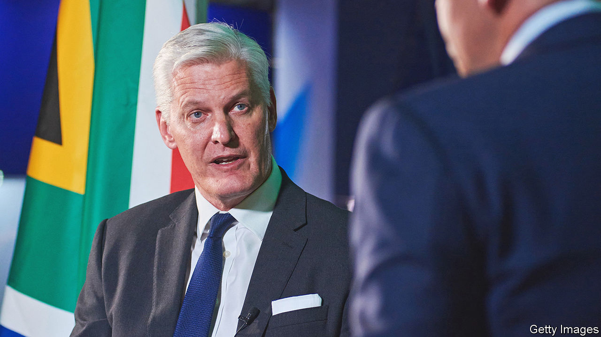

###### Fighting the power

# The man with a plan to fix Eskom 

##### Andre de Ruyter wants to overhaul South Africa’s power utility. If only the government lets him 

 

> Jul 14th 2022 

Andre de ruyter is used to having his weekends ruined. The ceo of Eskom, South Africa’s state-owned electric utility, was recently interrupted by a call telling him that locomotives carrying coal to a huge power station had stopped running. Thieves had stolen the overhead cables. He had to find working diesel trains—not an easy task, since fuel is often pilfered, too. “When people ask why isn’t Eskom turning around,” says Mr de Ruyter, “it’s because the chief executive is spending his Sundays trying to find locomotives.”

Eskom is a cause and a symbol of South Africa’s problems. Its woes have deep roots. After white rule ended in 1994 Eskom expanded access to electricity. But supply failed to keep up with rising demand. Two giant plants were belatedly given the go-ahead in 2007 but one is unfinished and the other faulty. Money has been diverted from maintaining the existing fleet, which is run harder than it should be. Skilled engineers have retired or left for jobs abroad. “Load-shedding”, as rolling blackouts are locally known, has entered common parlance. South Africans have suffered more of them since January than in any preceding full year.

Then there is corruption. Under Jacob Zuma, president from 2009 to 2018, Eskom contracts worth almost 15bn rand ($1.4bn) were given to cronies, many of them to businesses linked to the Indian-born Gupta brothers, according to a recent judge-led inquiry. Today crime is less systemic, but still present. Coal, diesel and cable theft has increased since Russia’s invasion of Ukraine raised commodity prices. Procurement fraud remains rife. An audit of one power plant discovered 1.3bn rand of unaccounted-for purchases. Another inspection uncovered that welders’ knee-guards worth around 75 rand were being bought for 80,000 rand a pop. “They were not diamond studded,” notes Mr de Ruyter. 

Having taken the helm in early 2020 after a stint as boss of a packaging firm, Mr de Ruyter wants to transform Eskom from a Soviet-style monolith to a 21st-century company. The ruling African National Congress (anc), with a penchant for dirigiste policies and a lackadaisical approach to crime, is standing in his way. 

Mr de Ruyter has made some progress, starting with bringing a degree of stability. Before his appointment Eskom had gone through ten ceos in six years. Thanks to greater discipline and cost-cutting measures, such as not replacing some retiring staff, the net loss in the latest financial year, which ended in March, is expected to have fallen from around 20bn rand in each of the previous three years to less than 10bn rand. He is trying to chip away at the mountain of total debt, which peaked at nearly 640bn rand in 2020 but has since come down to around 400bn (though servicing it still requires occasional government bail-outs). 

More strategically, Mr de Ruyter argues that Eskom must be restructured. Rather than generate, transmit and distribute electricity in an anachronistic, “vertically-integrated” way, Mr de Ruyter wants the company broken up and subjected to market forces, becoming a platform for private-sector generation and distribution. That, and a predictable tariff regime, would attract private capital to build renewable-energy infrastructure needed over the next decade to replace South Africa’s ageing coal-power fleet, which generates 84% of the country’s electricity. 

Mr de Ruyter points out that South Africa’s miners and manufacturers fear that large import markets may start to charge levies on South African products because they are so carbon-intensive. A failure to decarbonise would also be bad for Eskom, he adds. The company stands to benefit royally from the $8.5bn in assistance for decarbonisation offered to South Africa last year by rich-country governments. As a bonus, it is harder to steal sun and wind than coal and diesel.

Although Mr Zuma’s successor, Cyril Ramaphosa, sometimes says he supports Mr de Ruyter’s reforms, his government has thwarted them. Fearing a voter backlash, the anc keeps bills below cost and lets many South Africans get away with not paying them at all—municipalities’ arrears to Eskom add up to around 46bn rand. The energy department, run by Gwede Mantashe, a communist and former union leader who wants to protect coal-mining jobs, has blocked the procurement of renewable power. An illegal strike was concluded earlier this month after the government gave Eskom workers a 7% pay rise. 

The import-substitution policies of the industry department, also headed by a communist, mean that Eskom struggles to buy solar panels for pilot projects. Pravin Gordhan, the minister who oversees state-owned firms, and yet another communist, has dawdled over appointing board members, leaving Mr de Ruyter short of the support he needs to enact his plan. Opponents of his reforms from within the anc have accused him, without evidence, of racism. Does he ever think he should have turned the job down? “Three times every day before lunch,” he jokes. And perhaps four times on a Sunday. ■


