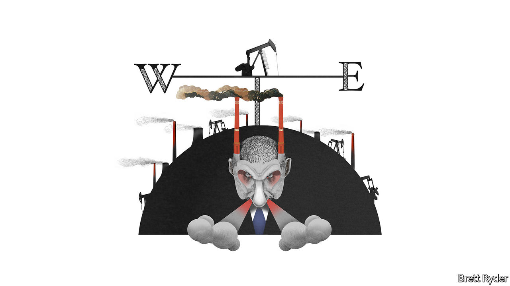

###### Schumpeter

# Watch Russia’s Rosneft to see the new direction of global petropolitics 

##### Oil’s new eastern bloc 

 

> Jul 14th 2022 

Igor sechin is easy to caricature. The boss of Rosneft, Russia’s state-owned oil giant, is a burly man with close-cropped hair whose pastime is making sausages, reputedly out of deer he himself has killed. He is one of President Vladimir Putin’s most trusted henchmen. Since 2014, when Russia annexed Crimea, he has been blacklisted by America and this year, after Russia’s invasion of Ukraine, the European Union put him on its sanctions list, too.

But he is no run-of-the-mill oligarch. The eu calls him “one of the most powerful members of the Russian political elite”. As a Rosneft man through and through, he has stood up strongly for the country’s oil-and-gas industry, which accounts for about 45% of the national budget. And he has a nose for geopolitics, which helps Rosneft shape and fund Mr Putin’s despotic adventurism. 

That is why it is worth watching state-controlled Rosneft and its boss to assess their response to the withdrawal of Western oil companies from Russia. On the one hand, the company faces reduced access to Western markets and has lost investment and expertise to help it develop oil- and gasfields in inhospitable parts of the country. On the other, it has benefited from a strategy masterminded long ago by Mr Sechin to pivot towards buoyant markets in China and India. The outcome will help determine whether the world is likely to split into two rival oil blocs. 

The West’s response to Russia’s assault on Ukraine has hit Rosneft hard. Though high oil prices enabled it to pay a record annual dividend recently, an oil embargo has throttled its access to European buyers. Since February it has borne the lion’s share of Russia’s drop in oil output. Firms that once cosied up to it now treat it as a pariah. bp, a supermajor, has written off its near-20% stake. ExxonMobil, another giant, is trying to pull out of the Sakhalin-1 oil-and-gas joint venture in Russia’s far east. Rosneft’s relationship with Western oil traders, who used to talk of a “pissing match” to win access to its treasure trove of crude shipments, has floundered. On July 13th a big trading firm, Trafigura, said it had unwound its 10% stake in Vostok Oil, a Rosneft megaproject in the tundra that Mr Sechin believes could sustain Russia for decades. 

Pariah status affects Rosneft in subtler ways, too. Many of Russia’s oilfields are ageing and require sophisticated techniques to squeeze out hard-to-recover crude at a reasonable cost. In the past the firm has had strong relationships with Western oilfield experts like Schlumberger, but these have pulled out of Russia. Moreover, sanctions have sent Rosneft’s non-Russian board members and senior executives scurrying for safety, leaving a dearth of expertise in their absence. 

Yet if anyone has seen this coming, it is Mr Sechin. Balancing Russia’s dependence on Western oil markets with business in the east, especially China, has been part of his strategy since Mr Putin first handed him control of Rosneft in 2004. From the outset, says James Henderson of the Oxford Institute for Energy Studies, a think-tank, Mr Sechin saw China’s commercial and strategic importance. He struck big oil-supply agreements with China National Petroleum Corporation (cnpc), Rosneft’s state-owned Chinese counterpart, in exchange for vast prepayments and financing from China that helped turn the Russian firm into one of the world’s largest listed oil companies. The payments helped Rosneft finance the takeover of the main oil-producing assets of Yukos, a Russian oil firm whose boss fell foul of Mr Putin in 2003, as well as tnk-bp, another rival Rosneft bought for $55bn in 2013. In February, during Mr Putin’s pre-war meeting with Xi Jinping, China’s president, Rosneft signed another oil deal to supply crude to cnpc worth a whopping $80bn over ten years. 

Mr Sechin’s India strategy has been quieter but also, as it turns out, shrewd. Rosneft used its part ownership of Nayara Energy, an Indian refiner, to gain a toehold in one of the world’s fastest growing consumer markets. Indian refiners processed heavy crudes that Rosneft once brokered from sanctions-hit Venezuela, a staunch Russian ally in America’s backyard. Now the refiners are reportedly keen to take discounted oil directly from Rosneft. 

After the initial blow from sanctions, such relationships have enabled Russia swiftly to shift its oil exports east, eclipsing Saudi Arabia in May as the biggest supplier to China and raising oil sales to India from almost nothing to about 1m barrels a day—albeit at steeply discounted prices. Its resilience has caught many forecasters, including the International Energy Agency, by surprise. 

Where there’s a well there’s a way

In order to keep its performance up, Rosneft has to keep pumping and drilling. Yet its need for Western firms like Schlumberger to help it do that may be overstated. Matthew Hale of Rystad Energy, a consultancy, says the vast majority of Russian oil development is in onshore fields that, despite the cold, are easy to exploit. Last year Russian oilfield companies provided four-fifths of the services needed to support these investments. He says the ability of Russian firms to replace Western partners in complex projects is more open to question. That may delay their launch. But for the time being, Rosneft can continue to produce oil fairly freely. 

It is not in the clear, though. If oil prices sink, its ability to drill wells profitably will be reduced. Constraints on Western capital, know-how and equipment may confound its attempts to develop big offshore liquefied-natural-gas projects in Russia’s frozen far east, which it had once set its heart upon. Without access to Western financing, it becomes even more dependent on China, which always strikes a hard bargain. And next year a full eu embargo on Russian oil will come into effect. 

That said, the emerging eastern bloc should worry the West. Not only is an energy axis involving Russia, China and India a challenge for Western oil firms, it is also a threat to the climate—as Mr Sechin’s plans to develop Vostok suggest. He probably doesn’t give a sausage for such considerations, though. ■


 


