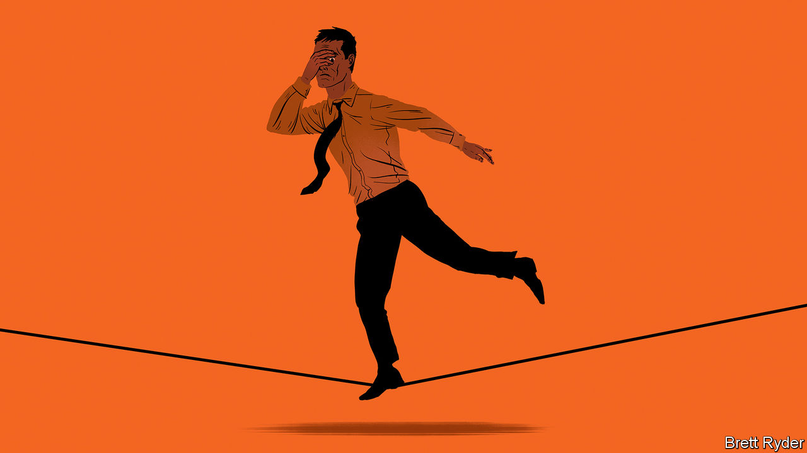

###### Bartleby

# Will the PowerPoint load? 

##### Small moments of excruciating tension 

 

> Jul 14th 2022 

The meeting has been going on for almost an hour already, but the end is now in sight. The vast majority of attendees have already got the cursor lined up over the “leave” button; freedom, or at least a five-minute break, is a click away. And then whoever is chairing asks a simple but terrible question: “Does anyone have anything they want to add?” 

Cue almost unendurable suspense. If the chairman’s voice is the next you hear, it’s all over bar the ritual waving at the camera. But if any of your other treasured colleagues speak up, your plan for a nice cup of tea is destroyed. The silence stretches for a period of seconds. Almost safe. “There is just one thing,” says Lauren from procurement, oblivious to the tiny dreams she has dashed and the fleeting hatred she has aroused. 

For most people, the workplace is not a stage for high drama. Careers are punctuated by only a few defining moments, from the interview for the top job to the m&amp;a deal that upends an industry. Although some companies and departments are marked by bullying and burnout, more fortunate employees experience suspense through a series of micro-dramas. Some small moments of great tension happen often enough that they are almost tropes. 

The pandemic has created many of these moments. A big Zoom call is under way, with lots of people on the line. Everyone is muted, save the speaker and one unfortunate soul, who has managed to unmute themselves. A lot of rustling can be heard. A family conversation is going on, a small slice of domestic life being broadcast inadvertently into the workplace. It’s almost too much bear. What if they have a blazing row? What if someone says out loud what everyone is thinking about the speaker? The horror of mild public embarrassment looms, and it is stomach-churning. “Jesus, this is unbearable,” you say to yourself, and realise you are also unmuted. 

Email can also evoke emotion. There is panic, after you send a message to the wrong person and frantically scramble to hit “undo” or “delete”. There is dread, when an email arrives from the person who is reliably wrong about everything and you know that opening it will mean conflict and wasted time. And there is mortification on behalf of other people, when an all-staff missive from the chief executive goes out about a new initiative and someone hits “reply all” on their message oleaginously congratulating the boss on their utter brilliance. 

Presenting is a low-stakes, high-tension act. “I’m going to share my screen,” you say, and press the button that promises just that. The presenting icon circles and circles, and you wonder if it will ever stop. Then you pick the wrong tab to share and everyone can see your calendar, including the entries marked “Job interview”. Then you share your whole screen and suddenly infinite, ever-smaller versions of yourself appear. It is a similar story in the real world. The clicker doesn’t work, so you hopefully press it a few times and the deck suddenly jumps forward to the slide that gives away your unexpected strategy recommendation. 

The offline world offers other moments of diminutive drama. Entering and exiting meetings while they are still going on is stressless in a virtual environment; in the real world, you have to negotiate your way past colleagues and whisper apologies. 

The working lunch is not a problem online: camera off, microphone off, nosh away. In person you must choose items that can be eaten quickly, efficiently and silently. Eating crisps during an in-person presentation sounds like setting off a firework display in a monastery. Taking a bite of some sandwiches risks a carnivorous version of the magician’s handkerchief trick, as you find yourself slowly pulling an entire side of beef into your mouth in one go. 

If you do not recognise any of these miniature dramas, one possible explanation is that you are already the boss: life is generally a lot less tense if you have ludicrous amounts of self-belief and get to set the rules. But for many employees, as well as almost everyone in Britain, this is what suspense looks like, not remotely dangerous but teeming with the possibility of awkwardness. 

If you and someone else have started making a point at the same time, do you keep going and hope that he gives way? What conversation can you start and finish in the time it takes for the lift to go five floors? And so on. The workplace can be a place of planet-changing ideas and epic rivalries. Day by day, it is a theatre of mild agitation. ■


