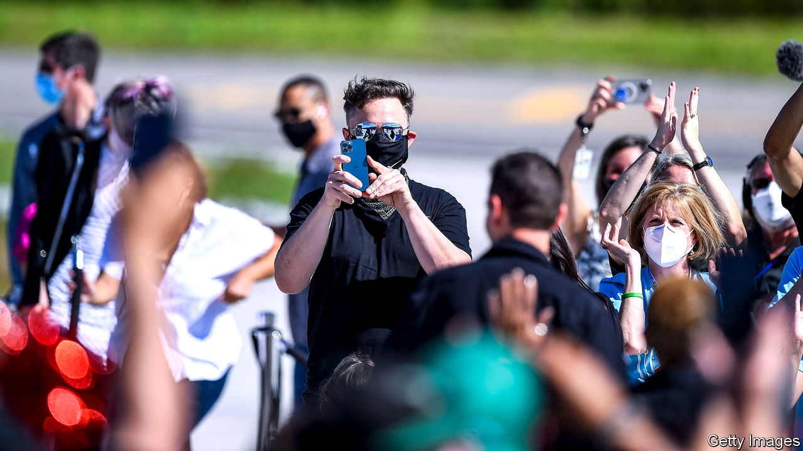
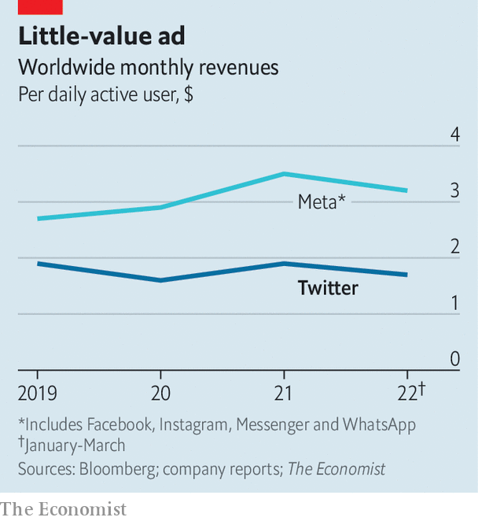

###### Blocked and reported

# With or without Elon Musk, Twitter is overdue a shake-up 

##### Behind a stagnation in users lies a stagnating product 

 

> Jul 11th 2022 

Elon musk’s acquisition of Twitter was to be one of the biggest buy-outs in corporate history. Now it threatens to become one of the ugliest disputes. On July 12th Twitter sued Mr Musk in a Delaware court for pulling out of the $44bn deal, as the world’s richest man—and holder of Twitter’s sixth-most-followed account—took to the internet to engage in battle by meme.

The argument may play out over months. But whoever prevails in court, Twitter has bigger problems to reckon with. Though it is one of the world’s most talked-about social networks, it has struggled to turn that clout into a successful business. Whoever ends up owning the app will press its managers for change.

When the sale was agreed in April, Mr Musk’s offer of $54.20 per share looked cheap—including to Twitter’s board, which at first wasn’t interested. No sooner had the deal been struck than tech markets crashed. On July 11th Twitter shares were trading at under $33, having shed another 11% in value as investors lost hope that the deal would happen (the share price has rebounded a bit since). Mr Musk claims to be pulling out because Twitter has more spam accounts than it told him. Many detect a simple case of .

For that reason Twitter probably has the upper hand in court. If the judge takes its side, Mr Musk faces a break-up fee of $1bn, as specified in the contract. He may consider that a victory. The judge could go as far as ordering the sale to go ahead at the agreed price; in 2001 the same Delaware court ordered Tyson Foods (a firm dealing in real rather than digital bird) to complete its purchase of ibp, a beefpacker. That deal, though, was worth less than a tenth as much as the Twitter purchase. And no one is sure what would happen if the mercurial Mr Musk simply defied an order to complete the acquisition. The dispute may yet be settled out of court, with Mr Musk paying a higher break-up fee or buying the company for less than the price he agreed.

However the saga ends, Twitter’s bosses will face the same puzzle they have contended with for years: how to turn their influential product into a more profitable one (see chart). Part of the problem is a failure to attract new users—and not of the bot variety against which Mr Musk has railed. While Facebook, founded just two years before Twitter, has soared to 1.9bn daily users, Twitter has reached 230m and is growing only slowly. Upstarts, , have lapped it. 

 


Behind that stagnation in users lies a stagnating product. Whereas Facebook and other social apps have evolved, Twitter today is a similar experience to when it launched in 2006. It had a chance to innovate when it bought Vine, an app which popularised short video four years before any TikTokers showed off their dance moves, but allowed it to wither. It tried to copy Snapchat’s and Instagram’s disappearing posts with “Fleets”, but the idea flopped and was killed off last year.

Lately Twitter has been bolder, with some success. “Spaces”, a live-audio feature, has proved popular enough to largely kill off Clubhouse, the app that inspired it. It has devised features to retain star creators, like tipping and pay-to-follow accounts. And it has pushed into longer-form content with the purchase last year of Revue, a Substack-esque paid-newsletter platform, and the launch in June of Notes, a way to write tweets of up to 2,500 words.

Monetising these and other innovations may prove harder. Over the years Twitter’s revenue growth has been even more disappointing than its growth in users. This year it will account for about 0.9% of worldwide digital-ad spending, estimates eMarketer, a research firm. Facebook and its sister company, Instagram, will grab 21.5%; even TikTok, just five years old, will take a slice worth 1.9%.

A weakening ad market has sent social-media firms scrambling to diversify their revenue; nearly 90% of Twitter’s comes from advertising. Twitter Blue, a subscription option launched last year, offers modest benefits including an “undo tweet” button for $2.99 a month. Mr Musk had wanted to push subscriptions, tweeting in April that Twitter Blue should be ad-free. Yet an ad-free Twitter would have to cost much more than $2.99 if it were to match the current model. Twitter’s accounts suggest that American users each bring in over $6 a month in ad revenue, on average. And unlike other subscription businesses which can eschew mass audiences in favour of small, high-paying ones, Twitter needs lots of users to produce its buzzy content.

Private ownership by a famous risk-taker looked for a while as if it might enable the kind of shake-up that Twitter needs. Instead the Musk affair looks like another distraction from the task at hand. ■


