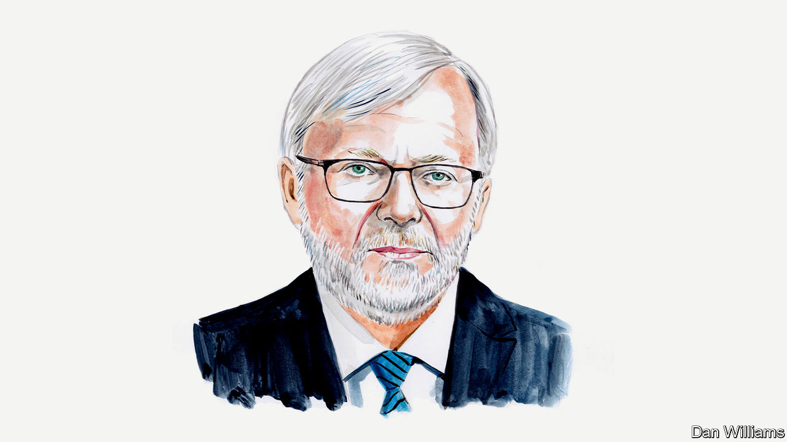

###### Japan

# Abe Shinzo was the most important Japanese leader in the past 50 years, says Kevin Rudd 

##### The former Australian prime minister considers Abe’s international achievements 

 

> Jul 11th 2022 

In the past 50 years, three Japanese leaders have become global leaders in their own right: Nakasone Yasuhiro (in office from 1982-87); Koizumi Junichiro (from 2001-06) and Abe Shinzo (from 2006-07 and 2012-20). Of these, history will view Abe as the most consequential. He transformed Japan’s post-war political identity, foreign policy role and strategic mission. Nowhere has this been more evident than in Abe’s response to the rise of China, whose challenge arguably became the organising principle of his prime ministership.

Abe led the creation of the concept of a “free and open Indo-Pacific”, subsequently adopted as the mantra of both the Trump and Biden administrations. It became a pan-regional vision in support of open societies, open polities and open economies. It was also a strategic alternative to China’s Belt and Road Initiative (bri) and its periodic recourse to coercive economic diplomacy against those who earned Beijing’s wrath.

He also championed the Trans-Pacific Partnership (tpp), a high-quality trade agreement linking America, Japan and ten other significant regional market economies. This was a remarkable feat given Japan’s protectionist tradition. After Donald Trump’s repudiation of the tpp—among the most stupid decisions ever made by any American administration—Abe kept the vision alive by pushing for what would become the cptpp with the eleven remaining members of the group (while leaving the door open to Washington, should it kick its sudden proclivity for protectionism).

Acutely conscious of the bri’s economic lure not just across Asia but across the wider developing world, Abe launched a Japanese partnership with the Asian Development Bank for some $110bn in 2015. Its projects took account of sustainability, transparency and debt capacity, in contrast with the problems of the bri.

Abe’s greatest mark, however, lies in his transformation of Japanese security policy. He managed it despite deep domestic and international reservations arising from Japan’s appalling history of militarism between 1895 and 1945. Abe made changes on three levels. First, he adopted Japan’s inaugural national security strategy and established the national security council, national security adviser and secretariat in 2013. He enhanced co-ordination among the three services of Japan’s Self-Defence Force and centralised policymaking in the Prime Minister’s Office. These changes finally brought about a fully centralised political and policy leadership to Japan’s hitherto fragmented national-security establishment.

The second change came through Abe’s ambitious “peace and security legislation” of 2015-16. It provided the legal foundation for his cabinet’s earlier reinterpretation of the constitution’s Article 9— the so-called “peace clause”— to exercise the right of collective self-defence under defined conditions. The third big change was to abandon Japan’s post-1976 convention of limiting defence spending to 1% of gdp. In May, he called for a doubling to 2% over the next five years, making it comparable to nato states.

In wider foreign policy, Abe’s signal achievement was the Quadrilateral Security Dialogue with the US, India and Australia. The Quad Mark I, which he advocated from 2006, failed to secure sustained support from either the Bush, Singh or Howard administrations before being abandoned by his successor Fukuda Yasuo. Undaunted, Abe resuscitated the Quad in 2017 and 2018 and its foreign ministers met in 2019. President Biden then elevated it to summit level in 2021 (ironically after Abe had left office). Abe also sought normalisation with the Republic of Korea over the appalling treatment of Korean “comfort women” during the war. He signed an agreement on the issue with the Park administration in 2015, which was then later rejected by the Moon administration. But Korea’s new president Yoon Suk-yeol has instead responded to the call for better relations.

Abe’s overarching strategy—adopted in part by the Biden administration—has been to change China’s international operating environment through a series of integrated economic, trade, development, foreign and security policy measures. He was not, however, a unilinear politician. Doubting Mr Trump’s long-term commitment to America’s allies, Abe reached out to Europe, India and Australia to help hold the democratic world together. In the same vein, in 2018 and 2019, he sought unsuccessfully to de-escalate tensions with China. Japan remains essential to America’s strategy for dealing with China.

Abe’s domestic agenda may have been less effective than his international one. Despite a decade of “Abenomics,” designed to make the Japanese economy more competitive, there is much less evidence of success. The same can be said of Abe’s efforts to smash the barriers to women’s equal participation in Japan’s shrinking workforce. Even so, Japan is still the world’s third-biggest economy.

Abe was a remarkable politician by the standards of any political culture. He was also controversial. His visits to the Yasukuni Shrine, a temple enshrining the spirits of 14 high-ranking war criminals, were one reason why. Abe didn’t rely on luck; he moved the dial through force of personality, political will, policy creativity and through an ability to drive Japan’s bureaucratic and political system away from its traditional homing grounds of inertia and entropy. Abe didn’t believe in hoarding political capital; he believed in using it.

I remember moderating a public discussion between Abe and Vladimir Putin in Vladivostok in 2016. Abe used every power of persuasion to induce “my good friend Vladimir” to agree to return Japan’s northern territories to Tokyo’s sovereignty. Mr Putin’s response, a very cold “”, was unsurprising. But I was surprised that a Japanese leader was prepared to risk losing public face by making such a public appeal. He may have failed on that occasion, but nobody could accuse Abe of being faint of heart. On that measure alone, he was a worthy adversary of Xi Jinping. The Chinese may not have liked Abe, but they respected him. And the world is a lesser place now that he has become the senseless victim of an assassin’s bullet. ■

_______________


