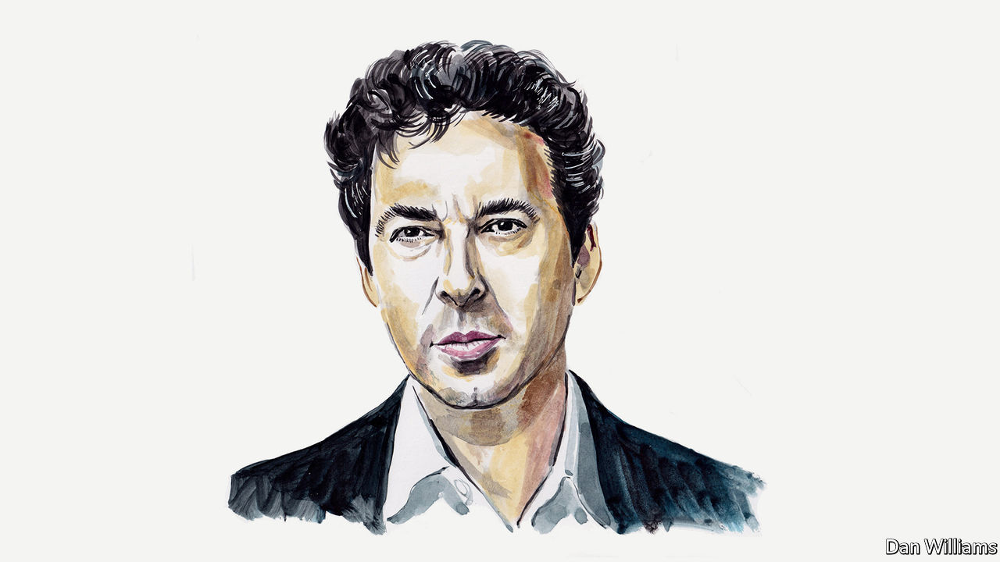

###### Education in America

# Banning critical race theory in schools is unjustified, argues Jason Stanley 

##### It will result in the botched teaching of America’s history according to the philosophy professor 

 

> Jul 14th 2022 

In america in the past two years a media campaign has incited a moral panic about public schools. Its advocates, from journalists such as Christopher Rufo and Tucker Carlson, to politicians including Virginia’s Governor Glenn Youngkin and Florida’s Governor Ron DeSantis, maintain that public schools impose leftist indoctrination on children. It has been funded and promoted by organisations associated with free-market solutions to social and political problems, such as the Manhattan Institute. Its proponents began in 2020 by accusing public schools of indoctrinating students in “critical race theory” (crt). Following Poland, Russia, Hungary, Brazil and other backsliding democracies, the campaign has now shifted its focus to “gender ideology”. These attacks have turned public schools and the communities that depend on them into proverbial war zones. 

Pioneered by the academics Kimberlé Crenshaw and Derrick Bell in the late 1970s, crt is an approach to understanding enduring gaps in America between black and white Americans, for example in wealth, housing, incarceration and education. crt’s basis lies in the fact that America’s institutions were designed initially by those who sought to preserve their own status and power. They did so in part by maintaining racial hierarchies that favoured white Americans. 

crt holds that while attitudes may have changed, the racist practices and institutions left behind persist (for example, in residential housing segregation). The political will to implement the massive structural change—in education, law, finance, etc—has not yet emerged. crt recognises two main reasons why. First, as the journalist David French has noted, “[t]ime and again, there are non-racist reasons for wanting to maintain the structures racists created.” Second, the forces that zealously protect these structures as a way of preserving wealth and power remain influential in American life. 

Against a background of stark racial inequality, crt shows that practices that are ostensibly neutral or meritocratic can function instead to reinforce disparities. Take public schools. In America these are funded to a large degree by local taxes. Because of racial segregation, many black Americans are caught in under-resourced schools, which leave them at a temporary educational disadvantage. This harms them in meritocratic “race-blind” admissions processes at some universities.

Is crt taught in schools? The theory is born of America’s history. Any accurate American-history course must cover the Jim Crow regime and how it employed superficially race-blind practices (such as “literacy tests”) to purge the voter rolls of black voters. Mass purging of voter rolls continues to be employed in various forms today for the same purpose. In other words, the tactics that underpin voter suppression, as the historian Carol Anderson has documented, are an ongoing legacy of America’s racist past. This is just one of many examples. If American history is being accurately taught, so is much of the basis of crt.

crt as a theory, however, is not being taught in schools, nor are its proposed solutions to enduring racial inequalities. At most, public schools require students to learn facts, rather than theoretical analysis or prescriptions about policy. Though the facts of American history do, indeed, make a powerful case for crt, learning such facts is not in any sense indoctrination.

According to a tracker run by Education Week, an online publication, since January 2021, 42 states “have introduced bills or taken other steps that would restrict teaching [crt] or limit how teachers can discuss racism and sexism”, and 17 states have “imposed these bans or restrictions”. Bans now exist in Florida, Texas and Tennessee, for example. Politicians threaten to remove public funding for school districts caught in violation. 

These laws are purposefully vague. They are easily interpreted as banning the teaching of the history that provides the basis of crt’s insights. If one bans this history, there will be even less support for needed structural changes to address inequality, including changes that would benefit all Americans (eg commitment to a strong nationwide system of free public schools and easily affordable first-class public universities).

The use of race to marshal white American opposition to programmes that benefit them as well is part of American history. Starting in the 1970s, the Republican “southern strategy” seeded among white Americans the idea that the benefits of greater taxes flow mainly to black Americans. By repeatedly associating the term “welfare” with a narrative of black criminality and laziness in political speeches, debates and right-wing media, Republicans were able to transform the word “welfare” into a political weapon. They could aim it at any policy against which they wanted to rally opposition. 

The basis of the anti-crt campaign is the discovery, sometimes credited to the American journalist Christopher Rufo, that the very expression “critical race theory” can be used, like “welfare”, as a political weapon. The three words tap into a long-standing racist narrative: that the struggle for black equality is really an attempt, masterminded by leftist intellectuals (historically identified as Jewish) to grab power by replacing the culture and political power of white Americans. The crt panic awakens a primordial fear that the dominant group will be “replaced”, culturally or otherwise, by minorities and their allies. It has been recognised as doing so by right-wing extremists and by Tucker Carlson, the talk-show host. Social-media campaigns repeatedly associate crt with absurd misrepresentations of its core tenets (such as its criticisms of neutrality and meritocracy) and then accuse public schools of crt indoctrination.

More recently, the attack on public schools has shifted to a new strategy. In 2013 Vladimir Putin’s Russia passed a “Gay Propaganda Law” banning the teaching of “non-traditional” relationships to minors. Whereas earlier the campaign claimed that public schools were awash with crt, it now targets “gender ideology” more specifically. The campaign suggests that the goal of inclusive and equitable gender pedagogy is not equality, but lgbt domination that usurps (and replaces) traditional gender roles. This is a process Mr Rufo has blamed for the sexualized grooming of children.

What are the ultimate goals of this campaign? Is it, as it, as proponents claim, to free public institutions from what they claim is leftist indoctrination? Or is it something else? The Republican “southern strategy” was designed to marshal broad support for lower taxes on wealthy Americans. One goal of the campaign against crt and “gender ideology” seems to be, in a similar way, to marshal broader support for defunding the public school system, which taxes fund. The campaign also involves a significant amount of projection, as a second goal is to introduce right-wing indoctrination into schools. Finally, and perhaps most significantly, both crt and gender theory expose the methods by which those who have traditionally been in positions of cultural, political and economic power preserve their influence over time. That, too, is why they are targets. ■

_______________


