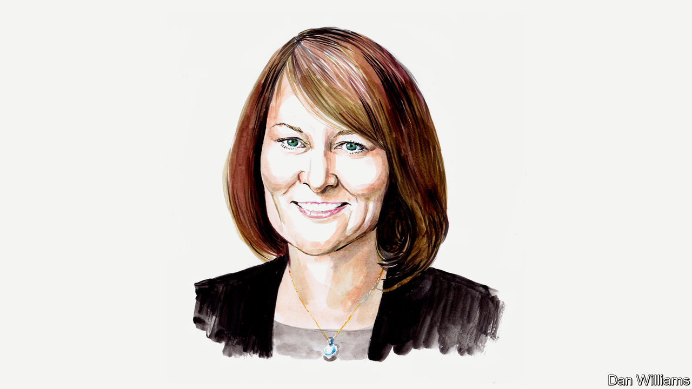

###### Education in America

# Critical race theory is appropriate in universities, but not schools, says Bonnie Kerrigan Snyder 

##### Pupils should grasp the basics of subjects before critiquing them, believes the free-speech advocate 

 

> Jul 14th 2022 

I studied for a doctorate in English literature in the early 1990s–when literary “theory” had taken root in academia–and found myself marinated in critical feminist theory. The recipe was simple: review every book through the lens of womanhood. Was the book written by a man? If so, attack it on those grounds, and be extra critical of the author’s portrayals of women. If it was written by a woman, extol its merit on those grounds, regardless of whether it is worthwhile. This was the simple means to success. Professors and students alike became cynical automatons, obediently parroting expected opinions.

Now such arcane theories have trickled down, in various forms, into the curriculum for children aged between 5 (in kindergarten), and 18 (in grade 12). For instance, in the past 18 months, according to news reports, 4-year-olds in Washington, DC were asked to identify the racist members of their own families and a public charter school in California sent a newsletter to parents disparaging “colourblindness” (the failure to notice others’ differing skin colour) among young children . 

When I conceive of critical race theory (“crt”, or, in the broader sense, “critical theory”), I think of an academic analysis based on the identification of oppressors and victims, with Marxist methods posited as remedies. These include redistributing resources from one group to another, positioning identity groups against each other, and incentivising activism, sometimes in place of schoolwork. Frustration over such instruction in American schools has resulted in political efforts to enact bans on crt in more than half of the states. 

Both lawmakers and parents object to the labelling and shaming of children based on their skin colour (an inversion of Martin Luther King’s aspirational appeal to judge people on their character rather than the colour of their skin) and their supposed “privilege”. Some teachers have excluded students of specific racial backgrounds from school activities, in violation of anti-discrimination laws. In one instance, in Atlanta, an elementary-school teacher even planned to organise her classes by racial group; a mother filed a federal complaint against the school last year. Children are taught to apply a “critical” lens to a history and literature to which they have barely been introduced. In one school district in North Carolina, first-grade pupils (aged 6-7) were taught about the racially problematic aspects of holidays such as Thanksgiving and Independence Day just before they celebrated them with their families. 

The core intellectual task of crt is to search for, identify and denounce racism wherever it can be found—in the curriculum, in society and in ourselves. Every work of literature and every historical event is to be analysed through the same prism, and the conclusion is always foregone—pupils must simply work backwards from it. The question is not, “Is racism present?” but rather, “How did racism manifest in this particular situation?” It is as if pupils have been given the answer grid for every test they will ever take. 

While most states have attempted to limit crt and associated concepts in their school curricula, 17 have expanded education on racism, bias and ethnicity according to Chalkbeat, a news outlet focussed on education. Schooling thus encumbered by ideological orthodoxy becomes a dull rote exercise in unquestioning genuflection—inadequate for fostering the sort of independent thought needed for the proper education of citizens capable of self-government in a free country. These are secular—not Sunday—schools. Dissent must be allowed, particularly in a country with protections for freedom of expression under the First Amendment. 

Even physics and mathematics are not exempt from the crt lens. Last year more than 1,000 professionals from related fields signed a letter arguing against a “social justice” framework that was emerging in maths teaching in California: school districts were discouraged from running advanced classes for the most talented pupils, for example. Some districts have been quite open about embedding the central tenets of crt throughout their entire curriculums.

At the graduate level critical theories are ponderous, esoteric and a bit dispiriting. In schools, they are utterly misplaced. They are most meaningfully applied by advanced students already well grounded in their respective disciplines. Among those still getting to grips with a subject, they are more likely to end discussions. The younger the student, the more impressionable they are likely to be. A balanced approach—mindful of competing perspectives and the developmental readiness of students—is both pedagogically appropriate and in line with educators’ professional and ethical guidelines of such bodies as the National Education Association, which advocates for public schools. 

Criticism has its place, but in the end it is merely an opinion or interpretation of something else. It can’t replace direct encounters with academic content, or efforts to reach personal conclusions. A review of a film isn’t the same as seeing it yourself and reaching your own conclusion about its merits. Tendentious pedagogy turns pupils into the means to a desired political end, and inclines them to predetermined conclusions, bypassing free thought. Too often and too easily, students learn to express opinions they believe will win them approval from the teachers who assign their grades. Ventriloquism isn’t free speech. Meanwhile, those nurturing opposing views frequently learn to remain silent. A recent survey shows that nearly half of American high-school students are uncomfortable disagreeing with their teachers in class. 

In school, broad condemnations of society for its shortcomings risk harming both those designated as oppressor and oppressed. To one we assign unremitting blame and to the other perpetual victimhood. Both deprive young people of their personal agency. To get a reliable account of the value—intended or unintended—of critical theories, ethnic studies, culturally responsive pedagogy and related teaching innovations, we need rigorous academic inquiry that is subject to equally rigorous attempts at disconfirmation. Unfortunately, many scholars are reluctant to voice an unapproved opinion or pursue an unpopular line of inquiry.

There is plenty of time for cynicism, and appropriate criticism, as pupils mature, fill in their knowledge gaps and develop nuanced, intelligent worldviews. Let’s not unduly burden them with adult preoccupations at the outset of their lives, which are not in line with their appropriate developmental and emotional needs. The world already has plenty of critics, and not nearly as many people capable of building something worthy of thoughtful critique. ■

_______________


