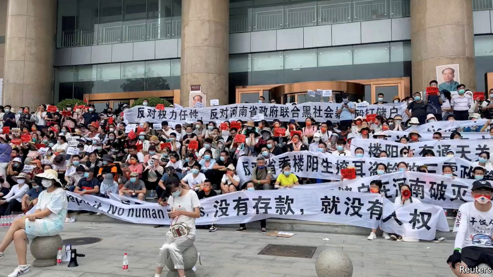

###### Send in the thugs

# A violent response to protests in China’s Henan province 

##### Thousands of people lost access to their savings. Then bullies beat them up 

 

> Jul 14th 2022 

Though he lives in Beijing, Guo Jiang deposited 1m yuan ($150,000) in a tiny bank in Henan province, nearly 700km away, earlier this year. It seemed a good idea at the time. The bank promised higher interest rates than its competitors. He found it using a service provided by Baidu, a reputable online-search giant. Since bank deposits are guaranteed, there appeared to be little to worry about. But Mr Guo has spent the past few months trying to recover his money.

The bank that Mr Guo trusted with his savings, Yuzhou New People’s Life Village Bank, is among several in Henan caught up in one of the biggest financial scandals in Chinese history. Some 400,000 people have been unable to access 40bn yuan in deposits. A property developer who controlled the banks reportedly misused the funds, then disappeared. 

By late May hundreds of depositors had descended on Zhengzhou, the provincial capital, to demand the return of their savings. Mr Guo, making a second trip, arrived on July 8th, ready for a fight. Still, he was stunned by the violence that occurred two days later. Thugs in white shirts charged into the crowds and beat protesters. Videos of bloodied and injured people spread on Chinese social media faster than state censors could delete them. 

Protests are not uncommon in China, but its vast domestic-security apparatus tends to keep them small and brief. Officials in Henan, though, have struggled to end the demonstrations in Zhengzhou. Last month they were accused of manipulating the local covid-control app in a way that forced protesters to quarantine—a move that was widely condemned. After the violence on July 10th, many of the protesters were detained. Mr Guo, who cares for his son and father, was shaken. “I believe what happened today is just the beginning,” he says.

The provincial government’s ham-fisted response is in part a reflection of its own lack of cash. For weeks it rejected the most obvious solution to the crisis: compensating depositors. (Baidu’s finance arm, Duxiaoman, told depositors that it is merely an intermediary and therefore not responsible.) Not until July 12th did officials offer a partial solution: repaying deposits of up to 50,000 yuan. People with larger deposits (many are seeking to recover millions) will be dealt with later.

Regulators have been waging war against the riskiest practices in the financial system for years, with much success. The shadow-banking industry, featuring off-balance-sheet loans to questionable firms, has been forced into retreat. Peer-to-peer lending has almost vanished. But the run on Henan’s banks highlights enduring problems which have been brought to the surface by a slowing economy.

Small banks in China hold about 16% of total assets in the commercial-banking system. Yet they are poorly supervised. Research suggests that about 87% of China’s more than 1,400 rural commercial banks are privately owned. Many firms have large stakes in them and are able to access deposits for their own use. This seems to have been the case in Henan. The property tycoon who controlled four of the troubled banks appears, in effect, to have been raising funds for his company illegally.

Online services have connected small banks to depositors across the country. Now trouble among just a fraction of them can cause widespread problems. One fear is that the news in Henan triggers a broader run on already weak institutions. Such a scenario is possible, says Betty Wang of anz, an Australian bank—though she notes that finding branches of bigger banks in the countryside can be difficult. 

As for Mr Guo, he left Zhengzhou empty-handed. He expects to receive some compensation eventually. But a full redemption of his deposit is unlikely. ■

