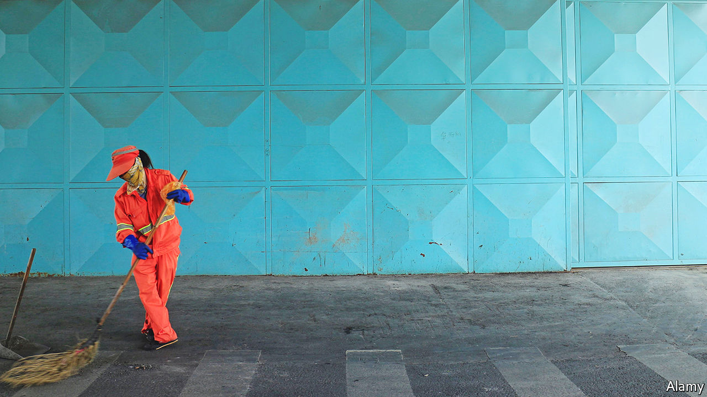

###### Title towns

# How “civilised” are China’s model cities? 

##### Clean toilets are good. Less crime would be better 

 

> Jul 14th 2022 

Any number of things might bring a city down. For Tangshan it was the brutal assault on several women last month. For Guangzhou it was the destruction of ancient banyan trees. When a company in Changchun produced dud vaccines, the city suffered, too. All three were thrown off the government’s list of “civilised” cities in recent years. 

The Communist Party has been trying to make cities more civilised since the 1980s, when officials began to worry that market reforms and economic growth might cause moral and social decay. For years undercover inspectors have thus graded cities on dozens of measures. For one to be deemed civilised, streets must be spotless and traffic orderly. Residents should exercise, donate blood and support “acts of justice”. 

Perhaps the top requirement is that a city do nothing to embarrass the party. It is therefore not exceedingly hard to make the cut; around 280 cities, districts and towns are currently considered civilised. Still, the label is worth a great deal to local officials. Many think it helps attract investment and tourists. More important, at least for officials, is that those who run cities that win the designation stand a better chance of being promoted. 

But while civilised cities may be greener and cleaner, the label can paper over big problems. Take Tangshan. Inspectors concluded that at least 85% of residents “felt safe” and 90% were “satisfied with the government” (both benchmarks for civilised status). Yet following the assault last month hundreds of residents queued outside police stations to report gang-related crimes and police misconduct. Some eventually retracted their complaints, to avoid “damaging the city’s image”, as one shop-owner put it.

The party does not like it when officials waste time and resources. But the civilised label is creating bad incentives. In one city red banners were strung across buildings telling citizens to improve their “quality”. Officials in another sent a “commando team” of workers to “promote civilisation by picking up cigarette butts”. Signs above public urinals often urge users to stand closer to avoid a mess: “One small step forward is a big step for civilisation!”

Residents of cities like Tangshan would prefer that their officials focus on bigger problems first. Then they can worry about cigarette butts.

