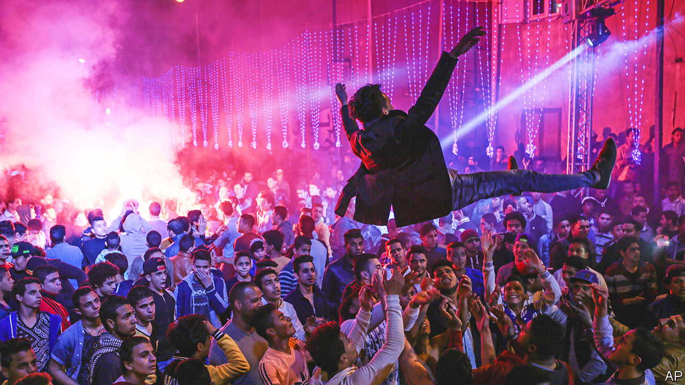

###### From El-Salam to the world

# Egypt’s authorities want to crack down on mahraganat 

##### But the working-class music will not be stifled 

 

> Jul 14th 2022 

As they navigate the narrow streets of Cairo, tuk-tuk drivers blast  from their speakers. The music’s sound is distinctive: the Egyptian (tambourine) and (drum) are combined with electronic beats, and performers both sing and rap. For a while —meaning “festivals”—was enjoyed mainly by the working classes and tolerated by the authorities. Now that it is more widely popular, officials are trying to silence it.

was born in El-Salam city, a down-at-heel outer suburb in eastern Cairo, in the late 2000s. Performers reflected on everyday experiences, ranging from lost slippers to rising unemployment and police brutality. “These lyrics are important because they give a voice to the voiceless,” says an Egyptian anthropologist who, tellingly, does not want to be named. The songs, she says, are “a loud cry from an invisible part of Egypt”.

Often the music was produced locally, distributed on usb sticks and played at weddings. But  quickly spread beyond El-Salam and became the sound of working-class Egypt. Some in the country’s elite thought this elevation of ordinary life was in poor taste. The songs were rarely played on the radio; performers were not invited to appear on television. 

Yet as a genre that documented society’s ills as well as being catchy, found new fans during the Arab spring of 2011. The beats could be heard on university campuses, in hotel lobbies and blasting out of cars. The clampdown on the music intensified after Abdel-Fattah al-Sisi came to power in a coup in 2013. The Egyptian Musicians’ Syndicate, a state-affiliated organisation that aims to cultivate national taste, decided was “vulgar”. In fact, it was subversive. “If you want to forget those who oppress you,” one song advises, “smoke weed.”

Sara Ramadan of the Association for Freedom of Thought and Expression, a human-rights group, says that under Mr Sisi artists have been “encouraged to present an optimistic image of Egypt, and avoid reference to the military and police. The syndicate began enforcing this vision by restricting these artists.” musicians began to be fined for performing without a licence issued by the syndicate. After “Bent el-Geran”, a song that mentions drugs and alcohol, went viral in 2020, they were even banned from playing in private venues. Later the syndicate stipulated that some performers had to apply for new licences every year.

In 2021 at least 19 musicians lost their licences or were unable to get them, in what seemed a bid to throttle their careers. The syndicate, which did not respond to requests for comment, also asked YouTube to remove some content (the videos are still up). Among the targets of the bureaucracy was Hamo Bika, the singer whose lyrics recommended marijuana. Refused a licence more than once, he has been castigated for the perceived crassness of his music, his failure to pass a classical vocal test and inability to file the right paperwork. In March he and Omar Kamal, a fellow singer, were given fines and suspended sentences for “violating family values” in a clip they posted of a belly-dancer grooving along with them. 

The restrictions reflect the increasing stifling of artistic freedom in Egypt—but so far they have been ineffective. In a digital age it is hard to silence entire genres. Mr Bika’s videos have millions of views on YouTube. “Moon Knight”, a recent Marvel series partly set in Egypt, included a song called “El Melouk” in an early episode. In April that track appeared at number 15 on s world-music digital-sales chart; overseas, it is now the top Egyptian song on Spotify, almost 90% of streams coming from outside the country. 

More may follow where “El Melouk” has led. Reservoir Media, a music company based in New York, hopes will take off among Western listeners as , a dance genre popular in Latin America, did in the late 2010s. It has signed a deal with Mohamed Ramadan, an actor and singer, bought an Egyptian label and hopes to cultivate new talent from the region. “Our interest is in new music that is culturally relevant,” says Golnar Khosrowshahi, Reservoir’s boss. “And this fits the bill.”

Conservatives lament all this, fearing foreigners will think  represents Egypt’s tastes. It may soon be a big cultural export whether the authorities like it or not. After “El Melouk” made the charts, one of the musicians posted the list on social media, adding his own caption: “From El-Salam to the world.” ■

