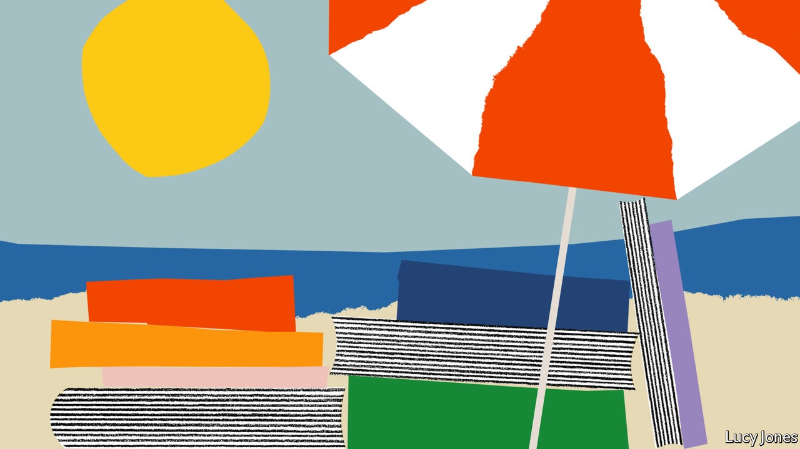
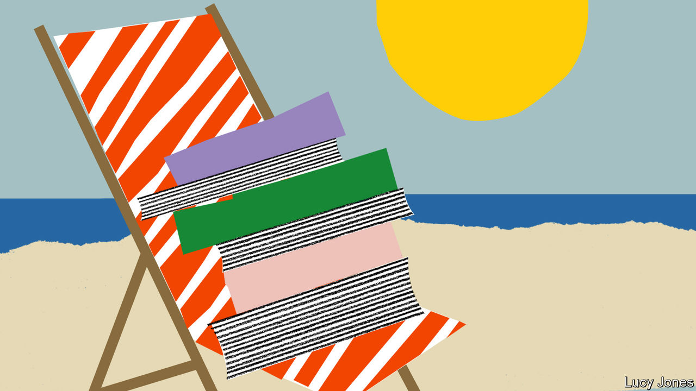

###### Our summer reading lists

# Our correspondents recommend the best books on their beats 

##### For our full shelf of reading lists, go to economist.com/economist-reads 

 

> Jul 14th 2022 

Biography

. By Suetonius. Translated by Robert Graves. 

An extraordinary series of portraits of the men who, in their time, were the most powerful in the world. Among the palace coups and military campaigns come sudden, arresting personal details: it is impossible to forget Tiberius rubbing a man’s face with a crab, or Augustus’s demands that things should be done “quicker than boiled asparagus”.

. By James Joyce. 

This is autobiography as great literature, delivered in a voice that is at first a child’s, then a boy’s, then that of the young poet determined to live by “silence, exile and cunning”. Though the author wears the alias of Stephen Dedalus, there is never much doubt that this is his own tortured youth in Dublin. A supreme description of the alternating beauties and horrors of orthodox Catholicism to a teenage mind.

. By Dylan Thomas. 

A riposte to Joyce, and again biography as literature, this time in the rampaging voice that sounds through the author’s poems and in “Under Milk Wood”. The book tracks the life and adventures of an unruly cub reporter roaming the streets of Swansea, learning how to drink, smoke and womanise. Life is remembered through the transcending eye of the poet, perhaps the truest lens of all. 

. By John Aubrey. 

A collection that includes many of the most prominent figures of a fascinating age: Francis Bacon, Robert Hooke, Edmund Halley, John Milton. It feels like the work of an antiquarian in a dressing gown, fishing up from memory snippets of past conversations, sightings and gossip. The mini-biographies are a chaotic mixture of achievements, very often in the sciences, with vivid glimpses of oddness.

Financial crime

 By Nicholas Shaxson. 

Now more than a decade old, this is still the best introduction to the world of tax havens. The book is particularly good on Britain’s “second empire”: its network of overseas territories, from Jersey to the Cayman Islands, the growth of which was driven by moneymen looking to create a tax- and regulation-free “elsewhere”.

By J.C. Sharman. 

The book to turn to for the lowdown on “grand corruption”: the theft of national wealth by kleptocratic leaders and their cronies, often in poor (albeit resource-rich) countries. Why, the author asks, is it so difficult to hold kleptocrats accountable? A big part of the problem is that financial crime straddles borders and recovering assets requires international co-operation that is still largely absent.

By Oliver Bullough. 

As well as being the centre of a global offshore web, Britain is itself a giant financial laundromat. After the second world war, as its empire dwindled, the country decided to carve out a new role as a home for footloose international capital, this book argues. Nowhere else offers a comparable array of enablers, from banks and lawyers to public-relations firms and other “reputation managers”. 

 By Tom Wright and Bradley Hope. 

A rip-roaring case study in kleptocracy, focused on the $4.5bn looting of 1mdb, a Malaysian state investment fund. The scandal ensnared not only Malaysian politicians and their bag-men but also Hollywood and Wall Street bigwigs. The book lifts the lid on how white-collar criminals use libel and privacy laws to stymie journalists seeking to expose their sins—and on the dangerous temptation to see financial crime as victimless because of its abstract nature.

France

 By Julian Jackson. 

To understand France today, consider the figure whose shadow looms over the country half a century after he left office: Charles de Gaulle. This biography deftly blends meticulous first-hand research with historical narrative to unpick the vision, flair and flaws of the leader who “exhorted the French to believe in themselves as a ‘great’ nation”.

 By Agnès Poirier. 

After the second world war radical philosophy, intellectual effervescence and anti-bourgeois style took hold on the  in Paris. This book centres on the streets and boulevards around the Café de Flore, in which aspiring writers and thinkers shared views, cigarettes and beds. The French still treat their public intellectuals as treasures: this is a reminder of where that fashion began. 

By Faïza Guène. Translated by Sarah Ardizzone.

This bittersweet novel follows Yamina Taleb, an Algerian woman who has suffered a double exile—first to Morocco during the Algerian war, then to Seine-Saint-Denis north of Paris after an arranged marriage. The tale is told through the eyes of the protagonist’s French-born adult children, and captures many of the tensions that tug at second-generation immigrant families in France today with honesty, humour and warmth.

 By Didier Eribon. Translated by Michael Lucey.

A short, sobering account of a French sociologist’s return to his working-class origins after the death of his father. The tale is partly a personal reckoning, but it is also an exploration of why the social milieu in which the author grew up turned its back on the hard left and communism, and looked to the far right for salvation instead. A book that illuminates the disillusion and anger behind the vote for the extremes today.

 


Latin America

By Fernando Cervantes. 

A balanced retelling of the Spanish conquest of the Caribbean, Mexico and Peru, which draws heavily on the letters and diaries of those involved. The author chronicles the brutality of the invaders but seeks to judge them by the values of their own times. The behaviour of Hernán Cortés and the rest was nurtured by a late-medieval religious culture, not purely by the lure of gold and still less by modern notions of statehood, he argues.

By Gabriel García Márquez. Translated by Edith Grossman. 

An unsurpassed journalistic account by Colombia’s most famous novelist of the horror inflicted by Pablo Escobar, the murderous drug-trafficker from Medellín, in the late 1980s and early 1990s. It focuses on the kidnapping of Diana Turbay, a journalist and daughter of a former president, tracing the agonising choices of officials torn between national interest and personal ties.

By Mario 

Vargas Llosa. Translated by Edith Grossman. 

Peru’s Nobel-prizewinning novelist is at his psychologically probing best in this fictionalised account of the moral corruption and political repression of the dictatorship of Rafael Leónidas Trujillo, the self-styled Generalissimo who ruled the Dominican Republic from 1930 until his assassination in 1961.

By Richard Lapper. 

A readable account of how Jair Bolsonaro won Brazil’s presidency in the election of 2018 through a culture war that forged an ad hoc coalition of farmers, evangelical Protestants and the security forces. The book takes in some of the damage that Mr Bolsonaro has inflicted on the country and its democracy. 

Silicon Valley

By M. Mitchell Waldrop. 

J.C.R. “Lick” Licklider, an early employee of the Pentagon’s Advanced Research Projects Agency (which later became darpa), was a visionary with a budget. He used military money to fund projects that led to the advent of personal computers, notably arpanet, precursor to the internet. A reminder that Silicon Valley originated not in startups but in universities and government.

 By Michael Hiltzik. 

Many of the 20th century’s important inventions were products of corporate-research labs. The greatest belonged to Xerox, a photocopier manufacturer. Starting in 1970, its Palo Alto Research Centre (parc) pioneered personal computing. This pacey book shows how, by adopting darpa’s free-for-all approach to research, parc became a hub of innovation. 

By Walter Isaacson.

A balanced portrayal of Apple’s co-founder, drawing on hours of interviews, which explores both his achievements and his difficult personality. That proved to be as influential as his products: Jobs’s “reality-distortion field”, which inspired cult-like loyalty, has been widely emulated.

By Sarah Frier.

A captivating account of the rise of Instagram, one of the modern Valley’s successes. Most riveting are the passages on the platform’s acquisition by Facebook for $1bn in 2012, which offer insights into the negotiating tactics of Mark Zuckerberg and Jack Dorsey of Twitter.

The history of Western capitalism

 By Robert Heilbroner. 

The best book for anyone interested in the history of economic ideas—not least because it is short, conversational and can be read in a few hours. First published in 1953, it covers some of the most consequential early economists, from Adam Smith to Thomas Malthus to Karl Marx, explaining what they thought and why. 

 By Joel Mokyr. 

Why was Europe the first region to industrialise? How did the concepts of free debate and free markets become embedded in everyday life? Geography probably helped: a firebrand intellectual who incurred official wrath could easily move to another European state. Elsewhere, free-thinkers had few escape routes.

. By Jonathan Sumption. 

This series is set long before capitalism got going. The Hundred Years’ War, in effect a French civil war that England egged on, began in 1337 (shortly before the Black Death) and finished in the mid-15th century. But the books show how different governance and politics were before capitalism, and thus what changed from the 18th century onwards. Kings did not care about economic growth, or even know what it was: they wanted glory. ■


