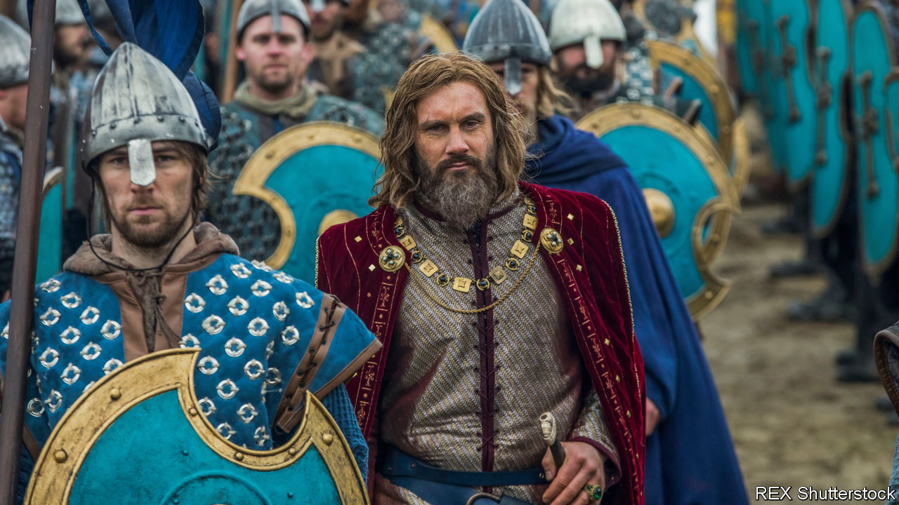

###### They stooped to conquer

# The Normans changed the face of Europe and the Middle East 

##### Levi Roach explains how in “Empires of the Normans” 

 

> Jul 14th 2022 

 By Levi Roach. 

For many years, a Viking host led by a charismatic brigand, Rollo, had been pillaging up and down the Seine. But when he overextended himself with an attack on the cathedral city of Chartres in 911, Rollo’s forces were given a bloody nose by the Frankish magnate Robert of Neustria. Robert knew this was only a temporary reprieve and advised the king, Charles the Simple, to cut a deal with Rollo while the going was good. They offered land between the Epte and the sea and marriage to Charles’s daughter, Gisla. 

In exchange Rollo would make a pledge of service to the king (including protection from other Vikings) and convert to Christianity. He had no hesitation in accepting the terms while demanding (and getting) yet more territory. But when it came to displaying gratitude by kissing Charles’s feet, as custom required, he got one of his men to do it. Also refusing to kneel, Rollo’s henchman simply grabbed the king’s ankle, pulled the royal foot to his lips and sent the monarch sprawling. The symbolism could not have been clearer.

Over the next three centuries, Rollo’s Norman successors—his great-great-great grandson was William the Conqueror—turned Normandy into the most politically and militarily cohesive territory in what would become France. From there they set forth to dominate much of western and southern Europe, carving out kingdoms in England, the south of Italy, Sicily and the Holy Land. Exactly 301 years after Rollo’s refusal to bend the knee, the 17-year-old Frederick II was being crowned in Mainz as king of the Germans and Holy Roman Emperor in waiting. Young Frederick was a Norman from Apulia. 

Yet even at what seemed to be the apotheosis of Norman power and influence, the idea of what it was to be one was becoming elusive. By assimilating and marrying wherever they showed up, the Normans willingly blended their identity with the locals’. By the time of Frederick’s coronation, Normans in England, although still French-speaking, thought of themselves as English. Normandy itself had been lost by King John to the French crown, while the multicultural Kingdom of Sicily was now part of the Holy Roman Empire. In another 100 years, brooding castles and soaring churches would be the only distinctively Norman features left.

Tellingly, the title of Levi Roach’s book is “Empires of the Normans”, not “The Norman Empire”. The grip Rollo’s descendants exerted on Europe and the Middle East was more the result of a militarised diaspora, vaulting ambition and crafty opportunism than of conscious empire-building. Even their genuine Christian piety served a practical end. Successive popes lent a cloak of legality to Norman land-grabbing when it suited their political purposes. 

Some of the ground covered by the book may be familiar to history buffs: from the high-stakes conquest of England to the fighting qualities that Normans brought to the near-miraculous triumph of the First Crusade. But by telling the story from their perspective and following them wherever they went—from Italy to the Balkans and Asia Minor, from England into Wales, Scotland and Ireland and from southern France into Iberia—Mr Roach gives a powerful account of how prowess in combat, shrewd alliance-building, low cunning and sheer chutzpah let them punch above their numerical weight.

It is a pity that the narrative sometimes drags as he tracks the exploits of so many Williams, Roberts, Rogers and Henrys (noble Norman families ran a bit short on names). Extraordinary characters such as Roger II of Sicily could have been better dramatised with more direct quotation from the lively primary texts. For instance, in her “Alexiad”, Anna Komnene, daughter of the Byzantine emperor Alexios Komnenos, is both fascinated and repulsed by Bohemond, the future Prince of Antioch: he is “perfectly proportioned” but a “supreme mischief-maker”. The result is an indelible picture of the warrior-politician.

Mr Roach has diligently mined the sources, but rather fussily deplores their bias and exaggeration. A flashier historian would have had no such qualms. ■

