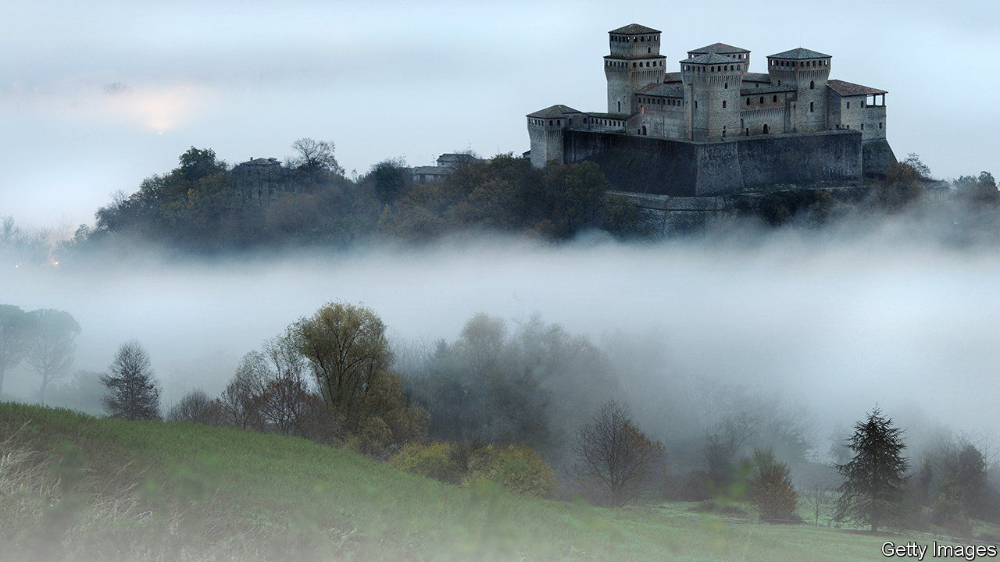

###### Grotesque fiction

# “Lapvona” is Ottessa Moshfegh’s strangest novel yet 

##### And, in her case, that is saying something 

 

> Jul 14th 2022 

By Ottessa Moshfegh. 

Ottessa moshfegh is a writer of great if inconsistent talent, whose output is both prolific and eclectic. Her new book, “Lapvona”, is her strangest yet—which, in her case, is saying something. 

Eileen”, her acclaimed first novel (published in 2015), told the story of a volatile young woman from New England in the early 1960s, delving into her bitter paranoias and twisted erotic fantasies. “My Year of Rest and Relaxation” (2018) saw a young woman drug herself into insentience with the help of a sinister psychologist. “Death in Her Hands” (2020) was framed as a mystery, yet withheld most of that genre’s satisfactions. It seemed wilfully rebarbative, a rejection of the idea of reading for pleasure.

“Lapvona” is the name of a fictional medieval village in an unnamed European country. Marek, the hero, is the disabled son of a shepherd, Jude. The village is beset by disasters, natural and man-made—the story opens with a murderous raid by bandits and much of the second half takes place during a drought. Marek’s mother is said to have died when he was a baby; he was brought up by his brutal father and a wise-woman, Ina, from whose withered breasts he still suckles as a teenager. The village is kept subdued by the twin forces of a strict, self-flagellating religion and a cruel feudal system that seeks to disempower residents at every step.

Perched on a hill above it is a castle. There lives Villiam, a vain and merciless nobleman surrounded by courtiers who serve his increasingly luxurious whims. Villiam’s son, Jacob, is a handsome, hearty young man who occasionally deigns to wander down to the village. He runs into Marek, who picks up a rock and, as a storm rages around them, sets in train a series of transformative events.

Despite its medieval milieu, “Lapvona” is a quintessential Moshfegh book. It has the warped earthiness of the author’s first two novels, featuring incest and sundry other perversions. There is a powerful undercurrent of allegory—the distance between reader and setting only emphasises how little has changed for those at the bottom of the economic ladder. Here everything is corrupt, all motives are grubby, and you feel you need a shower to rinse the book off once you put it down. ■

