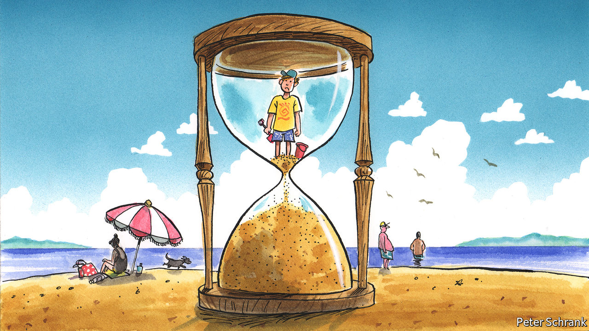

###### Charlemagne

# Down with long school summer breaks 

##### More time studying is better for children, parents and society 

 

> Jul 14th 2022 

Consider the summers of two sets of Viborg youngsters. Those from the Danish city of that name (pronounced VEE-bohr), the charming historic capital of the Jutland peninsula, are now three weeks into their end-of-year holidays—and will be back in school by early August, just three more weeks away. How cruel that must seem to their distant cousins in Viborg, South Dakota (pronounced VYE-burg), settled by Scandinavians in the 1860s. The pupils at Viborg-Hurley High, home of the Cougars, won’t have to think of textbooks and detentions until a week before September. That will be a full 13 weeks since they broke up in late May. 

Europeans suffer from—or enjoy—a reputation for leisure and plentiful holidays. This is well deserved for adults, many of whom will soon be turning on their out-of-office messages for weeks on end. Children are not always so lucky, relatively speaking. An axis of countries running through Europe, including Denmark, Germany, the Netherlands, and bits of Switzerland, have some of the rich world’s shortest school breaks. Others, for example in France, Portugal and Sweden, have holidays to rival America’s. Pupils may not like it much, but more time spent in the classroom is good for them. It also has desirable consequences for their parents and society as a whole.

Every school system offers respite from the labour of learning, if only to give run-down teachers a breather. The human brain needs rest. The original reason for having the longest respite in the summer is said to be that, in the old days, young arms were needed to help with harvests. In fact well-off urbanites who did not fancy spending their summers in sweltering cities probably had more to do with it. Either way, the break is now an immovable feature of the calendar. Whether set at national, regional or school-district level, the length of time off rarely changes. Children look forward to it for months, while parents wonder how to keep their sprogs busy even as they themselves often have to work.

Of all the reasons to prefer shorter holidays, their impact on learning is the most obvious. Staying away from school for too long results in what experts call “the summer slide”. Budding brains have a knack for forgetting what they have just been taught. Reading, writing, and particularly arithmetic suffer as weeks away from school turn into months. Shorter breaks translate into longer terms, too. Danish pupils spend around 200 days a year at school, typically 20 more than their peers in America, France or Sweden (albeit fewer than those in Japan or China). Over the course of a child’s upbringing that adds up to roughly a year’s-worth of extra tuition. An overlong summer break also structures the school calendar in undesirable ways. In most places exams are lumped in the spring, so that youngsters can regurgitate their knowledge before they check out mentally; it would be better to have students tested throughout the year rather than in one stressful burst.

Long school holidays have an impact beyond the classroom, too. Whatever the reason for the annual summer sabbatical, it was devised at a time when single-parent families were rare and mothers were expected to stay at home while children were small. This has changed; the educational calendar has not. The more time children spend in school, the easier things are for busy parents: that history class is also a form of child care, no matter how much teachers resent that thought. Extending the amount of school time has been found to increase the opportunities for all parents to work, which in practice particularly benefits women. 

Beyond penalising students and parents, long holidays accentuate inequality. The effect of summertime learning loss is worst for poorer pupils, and helps explain part of their shortfall in grades against their better-off peers. That is in part because well-heeled parents can afford weeks of space camp, coding classes and other enriching activities during holidays—a veritable industry now exists in America to polish youngsters’ cvs in readiness for college applications. Meanwhile, poorer children stay at home and do nothing (or worse). 

Schools in Europe are more likely to think of themselves as not just educating the young, but turning them into citizens. That is easier if everyone has more equal opportunities both inside and outside the classroom. Some have long breaks, but find ways to alleviate their side-effects. In France, for example, families that cannot afford to decamp from home can send their children to cheap state-run leisure centres, often on school premises. They don’t learn much, but are out of their working parents’ hair.

Most countries ought to go Dutch or Danish: shorten their holidays to six weeks in summer and roughly that again over the rest of the year. Students will be glad to hear this is nowhere near the political agenda, at least in Europe. The lengths of school breaks are essentially set in stone, beyond the odd debate of shifting one week of time off from one season to another, or staggering them so not all families end up vying for the same beach chair at the same time. Powerful teachers’ unions insist long breaks are needed both to allow them time to train and to attract candidates to what are often poorly paid positions. But need it be thus? Months off in summer are a perk, no doubt. Yet it is one educators end up paying for. Those in Germany, for example, have short breaks but earn roughly as much as professionals with similar levels of education. In America, teachers get more time off but are paid relatively less.

Summer lovin’

What of a teenager’s need to switch off, to be bored, even? A stretch of summer with little to do and parents too busy to nag has turned out to be a formative experience for many. That is a fine argument. But a youngster does not need endless weeks away from school to claim boredom: a few hours without a screen will usually suffice, in Charlemagne’s experience of parenting. A decent break in summer is a human necessity, to be savoured. But as so often, it is possible to end up with too much of a good thing. ■


