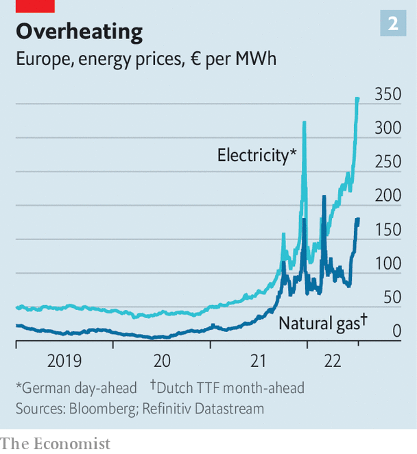

###### Winter is coming

# Europe is preparing for Russian gas to be cut off this winter 

##### An EU-wide plan is needed to cope 

 

> Jul 11th 2022 

“Social peace in Germany is being challenged,” declared Robert Habeck, Germany’s vice-chancellor, on July 7th. The villain: natural-gas prices.  in revenge for its support for Ukraine. In Germany, which  for around one-third of its gas imports, energy bills are expected to soar. Gas prices will cause firms huge losses; ultimately, Mr Habeck fears, they could trigger a . The ultimate threat—a complete Russian cut-off—looks ever more plausible.

Gazprom, Russia’s state-controlled gas goliath, has been squeezing the Europeans for months. s&amp;p Global, a research firm, reckons that in June Russia piped just 4.7bn cubic metres (bcm) to Europe, barely a third of the level in early 2021 (see chart 1). The biggest gas flows come via Nord Stream 1 (ns1), which links Russia to Germany via the Baltic sea. (Nord Stream 2, a new pipeline on the same route, was denied approval by Germany .) 

 


Now Russia is squeezing even harder. On June 16th it slashed exports via ns1 to 40% of capacity, citing technical snags. Big European buyers such as Italy’s Eni, Austria’s omv and Germany’s Uniper were hit hard: they must make up the shortfall by buying pricey gas on the spot market. 

On the morning of July 11th Russia shut down all gas exports via ns1 for about ten days of maintenance. A vital turbine does need fixing, and Siemens Energy, its manufacturer, had shipped it to Canada for repair. But because of Canadian sanctions, it was reluctant to send the turbine back to Russia. Mr Habeck urged Canada to release the kit to Germany, sidestepping the sanctions, to “take this turbine excuse away from Putin”. On July 9th Canada relented.

The European Commission wants to organise an eu response to any attempt by Mr Putin to cut supplies again this winter, not least to avoid the sort of beggar-thy-neighbour policies which member states pursued when covid first hit. “We need to make sure that in case of full disruption, the gas flows towards where it’s needed most,” said Ursula von der Leyen, president of the commission, on July 6th. Her plan should be announced by July 20th. A ministerial meeting on energy security is expected later this month.

Preparing for a shock

The response has four pillars: boosting gas-storage levels, diversifying energy sources, encouraging demand reduction, and rationing. The most important is storage. Last year many firms refused to buy gas at prices inflated by Russian manipulation. Levels in storage tanks became precariously low, but mild weather saved Europe. This year, a plan passed by the European Parliament mandates a minimum 80% fill-rate for gas storage by November 1st, rising to 90% in future years. 

The good news is that the eu’s tanks are now almost 60% full, with about 60bcm stored, up from some 50bcm a year ago. Before the shutdown of ns1, Michael Stoppard of s&amp;p Global reckons the eu was on track to “reach and exceed” the 80% goal by November 1st. New modelling by a group of German think-tanks led by the Kiel Institute suggests that Germany could cope this winter even if Russia cut off all gas in July. In April, when less was in storage, it thought that this would be impossible. 

 


But not all countries have stored gas equally. Those at or below 50% today (Bulgaria, Romania and Hungary are laggards) would suffer badly in a cut-off, and all would suffer if winter is abnormally cold. Mr Stoppard reckons that a cold winter could add up to 25bcm of extra demand. Even countries that scraped by would be in a terrible position come spring. 

As for alternative energy supplies,  (lng) imports have surged dramatically. High European prices have lured tankers away from Asia. Morgan Stanley, a bank, thinks some 41bcm of lng entered Europe in the first quarter, up 70% year on year. Nearly 30% of the world’s exported lng has gone to Europe lately, up from below 20% in 2021. 

Whether this can be sustained is an open question. Europe has already sucked up so much of the world’s lng that can be redirected away from Asia that there is now not enough left to cover a complete Russian cut-off—especially if China’s economy recovers from its covid lockdowns. Meanwhile, lng cannot reach Germany directly because it has no regasification facilities. It has acquired floating regasification ships for which Mr Habeck’s government is fast-tracking approval. But they are unlikely to be up and running till early 2023, reckons Jaime Concha of Energy Intelligence Group, an industry publisher. Ironically, in the three months after the invasion, some 15% of the lng entering Europe to replace piped Russian gas also came from Russia, notes Mr Stoppard. He estimates Russia has earned nearly $400m a day of late from sales of piped and frozen gas to Europe.

The eu’s medium-term plan is to scale up wind, solar and green hydrogen as energy sources, so that they more than replace Russian gas imports. But that will not solve an imminent cut-off. And to the chagrin of greens, filthy coal is on hand now. With Eurocrats’ blessing, member states including the Netherlands and Germany are issuing environmental waivers for coal plants to crank out more power.

Then comes the demand-side response. High gas prices have already acted to reduce some demand. Leslie Palti-Guzman of Leviaton, an energy-data firm, estimates that industrial consumption in Europe has dropped by roughly 8bcm per month in the past three months. German industry, which depends on cheap gas and accounts for 37% of the country’s total use, will be hit hard, she thinks. 

Finally there is rationing of energy. Germany talks openly about this dread prospect, but most countries have shunned it. Now the commission is preparing a “crisis-management framework”. Plans already exist for helping neighbours in a brief emergency, but not for one that could be region-wide and last for months. Under one proposal, the commission would co-ordinate gas-demand reductions in all member states. Beyond protecting hospitals and grannies, different countries have different priorities; one might refuse to send its gas to help a neighbour meet needs it does not consider urgent. Without a harmonised scheme, says one insider, “we’ll have a complete halt of a single market within a few months.” ■

