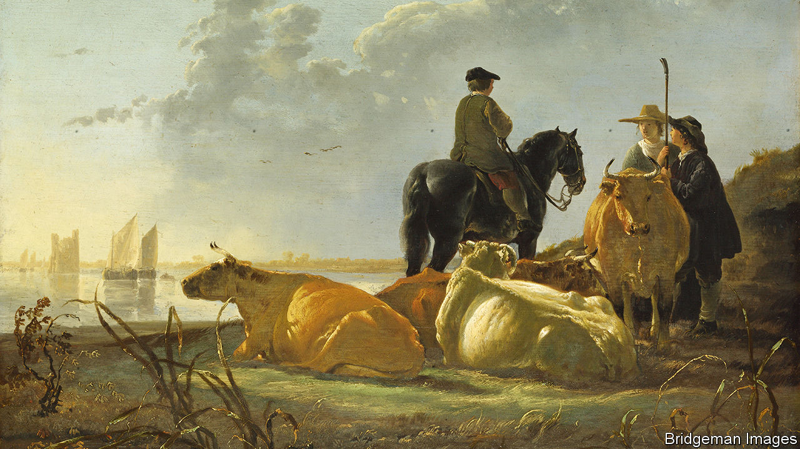

###### Food fight

# How many cows are too many, asks the Dutch government? 

##### And is a nut a fruit? 

 

> Jul 14th 2022 

Around the corner from the office of Mark Rutte, the Netherlands’ prime minister, lies the Koediefstraat, or “cow-thief street”. Many Dutch farmers might find the name appropriate: by their lights, the government wants to rustle their cattle. On June 10th it unveiled proposed limits to nitrogen pollution, such as ammonia from fertiliser and manure, to abide by eu biodiversity rules. Farms next to nature reserves must cut nitrogen output by 70%. About 30% of the country’s cows and pigs will have to go, along with a big share of cattle and dairy farms.

Since then farmers have protested so boisterously that one might think it was legal to drive a John Deere on the motorway. Pastures are festooned with the slogan “no farmer, no food”. Farmers have parked tractors in front of the Senate, harassed government ministers at their homes and blockaded distribution centres to press supermarkets to take sides. They tried to intimidate a vegetarian food company into removing passages on its website stating that cattle-raising contributes to climate change. 

The Netherlands is the biggest nitrogen polluter in the eu. The density of cows in parts of the country exceeds that of any other region of Europe. The government says that Dutch farmers will be paid the full value of any land, cattle or machinery they have to take out of production, and will get subsidies to convert to ecological farming. But radical groups such as the Farmers’ Defence Force say they will resist anyway. Far-right politicians have taken up the cause, claiming that the pollution limits are in fact a conspiracy by the World Economic Forum (the organisers of the annual Davos shindig, much beloved by globalisers) to replace farms with housing for immigrants. On July 3rd the government appointed a mediator, but the farmers’ groups have refused to meet him.

When it comes to food, good intentions and poor planning seem to be a problem lately for the Netherlands. In March the new government promised to fight obesity by eliminating vat on fruit and vegetables. But as America’s government discovered in the 1980s when it labelled ketchup a vegetable, determining which foods fall into such categories is harder than it seems. (Is juice fruit? What about nuts? Italians think so. Fruit rolls?) Experts have been dispatched to study the problem. Perhaps the partisans of orange juice will prove less ornery than cattle farmers.

