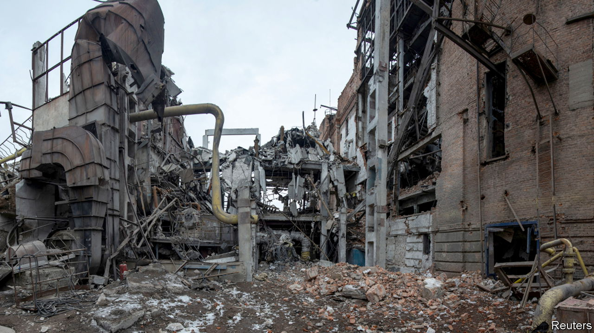

###### Cold front

# The war is forcing Ukraine’s energy planners to be creative 

##### As Russia bombs power plants, Ukrainians find alternatives 

 

> Jul 14th 2022 

A steel rail protruding from an ash tree is a grim memorial to five workers killed in a Russian air-raid on Okhtyrka power station in March. No one is sure where the bit of metal came from. The bombs left little for forensics. Three victims were never found at all; one of the bodies that was recovered had to be buried without a head. To this day, the power station lies largely in ruins. The boiler room is now several feet underground. The pipes that once fed gas into it have been shredded. But the plant’s director, Grigory Yurko, is at work on a Sunday, overseeing building work he says will eventually bring it back to life. Mr Yurko, who fought for the Soviet Union during its occupation of Afghanistan, says there is no alternative if he is to heat 10,000 apartments through the winter: “The town will die without us.” 

Securing reliable energy to warm Ukrainian homes has never been easy. But the ruins in Okhtyrka, a north-eastern city that resisted the Russian invasion, underline the unique challenges now facing planners. Although winter is still four months away, it is not at all clear how much energy will be needed, or how much can be supplied. Part of the country remains under occupation. Another part is under fire. One-third of the country’s coal supplies are unavailable. Gas production is down by only around 5-10%, but almost all of it is located close to the front lines. It is widely assumed that Russia will step up its attacks on the most sensitive points: compressor stations, power stations, substations. For some reason, it has not routinely targeted such infrastructure so far. Okhtyrka shows what can happen when it does. 

“It’s very difficult to model the risks, and it drives me crazy,” says Yuriy Vitrenko, the head of Naftogaz, Ukraine’s national oil and gas company. The most vulnerable bits of the system are rapidly being protected with new air defences, but even if incoming Russian missiles are intercepted, the falling shrapnel is dangerous. 

Financing Ukraine’s energy system is just as problematic. Fierce debates rage inside the government about how much gas needs to be stored for the winter. In any normal year, Ukraine would seem well-stocked. It has 11bn cubic metres (bcm) of stored gas, one of the highest totals in Europe, and is increasing that at a rate of one bcm per month. Given the 50% fall in consumption—a consequence of the devastating effects of the war on industry and the flight of people out of the country—Ukraine should be able to cover most of its needs with its own production, backed up by only limited additional purchases. But the government wants a more comfortable buffer, of 19 bcm. Naftogaz is arguing that 15 bcm should be enough. Ukraine is no longer directly dependent on Russian gas, but it is concerned by Vladimir Putin’s intent to use it as weapon, freezing Europe so that its support for sanctions weakens. 

In Okhtyrka, Naftogaz is trying to make sure that locals have plenty of options. A new gas boiler is being manufactured in nearby Kharkiv. But the hope is that local power needs will be met by a new biomass-powered boiler. The wood pellets that it burns will at first come from elsewhere in Europe, but eventually they will be sourced locally. If Okhtyrka can get through the coming winter, it could demonstrate how to make power generation across the whole country more decentralised, cheap and renewable. Mr Yurko says he is optimistic that the new boilers will be working in time. But he confides that he has stopped shopping in the local market after being besieged by worried people. 

The prevailing mood in that market appears to have changed little, with most shoppers resigned to a very difficult winter. “You want to know what I think?,” asks Artyom, a fruit- and vegetable-seller. “I don’t think anything, because thinking means falling into a depression.” ■


