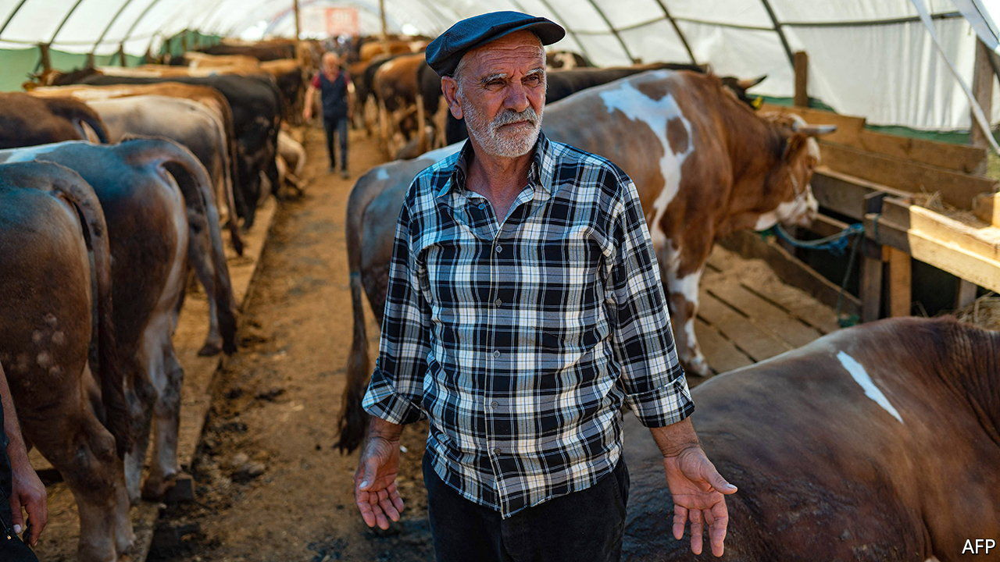
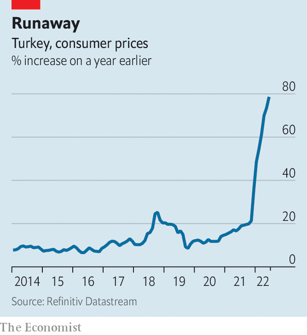

###### The price is wrong

# Turkey grapples with triple-digit inflation 

##### According to unofficial estimates, anyway 

 

> Jul 14th 2022 

The festival of sacrifice, which started across the Muslim world on July 9th, celebrates the prophet Abraham’s willingness to take his son’s life when asked by God to do so. (A lamb turned out to be enough in the end.) To this day the holiday features the ritual slaughter of an animal, usually a cow or a sheep, and the distribution of its meat to relatives and the needy.

At livestock markets in Turkey, the act of buying the animal is often a ritual on its own. The seller and the buyer lock hands, begin haggling, and loosen their grip only when they have agreed on a price. The handshakes, which range from the vigorous to the downright violent, can last minutes. Wrists are occasionally sprained. Fingers can break. 

This year, the handshakes have been few and far between. At a market on the outskirts of Gaziantep, a city in Turkey’s south, Ali Erturk, a farmer, says he has sold only a quarter of the sheep he brought with him, with only one day to go before the start of the holiday. By the same time last year he had sold all of his animals. Hassan, a local factory worker, walks away with a sheep he has bought for 5,000 lira ($290), the equivalent of his monthly wage. Others walk away empty-handed. The animals are the only ones pleased with the outcome. 

 


Around the world people are learning to live with increasing inflation. In Turkey they are having to cope with the runaway kind, and with a government they suspect of massaging the numbers. In late June a group of researchers put inflation in Turkey at 160%, double the official rate of 79%. A survey showed that seven out of ten Turks believed that group’s figures rather than the government’s. 

Inflation, along with a rapidly depreciating currency, has ejected many from the middle class. Millions of blue-collar workers, young people and pensioners have fallen below a poverty line of around $1,200 a month for a family of four. But soaring prices, combined with low interest rates imposed by Recep Tayyip Erdogan, Turkey’s president, have also driven up demand. Turks with money to spare, though dwindling in number, have been splurging on cars, electronics and other consumer goods. “People spend money as soon as possible,” says Arda Tunca, an economist, “because its value is bound to decrease.” 

That spending spree, plus a record level of exports, helped the economy expand by 7.3% in the first quarter of the year. But very few Turks are feeling the benefit. Over 70% say their economic situation has deteriorated over the past year. Only 10% say that it has improved. 

Turks tend to rely on foreign currency to protect their purchasing power. The value of dollar deposits in Turkish banks has exceeded the value of lira deposits since 2019. But even the dollar, which has appreciated by nearly 30% against the lira this year, has not been an adequate buffer against the rate of inflation Turkey has seen. As a result many Turks are pouring their savings into more volatile assets, such as high-risk stocks or cryptocurrencies. Nearly 19% of internet users in Turkey own cryptocurrency. That is the fifth-highest share in the world, according to a report published earlier this year. 

Wealthier types have also turned to property as a store of value. The result is a bubble. Over the past year, property prices in Turkey have increased by 182% in nominal terms, according to a recent survey. In Istanbul, home to some 16m people, they have more than tripled. Rents have followed the same pattern. Young people say they cannot afford to live on their own, much less start a family.

Turkey saw similar price rises during much of the 1980s and 1990s. But inflation then was easier to cope with, thanks to more predictable policies, including high interest rates. “Today, we’re like Alice in Wonderland,” says Seyfettin Gursel, another economist. Mr Erdogan’s insistence on low interest rates is forcing his officials to come up with off-the-cuff measures to prop up the currency and fend off inflation. None has worked. Big increases to the minimum wage have shielded workers from the effects of yesterday’s inflation but have become the cause of tomorrow’s. With elections set for next year and his political life on the line, Mr Erdogan is all but certain to ramp up spending. 

There is only so much he can do. The spike in consumer demand that powered the economy for the first few months of the year has begun to run out of steam. Ordinary Turks are running out of ways to cope with inflation. Their sacrifices are nothing to celebrate. ■

