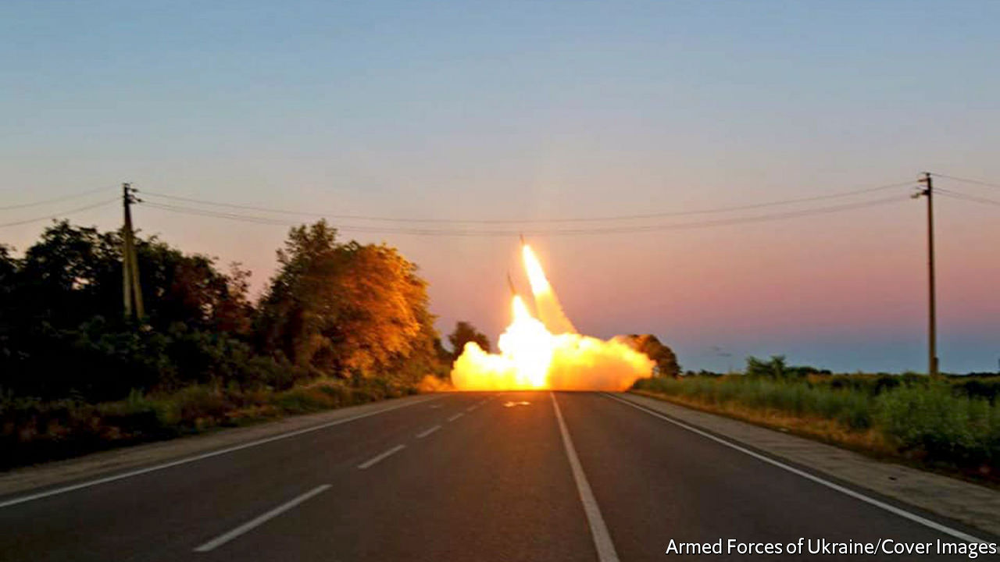
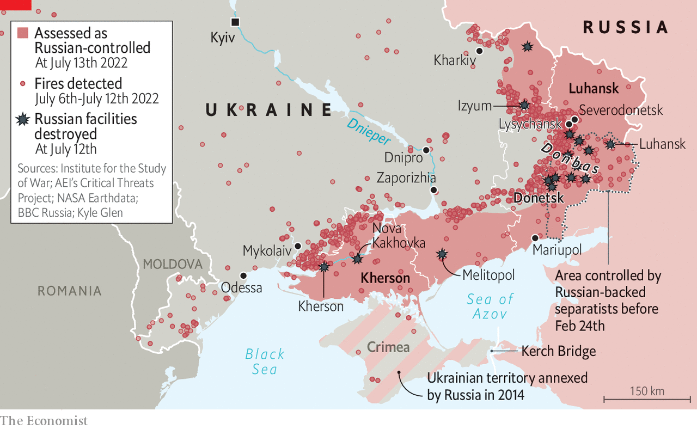

###### Deep battle

# Ukraine’s new rockets are wreaking havoc on Russia’s army 

##### The American-supplied HIMARS is wiping out arms dumps and command posts 

 

> Jul 13th 2022 

“Russian forward ammunition dumps are quite possibly the most unsafe places in any war zone,” explained an American army handbook published in 2016. Munitions were not stored safely, it noted, and many dated from the Soviet era, close to their expiry dates, creating “a tinderbox ready to explode”. “Priority targeting of these areas will cause a serious logistics strain on the Russian system,” it concluded. Ukrainian generals are now putting that theory to the test. 

On July 11th a Russian ammunition depot in Nova Kakhovka in southern Ukraine exploded in spectacular fashion. Satellite images showed that the entire facility vanished overnight. It is thought to be the latest victim of the High Mobility Artillery Rocket System (himars), which America began sending to Ukraine in late June. 

America has provided eight launchers and on July 8th said it would send four more. Each one carries a pod of six gps-guided missiles accurate up to 84km or so—nearly three times the range of the howitzers sent earlier. American officials  of providing more of these weapons until it was clear that Ukraine would use them effectively. Although they look superficially similar to Soviet-era rocket launchers, which rain down warheads over a large area, they are much more precise and need to be used judiciously to conserve ammunition. 

So far, Ukraine appears to be passing that test. The Nova Kakhovka facility was thought to have been the 19th such depot to have gone up in flames since June 27th, according to a tally by Kyle Glen, an open-source analyst. A 20th followed in Luhansk city on July 12th. A strike on a command post in Kherson province on July 10th is said to have killed many senior officers, including the major-general in charge of the 22nd army corps. 

 


himars strikes appear to have occurred all along the front lines, from Luhansk in the east to Kherson in the south (see map, which shows fires detected by infra-red satellites). Kirill Mikhailov of the Conflict Intelligence Team, an open-source research group, says the first battery of four launchers was deployed on the left bank of the Dnieper River and has been used against targets in Kharkiv, Zaporizhia and Donbas. More recently, another has been deployed to the right bank and appears to be preparing the ground for a counter-offensive around Kherson province. 

Ukrainian commanders are cock-a-hoop. They say himars is tilting the war  after the recent loss of Severodonetsk and Lysychansk, cities in Luhansk. A colonel in charge of its deployment says that the weapon is proving effective against a range of targets, from command posts to barracks, while remaining almost immune to return fire thanks to its ability to “shoot and scoot” quickly. Ukraine appears to be using Soviet-era rockets to confuse and overwhelm Russian air-defence systems, before launching the new gps-guided rounds. 

The colonel says that dozens more launchers would be needed to enable a serious counter-offensive. He also acknowledges that himars may grow less effective as Russia adapts, for instance by disguising key targets. But the fact that Russia’s army did not take such precautions despite weeks of notice that himars was coming points to a structural problem.

America’s army tends to disperse and conceal its ammunition dumps across a number of smaller sites. Russia’s army, which relies heavily on trains to move munitions and human muscle to load them onto trucks, has instead created big depots close to railheads—often by taking over civilian industrial distribution centres. That was fine until himars turned up. Dispersing those depots would require a huge amount of new equipment or manpower. Moving them farther away from the front lines would also strain the army’s limited fleet of trucks: doubling the distance more than doubles the number of trucks required, or more than halves throughput. 

Even if Russia were to move its supply chain painstakingly out of himars range, the respite might be only temporary. America, , sent the launchers on condition that Ukraine would not use them against targets on Russian soil. As a further precaution, it did not provide the longest-range munition: the Army Tactical Missile System (atacms) of 300km range. If it were to do so, every square inch of Russian-occupied territory would become well within range of Ukrainian firepower. This includes Crimea, which Russia annexed in 2014, as well as the Kerch bridge connecting it to Russia, ships in Crimean ports and many other juicy targets. ■


