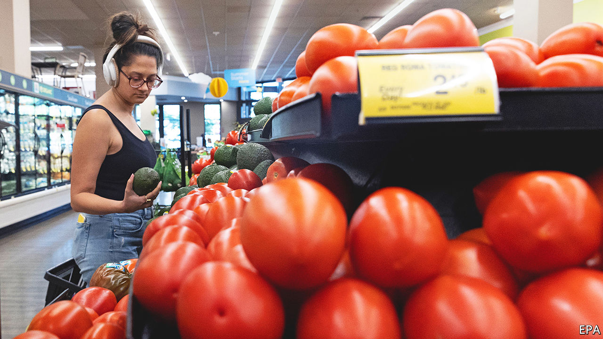
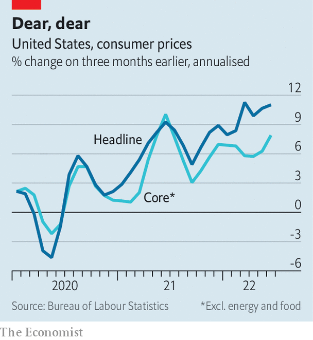

###### On the up and up

# American inflation tops forecasts yet again, adding to recession risks 

##### The Fed is under pressure to crank up interest rates more aggressively 

 

> Jul 13th 2022 

At this point upside surprises in inflation occur with such frequency that surprise is probably the wrong word for them. So it was with America’s  for June, published on July 13th. It soared 9.1% compared with a year earlier, marking yet another four-decade high and beating forecasts for an 8.8% increase. Still, investors seemed to be caught unawares, with stocks falling sharply after the data, adding to this year’s big losses. The pessimism in financial markets is easily understood:  is forcing the Federal Reserve to press on with aggressive monetary tightening, even at the potential cost of a recession.

All the more important, therefore, to understand how persistent inflation will be. In this respect the most concerning part of the latest data was not the shocking headline figure, about half of which could be attributed to oil and gas prices, which surged early in June but have since ebbed. Rather, it was the change in core prices, stripping out volatile food and energy.

 


Core inflation rose 0.7% in June from May, the highest month-on-month increase in a year. And it was not a blip: over the past three months core inflation has been running at an annualised rate of nearly 8%, an indication of the breadth of price pressures (see chart). Just about everything—from cars to clothing and furniture to rents—is getting more expensive.

That reinforces investors’ belief that the Fed will stay on its hawkish path. A day before the inflation data, bond-market pricing implied that the Fed would raise interest rates by three-quarters of a percentage point at its next rate-setting meeting in late July, the second straight increase of that size. Following the data, bond pricing put the chances at roughly 50-50 that it would instead opt for a full percentage point increase. Either way, it puts the Fed on track for the steepest monetary tightening in a calendar year since 1981, when Paul Volcker was at the central bank’s helm. That is already weighing on .


America is hardly alone in struggling with high prices. Inflation in the euro area is expected to have risen to 8.6% in June. But the details are different. Europe’s problems are more closely linked to surging gas costs, both exacerbating the risk of an imminent recession and perhaps limiting the European Central Bank’s scope for rate increases. That has hurt the euro, which has fallen by more than 10% since the start of the year, bringing it to parity with the dollar for the first time in two decades.

The White House has tried to put as positive a gloss as possible on the figures. Before the data release, it drew attention to the recent decline in petrol prices. The national average is now about $4.63 per gallon, 5% lower than in June. With the price of crude down by even more, that does probably set the stage for a lower inflation reading in July. Moreover, President Joe Biden’s advisers have noted that an alternative gauge of inflation, the personal-consumption-expenditure (pce) price index, which is usually seen as more reliable by the Fed, has been more muted.

Neither argument is all that reassuring. Energy prices have weakened over the past month, but with the war in Ukraine dragging on and winter looming, they may resume their upward climb before long. As for pce inflation, it is indeed less extreme than cpi inflation, but it is still more than twice as high as the Fed’s 2% target, and rising prices for services such as health care may nudge it higher still.

The best news about inflation is that the Fed’s tightening is in fact gaining traction in the crucial realm of expectations. The Fed cannot solve supply-chain snarls or reduce oil prices. Where it can be uniquely effective is in tempering the outlook for prices. A basic measure of market expectations for annual inflation over the next five years is now 2.5%, down by more than a percentage point since March. In the middle of June a closely watched consumer survey by the University of Michigan put expected annual inflation at 3.3% for the next five years; by the end of the month it was down to 3.1%. 

That is precisely what the Fed wants to see. Unfortunately, economists, firms and investors are also busily ratcheting down their expectations for economic growth—a consequence the Fed cannot avoid. ■


