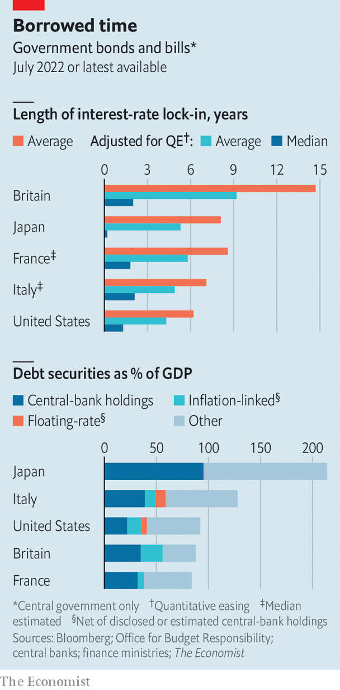

###### When maturity misleads

# How higher interest rates will squeeze government budgets 

##### Rising borrowing costs will hit taxpayers sooner than you think 

 

> Jul 12th 2022 

In recent years government debt appeared to matter less and less even as countries borrowed more and more. Falling interest rates made debts cheap to service, even as they grew to levels that would have seemed dangerous a generation before. The pandemic put both trends into overdrive: the rich world borrowed 10.5% of its gdp in 2020 and another 7.3% in 2021, even as long-term bond yields plunged. Now central banks are raising interest rates to fight inflation and public debt is becoming more burdensome. Our calculations show that government budgets will feel a squeeze far more quickly than is commonly understood. 

In May America’s budget officials raised by a third the forecast cumulative interest bill between 2023 and 2027, to 2.1% of gdp. That is lower than forecast before the pandemic, but it is already an underestimate. Officials optimistically assumed the federal funds rate would peak at 2.6% in 2024, but markets now expect the rate to exceed 3% in July 2023. In the euro zone, as interest rates have risen, the premium indebted countries like Italy must pay to borrow has gone up, reflecting the danger that their debts may eventually become too onerous to service. Britain’s officials forecast in March that its government would spend 3.3% of its gdp servicing its national debt in 2022-23, the highest share since 1988-89. 

For a given cost of borrowing, three main factors determine the cost of servicing legacy debts. Two are straightforward: the level of debt, and the proportion of it whose value is pegged to inflation or prevailing interest rates. Britain’s debt-service costs have risen so sharply, for example, because an astonishing one-quarter of its debt is inflation-linked.

The third factor is more complex: the maturity of the debt. When governments issue long-dated bonds, they lock in the prevailing interest rate. In 2020 America’s Treasury issued about $200bn-worth of 30-year debt at yields of less than 1.5%, for example. The more long-dated debt, the longer it takes for budgets to take a hit when rates rise. The most common measure of this protection, the weighted average maturity (wam) of debt, can be a source of comfort. Britain, in particular, has a lot of long-dated bonds: the wam of its bonds and treasury bills is about 15 years.

But measures of maturity can mislead. The wam can be skewed upwards by a small number of very long-dated bonds. Issuing 40-year debt instead of 20-year debt raises the wam but does not change the speed with which rising interest rates affect budgets over the next few years. The Office for Budget Responsibility (obr), Britain’s fiscal watchdog, has suggested an alternative measure. Suppose you line up every pound (or dollar) a government has borrowed by the date on which the debt matures. Halfway along you would find the median maturity—the date by which half the government’s borrowing would need to be refinanced at higher rates. Call it the interest-rate half-life. Though Britain’s wam is 15 years, its interest-rate half-life is lower, at about ten years.

There is another complication. Central banks in the rich world have implemented huge quantitative-easing programmes (qe), under which they have bought trillions of dollars worth of government bonds. To do so they have minted fresh electronic money, known as central-bank reserves. These reserves carry a floating rate of interest, the adjustment of which is the main tool of monetary policy. When rates rise, the cost to central banks of paying interest on the ocean of reserves created under qe rises immediately. Raising interest rates thus reduces central-bank profits. And because those profits typically flow straight into government coffers, taxpayers suffer.

The effect of qe is therefore the same as if governments had replaced vast amounts of debt for which the interest rate was locked in with debt carrying a floating rate. For most of the history of qe this refinancing operation has been highly profitable, because bond markets repeatedly forecast interest rates would rise sooner than they did. From 2010 to 2021 the Fed remitted over $1trn to America’s Treasury. qe has been particularly lucrative for central banks in euro-zone countries whose long-term debt is risky and therefore carries a high yield. National central banks such as the Bank of Italy carry out most of the ecb’s qe locally, bearing the default risk and earning the yield on the bonds of their respective home states, while also paying their share of the ecb’s interest costs. Earning the yield on Italian government debt while paying out much less in interest on reserves helped the Bank of Italy to remit profits worth 0.4% of gdp to the government in 2020.

As short-term rates rise, profits from qe will gradually dry up, and could even turn negative. In May the Federal Reserve Bank of New York, which manages the Fed’s qe portfolio, projected that interest rates one percentage point above what was expected by market participants in March would be enough to turn the portfolio’s net income negative for a short time—a scenario that today looks likely. Another percentage point on interest rates would lead to negative net income for two to three years. 

 


A full accounting of interest-rate sensitivity must thus adjust for the holdings of central banks, treating the associated debt as carrying a floating rate of interest. Refreshing the obr’s calculations, we find that qe reduces Britain’s interest-rate half-life to just two years, meaning 50% of Britain’s government liabilities will roll on to new interest rates by late-2024. We have also replicated the exercise for bonds and bills issued by governments in America, France, Italy and Japan (see chart). For France and Italy the interest-rate half-life is an estimate. The central banks involved disclose which bonds they hold, and the wam of their holdings, but do not reveal how much they have bought of each bond issuance. Our calculations assume they hold a flat proportion of each bond’s outstanding value (which in both cases produces a portfolio whose wam roughly matches the disclosure).

In every case, the interest-rate half-life is much lower than the reassuring wam. Most striking are the results for Japan and Italy, which have the highest debts. Because the Bank of Japan has replaced nearly half the Japanese bond market with its reserves, the interest-rate half-life is vanishingly short. Thankfully inflation in Japan is only 2.5% and expected to fall. There is little pressure to raise interest rates. 

The same cannot be said for the euro zone, where the ecb is projected to raise rates rapidly so as to tame inflation. It is often noted that Italy’s huge debts of over 150% of gdp at least carry a wam of over seven years. But Italy will in fact inherit higher funding costs quickly because its interest-rate half-life is little more than two years. Were the ecb’s policy rates to reach 3%, the Bank of Italy’s share of the interest costs would immediately rise by an annual 1.2% of gdp. Every one percentage point increase in the financing costs on the €462bn of debt (net of central banks’ estimated holdings) coming due by July 2024 would cost the government another 0.3% of gdp annually. 

Is there any way for indebted countries to avoid higher interest costs? It might seem tempting to unwind qe faster, by selling bonds (rather than waiting for them to mature, as several central banks are currently doing). But selling bonds would cause central banks to book capital losses, because rising yields have eroded the value of their bondholdings. At the end of March the Fed’s unaudited financial statements showed an unrealised capital mark-down of $458bn on its qe portfolio since the start of the year; Paul Kupiec and Alex Pollock of the American Enterprise Institute, a think-tank, estimate that the hole has since grown to about $540bn.

Another option is to find a way for central banks to pay less interest on reserves. A recent report by Frank Van Lerven and Dominic Caddick of the New Economics Foundation, a British think-tank, calls for them to pay interest on only a sliver of reserves that affects their decision-making, rather than the whole lot. The ecb and the Bank of Japan already have such a “tiered” system. It was designed to protect commercial banks from the negative interest rates they have imposed in recent years.

Using tiering to avoid paying banks interest while their funding costs went up would be a tax in disguise. Banks, considered together, have no choice but to hold the reserves qe has force-fed into the system. Compelling them to do it for nothing would be a form of financial repression which may impair banks’ ability to lend. It would “transfer the costs [of rising rates] to the banking sector,” Sir Paul Tucker, a former deputy governor of the Bank of England, told parliament in 2021. 

A third option is to tolerate high inflation rather than raise rates. Despite rising interest costs, many countries’ debt-to-gdp ratios will fall this year as inflation eats into the real value of their debts. Many prominent economists have argued that an inflation target of 3% or 4% would be better than one of 2%. For now the idea is pie-in-the-sky. Central banks are too worried about their credibility to switch targets, and with good reason: break your promises on inflation once and people may wonder if you will do it again. But because making the switch would deliver a one-time fiscal windfall at the expense of long-term bondholders, and because inflation can be painful to get down, it could eventually appeal to indebted governments.

Whether it is banks, taxpayers or bondholders, somebody has to pay the bills that are now falling due. Soaring interest costs will further squeeze government budgets already under pressure from higher energy costs, rising defence spending, ageing populations, slowing growth and the need to decarbonise. With inflation high, it is also a bad time to let deficits grow—a path that might force central banks to raise rates even more. ■


