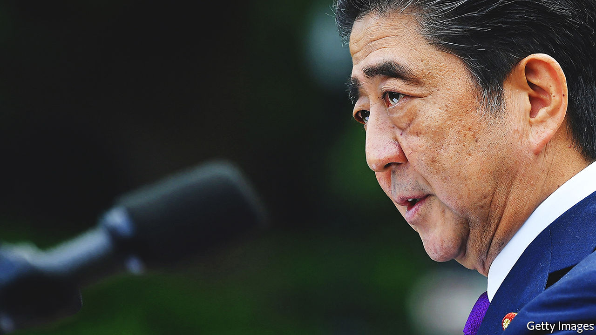
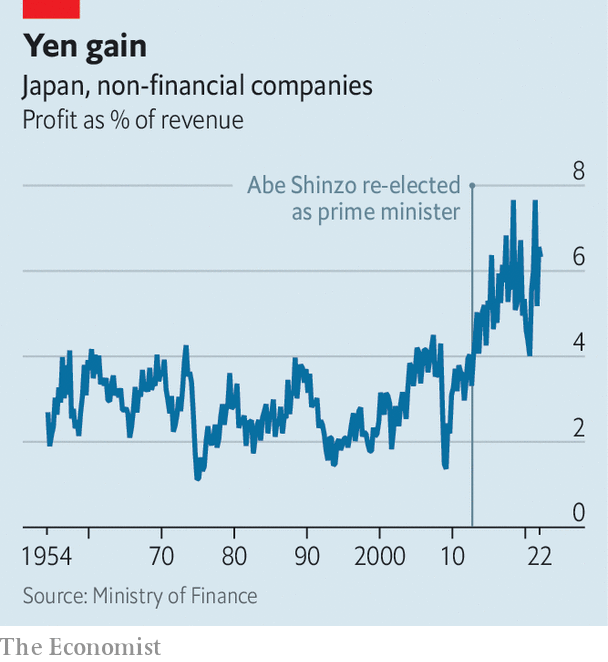

###### Abenomics After Abe

# The legacy of Abe Shinzo will shape Japan’s economy for years 

##### The anti-deflation arsenal of the country’s most influential prime minister is still needed 

 

> Jul 14th 2022 

A little less than eight years is not an especially long tenure for heads of government in much of the world. In Japan, it is a veritable aeon. And two years after the resignation of Abe Shinzo, a former prime minister who was , the reforms he pushed in office look set to shape Japan’s economy for years to come.

The current prime minister, Kishida Fumio, secured a big majority of seats in the upper house of Japan’s legislature in the election on July 10th. His greater focus on equality and redistribution, which he calls “New Capitalism”, was initially cast as an alternative to Mr Abe’s vision. In reality, it will be built on the  his predecessor laid out. The programme which began after Mr Abe’s 2012 thumping election victory—dubbed Abenomics—had three so-called “arrows” to dislodge Japan from its economic stagnation: flexible fiscal policy, monetary expansion and structural reforms. 

 


Clear positives stand out from Mr Abe’s record, most notably the financial accounts of Japan Inc. Reforms to corporate governance encouraged more shareholder-friendly activity and prodded firms to reduce moribund networks of cross-shareholdings. Those changes, paired with a slump in the yen, boosted corporate earnings to record levels (see chart). An environment friendlier to investors also helped to raise anaemic levels of inward foreign direct investment. In 2020, direct investment into Japan was worth 1.2% of gdp, the highest on record. 

There have been stark improvements in the labour market, too. Japan’s female employment rates, previously low by the standards of rich economies, climbed rapidly under Mr Abe. At 72% among working-age women, the employment rate is now more than ten percentage points above the levels Mr Abe inherited, and six percentage points above the American equivalent. Kathy Matusi, the economist who championed increasing female participation as a way to unlock the productive potential of the Japanese economy, credits Abe-era reforms, such as mandatory disclosure on gender diversity and more generous salary replacements for new parents.

Mr Kishida’s aides now talk less of ditching Abenomics and more of building its legacy. When his New Capitalism Council revealed its “grand design” document in May, it concluded that the strategy would adhere to the three-arrow framework. The strategy focuses, rightly, on the need to get firms to deploy their excess cash through wage increases or capital investments. Stagnant wages have been Abenomics’s biggest shortcoming. At around 266,000 yen ($1,940) per month in May, Japan’s average wage has barely budged in a decade, and has actually fallen in real terms. Most of the recent rise in female employment reflects growth in part-time jobs that are usually poorly paid. This is where Mr Kishida could have the most to offer. Regrettably, his approach to the issue so far differs little from Mr Abe’s: tax incentives and browbeating, with a bit of a boost for public-sector workers.

Fiscal policy was a troubled area for Mr Abe, and is likely to remain one for Mr Kishida. Two long-planned but ill-fated increases in Japan’s sales tax, in 2014 and 2019, made fiscal policy a drag on the recovery rather than a boost. Spending under Mr Abe was not as flexible as the first arrow’s label would have suggested. After leaving office, Mr Abe did convince the party to soften its pledge to balance the primary budget (excluding debt-servicing costs) by 2025. But Mr Kishida is said to be more concerned about fiscal sustainability. His closest advisers have backgrounds in Japan’s typically hawkish finance ministry. 

Mr Abe’s support for a more stimulative monetary policy has also lasted beyond his tenure, with mixed effects. Enormous purchases of bonds, and a subsequent policy to directly fix the yields of government bonds, may have prevented Japan from falling back into deflation, but failed to stimulate inflation or nominal-income growth as desired. As inflation rises globally, the Bank of Japan may find it harder to keep policy easy. But Mr Kishida will likely pick a continuity candidate when Kuroda Haruhiko, Mr Abe’s central-bank governor, leaves office next April.

With Mr Abe gone, might Mr Kishida feel liberated to diverge further from his predecessor? Different global conditions could fuel such a change. Concern about fiscal discipline has more truck in a world of rising interest rates. But the differences between Mr Abe’s and Mr Kishida’s approach now look more likely to be a matter of degree rather than substance. Mr Kishida’s focus on wages, in particular, could augment the successes of Abenomics if properly pursued. Mr Abe’s arrows, in short, will remain essential weapons. ■


