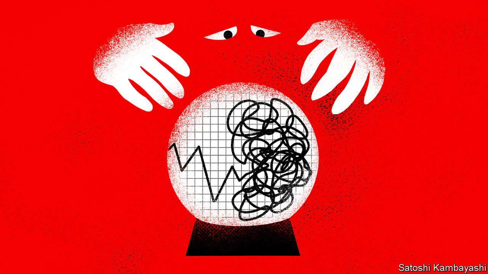

###### Buttonwood

# Why markets really are less certain than they used to be 

##### Three gauges of investor fear are unusually high 

 

> Jul 14th 2022 

Market commentators and investors often exaggerate the uniqueness of their times. History counts no fewer than four “Black Mondays”—echoing the “Black Thursday” that sparked the 1929 Wall Street crash, which heralded the Great Depression—even though the 1987 and 2015 editions rapidly proved unremarkable. Many other days once doused in dark paint have been forgotten. The 25-year period to 2007 looks so boring, in hindsight, that it is dubbed the “Great Moderation”. The ensuing financial crisis did rock markets, but the pattern of hyped but transitory shocks soon resumed—remember the taper tantrum of 2013? 

This year there have been plenty of stomach-churning gyrations. Since January the nasdaq, a tech-heavy stock index, is down by almost 30%. The shocks keep on coming. Just as investors started to worry about stubborn inflation, Russia invaded Ukraine, turbocharging commodity prices and piling more pressure on central banks to crank up interest rates. China is strangling its economy with its zero-covid policy.

But just how unusual is the turmoil? In order to quantify its uniqueness, Buttonwood has examined three measures of market-related uncertainty: expected asset-price volatility, divergence in economic forecasts and the unpredictability of economic policy as chronicled in the media. The tests suggest we really are living in unusual times. 

Start with swings in asset prices. In the past month America’s s&amp;p 500 stock index has been three times more volatile than it was before the pandemic. And investors are still jittery. The volatility index (vix)—which captures investors’ appetite for insuring themselves against future stock-price moves—has hovered at around 25 points since 2020, nearly eight points above its 2010s average. That is not unprecedented, however. Since the 1990s a range of crises, from the Gulf war to the dotcom crash, have kept the vix near 25 points for months.

The bond-market hysteria is more unusual. The Merrill Lynch Options Volatility Estimate (move) is a gauge of fear among bond investors. It is at levels last seen in March 2020, when the spread of covid-19 caused market panic, although it is still lower than during the 2007-09 financial crisis. The elevated move reflects the clumsy pivot in central-bank policy. On May 4th Jerome Powell, the chairman of the Federal Reserve, signalled it was not even considering raising rates by 0.75 percentage points at its next meeting—before doing just that six weeks later.

Central bankers have become hard to read for a reason: the macroeconomic oracles on which they partly rely, our second gauge, are exceptionally dispersed. A measure of disagreement among professional forecasters of economic growth surveyed by the Philadelphia Fed is nearly triple its typical 2010s level; it has been above two percentage points for nine consecutive quarters, which last occurred between 1979 and 1981, when inflation was in double digits. 

Our third measure of uncertainty, that arising from the inscrutable outlook for economic policy, indicates lasting change the most clearly. An index built by Scott Baker of the Kellogg School of Management and colleagues tracks the frequency of articles that include worrying bundles of words—such as “regulatory”, “economic” and “uncertainty”—in global publications. It suggests that economic-policy unpredictability has been rising steadily since the financial crisis and is now far higher than in the late 1990s, when the index began. 

That our indicators are flashing red at the same time suggests an enduring step-up in uncertainty from which it may be hard to climb down. Furthermore, the different types of uncertainty reinforce each other. Political polarisation, which tends to make economic policy erratic, is fuelled by high inflation. All this means the economy is harder to forecast, making life harder for central banks, in turn spooking investors. The fragmentation of global trade doesn’t help. The unwinding of supply chains encourages stockpiling during booms and fire-sales during busts, amplifying economic swings.

Persistent uncertainty means a higher cost of capital and less affordable insurance against shocks. All of which tends to dampen business investment, weighing on gdp growth and equity returns. There have been many dark days for the nasdaq in 2022: the index has already recorded 32 daily falls of more than 2% since January. This time their entry on the calendar of doom looks deserved. 


