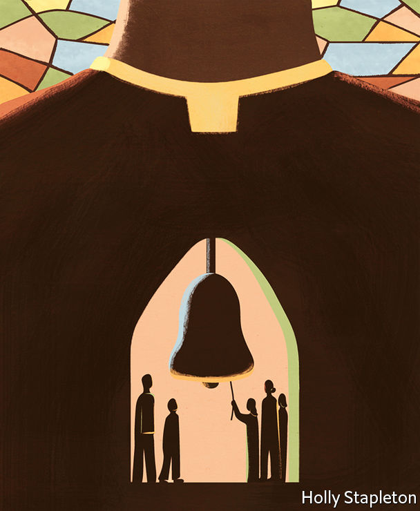

###### Sex abuse and the church

# Catholic reformers want big changes to a church marred by sex abuse 

##### Talk of schism is in the air 

 

> Jul 14th 2022 

It is just one of thousands of similar stories. Juan Cuatrecasas’s son attended a school in Bilbao run by Opus Dei, a Catholic institution. Around age 12, he became afraid of going, locking himself in bathrooms and suffering panic attacks. He told his parents that his religion teacher had brought him to his office, had him take off his shirt, sat him on his lap and showed him pictures of scantily clad women before touching him through his clothes. Later, he was violated with a pen. 

Mr Cuatrecasas went first to the school, not the police. The priest claimed he had made the boy undress because it was hot and showed him pictures to explain women’s sexual development. The school denied the worst. The boy was interrogated and his account made to look fabricated. A Spanish court eventually convicted the teacher, sentencing him to 11 years in prison, though that was reduced on appeal. Mr Cuatrecasas echoes a common theme: the abuses are harrowing, but what most outrages some victims is the way the church handles them. Too often, it has denied there is a problem, treated victims dismissively and shuffled the abusers to different jobs where they can re-offend.

Over the past 20 years the Roman Catholic Church has been battered by a seemingly endless succession of child-abuse scandals. In 2002 the , a newspaper, revealed molestation of children by priests and a cover-up implicating Cardinal Bernard Law, then the archbishop of Boston. Similar abuse has been uncovered by wide-ranging investigations in America, Australia and Europe. Isolated but repeated scandals in Africa, Asia and Latin America point to a global problem. 

The revelations are still coming. In 2018 a German report on sexual abuse by clerics identified a systemic problem and thousands of victims. Extrapolating from identified cases, a French investigation concluded last year that at least 216,000 people had been abused by members of the clergy in the seven decades to 2020. The Portuguese church announced a national investigation in 2021. In March, following reporting by , another newspaper, the Spanish government launched one of its own. Poland’s more piecemeal approach has turned up hundreds of victims, and forced a bishop to resign in 2021. 

The dismal litany has fuelled calls for change. In 2019 the church’s German branch set up a “Synodal Path”, a citizens’ assembly of clergy and lay people, to discuss the scandal. When it concludes next year, it is likely to make some radical recommendations. Members want an end to mandatory celibacy in the priesthood; ordination for women; blessings for gay marriages and more power for lay people. 

That has caused a predictable backlash. Conservatives, especially in Africa and America, accuse German liberals of using the sexual-abuse scandal to dismantle church doctrine. In Africa and Asia, meanwhile, church leaders still dismiss the crisis as a Western problem. There are mutterings of schism. 

Pope Francis wants to bring his sundered flock together. In March 2020 he announced a global “Synod on Synodality”—a discussion open to all 1.4bn Catholics. What filters up from the faithful will inform a meeting of bishops at the Vatican in the autumn of 2023. Whatever it decides, it seems inevitable that large numbers of Catholics will be left unhappy.

Germany’s report in 2018 made many recommendations. Three big changes—reducing the power of clerics, abolishing the requirement for celibacy and changing the church’s attitude towards gay people—became the pillars of Germany’s synodal path, with the role of women in the church later added as a fourth.

The report said that celibacy does not increase the risk of abuse in and of itself, although it did concede that seminaries teach too little about its difficulties. Others have arrived at different conclusions. Australia’s Royal Commission into institutional child sex abuse concluded in 2017 that mandatory celibacy made abuse more likely. One of the report’s authors, Desmond Cahill, said some priests were “terrorised with their own sexual desire”. 

Critics have long argued that the clergy is attractive to predators. Being a priest offers child-abusers ready access to victims and the sort of moral authority that, in the past at least, made it hard for those victims to have their complaints heard. The requirement for celibacy makes a career as a priest far less appealing to anyone who craves romance or a family—which is to say, most people. But for those who are used to hiding their sexual desires, such as paedophiles, it imposes few additional burdens. They already have to be celibate, or at least pretend to be. 

Some, says Mr Cahill, join the priesthood hoping that a spiritual life might cure them of unwanted urges. And the difficulties of denying the basic human urge for sex can end up warping those who had no intention of abusing children when they took up office, he says. Marie Keenan of University College Dublin, who has written a book on Catholic child abuse, describes priests struggling with “denied sexuality, emotional need, learned rationality, and intellectualisation of physical, sexual, and emotional life”. 

Whatever the reasons, sex abusers appear to be unusually common among the clergy. Researchers think somewhere between 6% and 9% of Catholic priests and religious figures may have been child abusers. Since much sex abuse goes unreported, reliable numbers for the general population are hard to come by. One of the highest credible estimates comes from Britain’s National Crime Agency, which said in 2015 that between 1% and 3% of men might display sexual interest in children, though many never act on it. 

Catholic clergy have not always been celibate. In the early days of the church, many seem to have been married. The idea of celibacy began to gather from the 11th century. Its “excellence” was reaffirmed at the 16th-century Council of Trent, though it was not codified in canon law until 1917. Church leaders argue that by forgoing marriage, priests emulate Jesus and can devote themselves more fully to their flock. 

But there are exceptions to the rules. Since the 1980s married Protestant clergy who convert to Catholicism have been allowed to become priests. Most Eastern Churches, which have different rites and canon law from Latin Catholicism, but which recognise the authority of the pope, allow already-married men to become priests too. Blind eyes are often turned. Tere Cortés and Andrés Muñoz, who run the Movement for Optional Celibacy in Spain, say they know priests living with “cleaners” who are their romantic partners. The children of such clandestine unions “can’t call their father ‘papá’”. Similar stories of priests with mistresses or wives are common in Africa. 

Even where celibacy is more rigorously policed, many would be happy to scrap it. Polls suggest that majorities in Europe, Latin America and the United States would back change. Even in the conservative Spanish church, most priests say they are in favour too. In 2019 bishops from nine Amazonian countries proposed allowing married men to become priests to help ease a shortage that has left some Amazonian Catholics waiting months between masses. The Vatican vetoed the idea. 

The role of women is controversial too. Maria 2.0 is a German pressure-group formed after the country’s report on sexual abuse. Shocked by what an all-male priesthood had tolerated, it began campaigning to see women ordained. In 2014, 59% of North American Catholics said they supported the idea. In 2019, majorities in Argentina, Brazil and Chile said the same. Women are far less likely to commit sex crimes than men are. 

 


There is little evidence that women have ever been Catholic priests. Deaconesses are mentioned in the New Testament, though conservatives argue that they were probably not ordained. Once again, practice sometimes runs ahead of theory. In March the diocese of Essen, in Germany, said it would let women perform baptisms because of a shortage of priests. The Amazonian bishops also asked the Pope to re-open a Vatican commission on women deacons. The group—which is, inevitably, split between reformers and conservatives—met for the first time last year. 

The resistance many church leaders show to such changes illustrates what many abuse victims see as Catholicism’s biggest problem: the concentration of power in the hands of clerics. Church hierarchies, they say, helped with the cover-ups. Colm Holmes, chair of We Are Church International, a reform-minded pressure-group, puts it bluntly: “They [the priests] have the power. They have the privilege. They have the money,” he says. “Basically they want to hold onto it.” 

Germany’s synodal path has already voted to strip away some of that power. Earlier this year members endorsed a proposal to give lay Catholics a say in choosing their bishops. The very structure of the assembly provides a more democratic model for Catholicism. It points towards a future where lay people could influence decision-making from the bottom up.

Humbling the exalted

Some church leaders are alarmed by that. They think the views of lay reformers go against Jesus’s teachings. In April more than 100 bishops—mostly American, but with representatives from every continent—wrote a “fraternal letter” to Germany’s bishops warning that the synodal pathway had gone too far. As Thomas Paprocki, the bishop of Springfield, Illinois, puts it: “A shepherd has to guide the people. You don’t just let them run wherever they want. The Church is not a democracy.” 

Perhaps not. But worshippers can vote with their feet. As more sex-abuse stories come to light, the sheep are straying. In America the share of Catholics attending mass each week fell from 31% in 2000 to 17% in 2021. Pews are emptying in Spain and Ireland. In Germany so many are opting out of paying tax to the church that the officials who process such requests have taken on extra staff to cope with demand. In Chile trust in the church has fallen from around 70% to 20%. Only in Africa, with its booming population, is the number of Catholics expected to grow. Even there, their share of the population will fall. 

Pope Francis, in other words, has his work cut out. The coming global synod will focus on the process of talking and listening, rather than the practicalities of abuse and reform. But the tensions between conservatives and liberals will be inescapable. Francis himself has proved unwilling to take bold action in the past. After he dismissed the concerns of sex-abuse victims in Chile, a court found that the arch-diocese of Santiago had covered up accusations of abuse. The pope apologised—something that would once have been unthinkable—and seems to have emerged chastened. But that does not make his dilemma any easier. He can move boldly and risk schism, or proceed slowly and risk a longer, slower diminishing. ■

