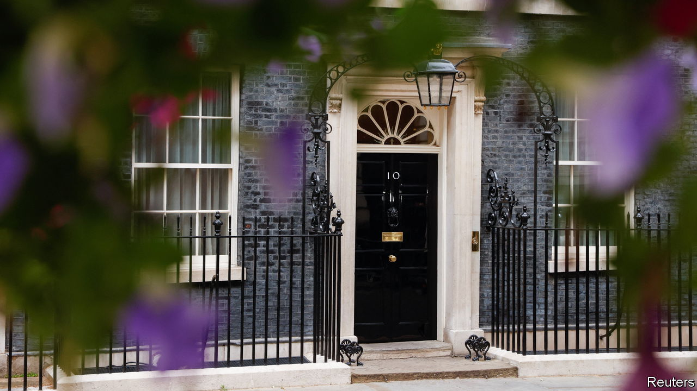

###### British understatement

# Britain’s Conservatives seem oblivious to the coming budget crunch 

##### It is a bad time to be increasing deficits to pay for tax cuts 

 

> Jul 13th 2022 

A little more than a decade after the Conservatives declared Britain to be on the brink of a bond-market crisis, many of the candidates to lead the party—and therefore the country—are promising to dole out plenty of cash. Tom Tugendhat wants to reverse a recent increase in national insurance, a payroll tax. Liz Truss wants to do that and cancel a planned rise in corporation tax. Penny Mordaunt, the , wants to peg most tax thresholds to inflation and temporarily halve vat on petrol.

There is still time for candidates to flesh out their plans, and none admits to throwing fiscal caution to the wind. Ms Mordaunt promises that she will get the debt-to-gdp ratio down. But none of the candidates has given a credible account of how they will finance all their giveaways. The implication is clear: most would borrow more than planned under Boris Johnson’s premiership. Given the pressure on government budgets around the world, that is worrying.

Politicians in rich countries ran up  during the pandemic and now face demands that they help the public, which is dealing with soaring energy and food prices. They must spend more on defence following Russia’s invasion of Ukraine and in light of the growing threat posed by China. They have to find the cash to decarbonise their economies, a project which in Britain could raise debt-to-gdp by 20 percentage points by 2050. All the while they must contend with ageing populations demanding more spending on pensions and health care.

The trouble is that this is an especially bad time to be increasing government borrowing. Annual global inflation is 9.5% and interest rates are rising. Stimulating economies with unfunded spending or tax cuts would only force central banks to tighten monetary policy even more.

Inflation eases government-debt burdens, but higher interest rates will mean that governments will have to pay more to borrow. This feed-through from monetary policy to government budgets will happen much faster than markets seem to think, in part because central banks’ vast bond-buying activities have left taxpayers across the rich world unusually . Britain is no exception. Despite the fact that the weighted-average maturity of its bonds is over 15 years, higher borrowing costs will affect half of its liabilities within about two. 

Some contenders for the Tory leadership have argued that inflation is solely the Bank of England’s responsibility. They are sorely mistaken. Raising interest rates is effective only when fiscal policy remains sound. In a tug-of-war between hawkish central banks and spendthrift politicians, the politicians win. Just look at Brazil, which has raised rates by over 11 percentage points since March 2021 but is still suffering annual inflation of nearly 12%, in part because fiscal policy lacks long-term credibility. Margaret Thatcher, the inflation-busting prime minister whom Tories idolise, was a deficit hawk.

No rich-world country is on the precipice of a fiscal crisis—though fragile Italy will also suffer rapidly rising rates. But if politicians borrow maximally today just because the bond markets will let them, they will have less headroom tomorrow if there is a war, say, or another pandemic. To use up fiscal space is to squander insurance against the next disaster. Some Tories note that Britain has room to spend before it breaks its fiscal rules. But that claim is built on a tentative official forecast of the economic outlook. To erect the pillar of your fiscal policy on it is reckless. 

And for what? Many Tories say tax cuts would unleash economic growth. In fact, because the stimulus would be offset by higher interest rates, the boost would be marginal. A pro-growth agenda would make taxation as efficient as possible, for example by shifting the tax burden from income towards land and inheritance. It would not pretend that tax is unnecessary or that tax cuts will pay for themselves.

After Johnson, an honesty test

Regrettably, Conservative leadership hopefuls are as likely to redesign the tax system as to condemn over-generous increases to public pensions, which benefit their elderly voters and are the biggest waste of the state’s money. Financing tax cuts with debt would help Conservatives avoid the contradiction of calling for a smaller state when that state increasingly benefits their own supporters. The truth is that an ageing society makes it harder than ever to combine falling debts with a shrinking government and generous public services. A willingness to confront that fact is the acid test of the next prime minister’s candour. ■

