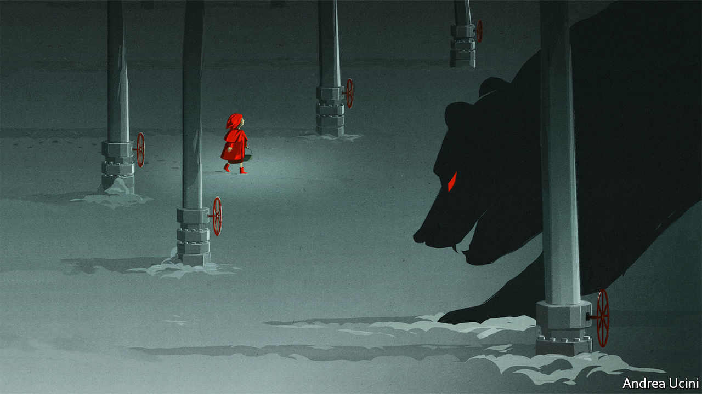

###### The energy shock

# Europe’s winter of discontent 

##### Even as temperatures soar Europe faces a bitter energy crisis later this year 

 

> Jul 14th 2022 

If you have spent the past few days being sizzled alive on a Mediterranean beach or slow-roasted on the streets of Berlin, London or Rome amid a heatwave, cold weather may be the last thing on your mind. But make no mistake, winter is coming, and it promises to be brutal and divisive because of an energy crisis that is rapidly worsening as Vladimir Putin strangles . Several calamities in the past decade have come close to ripping Europe apart, including the euro crisis in the early 2010s and the migrant crisis in 2015. The winter energy shock of 2022 could yet join them. Once again, the continent’s unity and resolve are about to be tested.

Most Europeans cannot yet see or smell the gastastrophe, but in the markets the  are already flashing red. Prices for delivery of gas this winter, at €182/mwh ($184/mwh), are almost as high as in early March, after Russia invaded Ukraine, and seven times their long-run level. Governments are preparing bail-outs of crippled utilities in France and Germany, and some investors are betting on which industrial firms will go bust later this year as rationing takes hold. While most of Europe’s politicians fail to level with the public about the hard choices that lie ahead, even grizzled energy traders used to wars and coups have started to sound worried.

A severe energy crisis has been a danger ever since Russian tanks rolled into Ukraine. As sanctions and Russian blackmail threaten to cut Europe from its main supplier, gas is the choke-point. It satisfies a quarter of the continent’s energy demand and Russia supplies a third of that. The figures are higher for some countries, including Germany. Unlike oil and coal, which are fungible and traded globally, gas must either be piped or transported as liquefied natural gas (lng), using facilities that take years to build or reconfigure. 

As Mr Putin understands all too well, gas is also a market in which Russia holds the whip hand. Its economy would collapse without oil exports that on average have been worth 10% of its gdp over the past five years—which is why Russia has gone to extraordinary and largely successful lengths to break the . But Russia can live without gas exports, which are only 2% of gdp. By turning down the taps on its pipelines, it thinks it can inflict more pain on Europe than it visits on itself.

Until a few weeks ago it seemed as if Europe might escape the worst, helped by more lng cargoes from America and elsewhere. Gas demand is seasonal, so it is vital to build up reserves in the spring and summer. From a scary 26% in March, by June Europe’s gas tanks were over half-full and on track to hit 80% by November, the minimum needed to get through winter.

Now the picture is worsening again. Glitches at a Norwegian gasfield are partly to blame, as is the hot weather which creates demand for electricity to power air-conditioning. But the big problem is the flow of gas to Europe from Gazprom, Russia’s gas monopoly. It was already running at about half the normal level and has dropped even further. Russia says that since July 11th, Nord Stream 1, an important pipeline, has been undergoing maintenance which will be completed by July 22nd. But it has not compensated by increasing supply via alternative pipelines that pass through Ukraine. Because traders think Mr Putin is deliberately squeezing supply, prices for delivery in two winters’ time, in 2023-24, are four times the normal level.

Consumers, who use gas directly for heating and cooking, as well as indirectly as electricity, have little idea of what may hit them. At the moment, many are protected by price caps, subsidies and long-term contracts. The typical German pays at least 70% less than the market price for gas. Industrial users such as chemicals and glassmaking firms are in trouble, as well as a broad list of businesses, including many . Across the euro zone a halt to Russian gas flows could lower gdp growth by 3.4 percentage points and raise inflation by 2.7 percentage points, according to ubs, a bank. In Germany the hit would be still worse. 

You may think a recession and inflation would be tolerable—after all, in 2020 Europe’s covid-hit gdp fell by 6%. But the energy threat is more insidious. Shortages could trigger beggar-thy-neighbour behaviour as states hoard gas, stopping it from flowing on to the next country. Britain has threatened as much. Gaps in the wholesale price of gas in different eu countries suggest that firms fear a breakdown in the single market. Governments’ debts are higher than ever. A  could raise fears of defaults or even of an Italian debt crisis that would threaten the entire euro zone. A popular backlash over energy prices could also erode popular support across the continent for standing up to Mr Putin. 

For all these reasons, European governments must rouse themselves to face the energy shock now. As with vaccines, they need to transcend national divisions. The European Commission is working on a plan to present to an emergency summit on July 26th. Given their roles in the gas trade, the plan should include Britain and Norway. Supply needs to be maximised, which is why common purchases of lng cargoes are worth pursuing and why the Netherlands should postpone closing its Groningen gasfield next year.

Next is the need for a common hierarchy governing rationing, applied across the continent: intensive energy users should suffer first, consumers last. Countries need to share storage capacity and guarantee free movement of gas. The more integrated the system, the more resilient it will be. Last, politicians should be honest with the public. Consumer prices need to rise now in order to curtail demand and help build up storage. Help will come next winter from even small voluntary changes in household habits, such as keeping the heating lower.

The prize for Europe is not just getting through the coming months. Europe will forever free itself from Russian energy intimidation. It will also have created a coherent continent-wide energy-security mechanism that will help accelerate the shift to cleaner energy. Europe has a habit of coming together during crises. It is time to do so again. If you are reading this in Paris or Madrid with the air-conditioning on, turn it down a notch. ■


