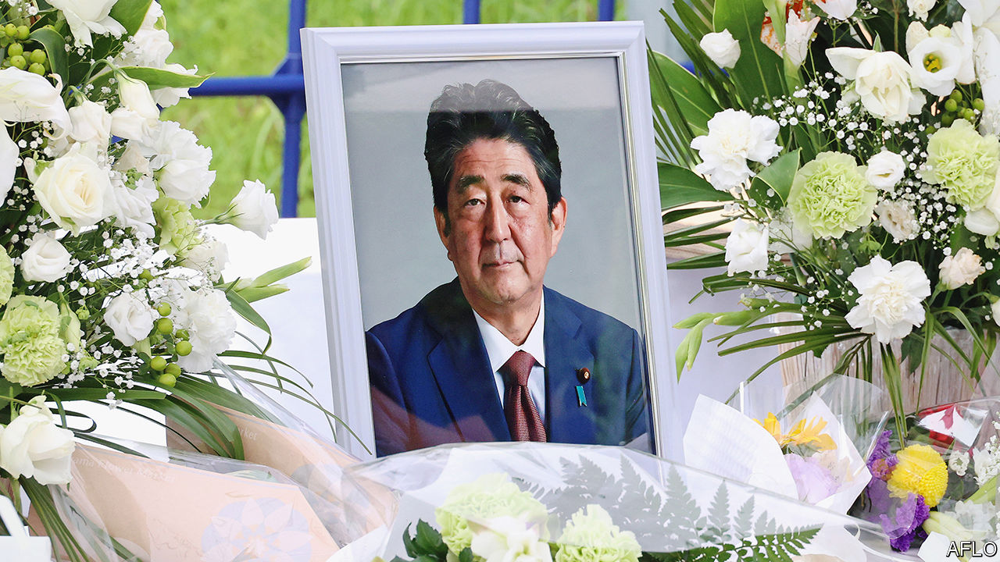

###### After Abe

# Japan should stay true to Abe Shinzo’s vision—up to a point 

##### Kishida Fumio, the prime minister, should follow Mr Abe’s pragmatism, not his nationalism 

 

> Jul 14th 2022 

Max weber spoke of the contrast between politicians wedded to moral purity and their pragmatic peers. Abe Shinzo, Japan’s prime minister from 2006-07 and 2012-20, was a keen reader of Weber. The tension between the competing ethics of conviction and responsibility defined his own life, which an  cut short on July 8th. 

Mr Abe had an ideological core. It was Abe the conservative nationalist who repelled his neighbours and polarised his country. Yet he also developed a studied pragmatism. This Abe was a realist who strengthened Japan’s defences and rallied allies. 

Despite Mr Abe’s death Japan is likely to stick to the course he set. It will remain committed to boosting its own armed forces, reinforcing its alliance with America, and deepening its security relations in Asia and beyond. In part that is because for all his diplomatic flair, Mr Abe was responding to geopolitical shifts happening around Japan—namely America’s vacillations and China’s rise. 

’s central achievement was reviving Japan as a global force in its own right. This began with institution-building, including the creation of a national security council to streamline policymaking and the fortification of the armed forces to boost deterrence. Mr Abe also erected an architecture for the “Indo-Pacific” region, through trade pacts and groupings such as the Quad. Crucially, Mr Abe also understood that Japan’s global role depends on its economic vitality at home. 

Yet Mr Abe’s desire to bring his country out of the shadow of the second world war and back onto the global stage sometimes meant glossing over ugly parts of its history. He fought to purge textbooks of what he saw as a “masochistic” version of Japan’s colonial and wartime past. Those revisionist tendencies strained relations with South Korea, a former colony. Though Mr Abe, to his credit, did try to resolve long-standing historical disputes, he left office in 2020 with ties severely frayed. 

Kishida Fumio, Japan’s current prime minister, has been quick to declare fealty to Mr Abe’s hawkish legacy. But he must be careful to distinguish between the pragmatic Abe and the ideological Abe, whom he should lay to rest. Mr Kishida can begin burying the ideological Abe by working with Yoon Suk-yeol, South Korea’s new president, to repair ties. He can boost his country’s standing when Japan revises its national security strategy and updates its defence spending plans later this year. 

Japan’s ultimate aim should be to revise its pacifist post-war constitution, which prohibits it from possessing “war potential”, to align with reality, which is that it maintains a large modern army. A revision would put its “Self-Defence Forces” on a solid legal footing. The debate preceding it would help Japanese voters understand that they live in a dangerous world, and need the means to defend themselves. Parties favouring revision hold the two-thirds majorities needed in both houses to put such changes to a referendum. Polls suggest the public may be more amenable than ever before. 

However, unlike Mr Abe, Mr Kishida is unlikely to press hard for a vote and he may be right. The debate would be rancorous, the amendment might not pass, and if it did it would upset both South Korea and China, where nationalists constantly pretend that  is about to revive. As Mr Abe acknowledged, his government’s more modest legal tweaks have given Japan’s armed forces the ability to deal with potential contingencies around Taiwan. Mr Kishida is therefore likely to carry on down the path Mr Abe charted, but more cautiously. If he can also lose some of his predecessor’s nationalist baggage along the way, all the better. ■

