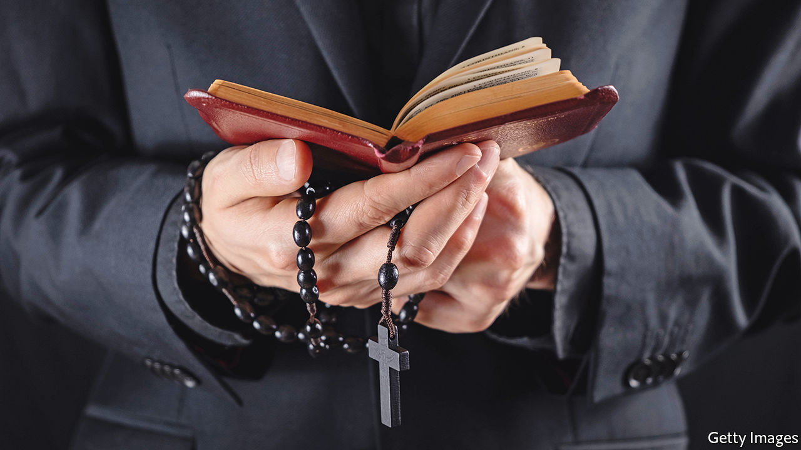

###### Let them wed

# The Catholic Church should scrap the requirement for priestly celibacy 

##### It would help it recruit clerics who do not abuse children 

 

> Jul 14th 2022 

The pope is not in the habit of taking advice from newspapers. After all, the Roman Catholic Church takes instruction from the creator of the universe. Nonetheless, Pope Francis has opened up a process whereby all 1.4bn Catholics can have a say about the future of the faith. If they want to reduce the scourge of sexual abuse by priests, they should demand an end to the rule requiring priestly celibacy. 

Were this just a theological question,  would take no view. But it is not. In parish after parish, school after school, diocese after diocese, Catholic priests have abused children. America, Australia, France, Germany and Ireland, among others, have undertaken reckonings. The number of victims in France alone was estimated at 216,000 in the 70 years to 2020. Now countries such as Poland, Portugal and Spain are investigating, too.  involves not only bad apples, but a rotting orchard (see International section).

Further revelations are inevitable. The scale of abuse against adults, including nuns, is starting to be reported. Investigations have barely even begun in poor countries into what might have happened in 9,000-odd residential Catholic institutions, including orphanages. Even in rich countries where criminal-justice systems are well-resourced, investigations have been thwarted by an ancient institution’s reflexive secrecy. 

Some of the church’s failings are common to other organisations. When a few people are given power over others, when checks on that power are weak and when victims lack effective channels to report abuse, predators will take advantage; witness the recent reckoning in Hollywood. If, furthermore, an institution routinely hushes up allegations and shuffles suspected predators to other jobs, rather than promptly reporting allegations to the police, abuse thrives. The church is working to correct these failings. But that will not be enough. 

Requiring priests to be celibate dramatically reduces the pool from which they can be recruited. For many people, no matter how pious, renouncing sex, romance and the chance to start a family is too great a sacrifice. One group for whom such a rule imposes little extra burden, however, is paedophiles. Society requires them to suppress their urges. Many already try to be celibate, or pretend to be so. 

Some become priests sincerely hoping that a spiritual life will help them resist temptation. Others no doubt do so precisely because the priesthood offers opportunities to abuse. Either way, the church has done a poor job of winnowing out those who pose a danger to their flock. Some argue that it has also done a poor job of preparing priests for the stress of a sexless life. Estimates from around the world, from a variety of scholars, have found that 6-9% of priests and members of celibate orders, such as monks, may be abusers. Statistics on the general population are hard to pin down, but Britain’s National Crime Agency estimated that 1-3% of adult men have urges to abuse children; a much smaller share act on their urges. 

The Vatican says that Jesus remained celibate, and so should his servants on Earth. Though some parts of the Bible praise celibacy, nothing in the gospels requires all clergy to embrace it. Before the 11th century, the Roman Catholic Church did not insist on it. The rule was introduced partly for financial reasons: clergy without children were more likely to leave their assets to the church. Today, many Eastern-rite Catholic churches let their clergy marry before taking holy orders. Strikingly, these churches have low levels of reported sexual abuse of children.

Protestant denominations show that married clergy can successfully tend to both their family and their flock—indeed, marriage may bring priests closer to their parishioners. That would weaken the idea that clerics are an untouchable group apart, which many researchers see as contributing to abuse.

The church is desperately short of priests. In its heartlands it is losing followers, not least because many no longer trust an institution that has sheltered abusers. If the church stopped requiring priests to be celibate (or male, for that matter), it could recruit from a much larger pool. If it also monitored them better and acted faster, fewer people would be abused. Whether that would slow the pace at which the faithful are leaving the church is hard to say. Regardless, it would be a blessing. ■

