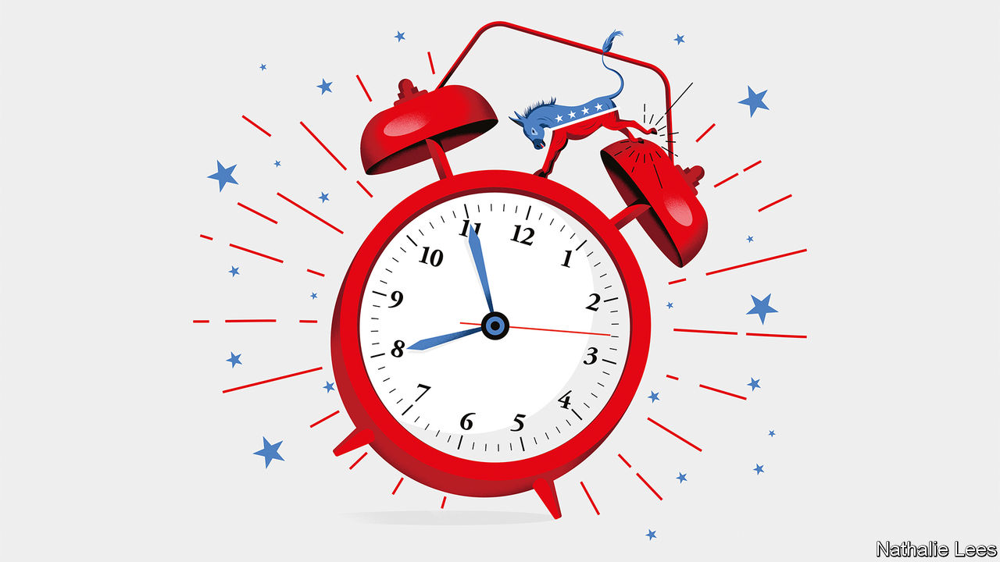

###### American politics

# The Democrats need to wake up and stop pandering to their extremes 

##### For the good of America, the governing party urgently needs to take on its own activists 

 

> Jul 14th 2022 

Every president yearns to be historic—but not historic like . At this point in his presidency Mr Biden’s singular achievement is to have the lowest approval rating of any incumbent since the 1950s. Even among Democrats, 67% think the , 78% think the country is heading in the wrong direction and 64% want another presidential candidate on the ticket in 2024. 

Mr Biden took office promising to heal the soul of the nation. Eighteen months later he has little to show for his efforts.  has sapped goodwill. The White House’s attempts to mobilise the state, including the theory-of-everything bill known as Build Back Better, have stalled in Congress. Democrats are bracing themselves for heavy losses in mid-term elections in November, which would doom most of the administration’s remaining ambitions. A gerontocratic rematch in 2024 could well see Donald Trump returned to the White House—legitimately.

This newspaper does not usually hand out advice to political parties, but America’s sickly democracy requires urgent repair. A majority of Republican members of Congress have endorsed Mr Trump’s attempt to —and many of them are likely to see themselves rewarded if the House returns to Republican control. For as long as they pander to their base by embracing Mr Trump’s baleful influence even after he nearly overthrew the constitution, repair will not come from Republicans. 

The Democrats therefore rightly see themselves as the only remaining guardians of America’s political system. The country needs parties that actually represent voters, few of whom belong to the extremes. And yet Democrats too have fallen prey to their activists.

Fringe and sometimes dotty ideas have crept into Democratic rhetoric, peaking in the feverish summer of 2020 with a movement to “defund the police”, abolish immigration enforcement, shun capitalism, relabel women as birthing people and inject “anti-racism” into the classroom. If the Democrats are defined by their most extreme and least popular ideas, they will be handing a winning agenda of culture-war grievance to an opposition party that has yet to purge itself of the poison that makes Mr Trump unfit for office. 

The Democrats have , but they lack urgency. That may be because some of them blame their problems on others—as when the White House points to “Putin’s price hike” or the negativity of Republican politicians and the conservative media. Although there is something to this, the party also needs to ditch cherished myths that empower its idealists. 

One is that a rainbow coalition of disaffected, progressive voters is just waiting to be organised to bring about a social revolution. The truth is that those who do not vote are politically disengaged and not very liberal. Some black,  and working-class voters may well see each other as rivals or have conservative views on race, immigration and crime. 

Another myth is that winning over centrist voters is unnecessary, because Democrats’ fortunes will be rescued by grand structural reforms to American democracy that are tantalisingly within reach. The constitution biases the Senate and electoral college towards rural America, and thus away from Democrats. Some in the party dream of using a congressional supermajority to shift representation in Washington towards the popular vote by adding states to the union, amending the constitution or packing the Supreme Court. Yet even in better times, there is a slim chance of that actually happening.

The greatest myth is that the party’s progressive stances invigorate the base and are off-putting only to the other side. Consider the governor’s election in Virginia in 2021. After favouring Mr Biden by ten percentage points in 2020, voters elected a Republican whose signature campaign pledge was ridding schools of  (crt). That concept has become a catch-all term for conservative gripes, some real and some fantastical. Republican attacks on Democrats as out-of-touch socialists ring true to many voters in the centre. 

The good news is that Democrats are showing signs of turning back from . In San Francisco irate voters have recalled their district attorney as well as three school-board members whose zeal for ideological neglected bread-and-butter problems with crime and schooling. Last year Minneapolis defeated a referendum to defund the police and New York chose a former police captain as mayor. All these causes were backed by non-white voters, including Asian-Americans in San Francisco and African-Americans in Minneapolis. Prominent Democrats running in battleground states are steering clear of the rhetoric that enthralled the party in 2020.

However, . All too often, Mr Biden seems to distinguish himself from his party’s worst ideas in muted tones and delicate asides. He needs to be louder and clearer in defending ideas that used to be uncontroversial: rising crime is unacceptable and the police force is needed to contain it; legal immigration is better than the illegal sort, and borders should be kept secure; the study of racism belongs in the school curriculum, social-justice praxis does not. It is not enough for Democrats to bemoan Republican disinformation. They need to counter the idea that they themselves are in thrall to their own extremes.

The bullseye is in the middle

Moving towards the centre ground would not just be a shrewd political tactic, it could also be the beginning of a cure for American democracy. The stakes could not be higher. The Republican Party has succumbed to Mr Trump’s contempt for the rule of law and the true outcome of elections. For as long as the former president is poised to stand again for his old job in 2024, rebooting the Republicans will require nothing short of overwhelming electoral defeat. And that in turn requires a clearer end to the ideological drift that is jeopardising the Democrats. Standing up to the ideologues of the left will require grit, but if Mr Biden truly wants to save the soul of the nation he will have to start with the soul of his own party. ■


