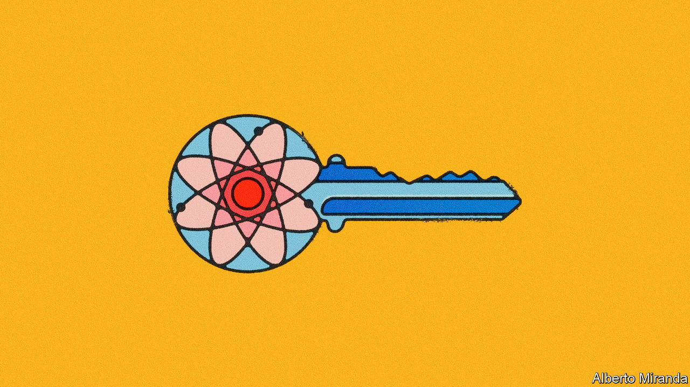

###### Post-quantum solace

# What to do now about tomorrow’s code-cracking computers 

##### A future-proof way to encrypt sensitive data is now available. Put it to use 

 

> Jul 14th 2022 

Hacking and data breaches are a cost of doing business. One defence is to use encryption, but in the fast-approaching era of  that defence will fail.

When  reach their potential, decades of secret intelligence, credit-card details, intellectual property and military and medical data will become as easy to read as the words before your eyes. The world will suffer the broadest, deepest hack in history.

Now researchers at the National Institute of Standards and Technology (nist), America’s standards agency, have shown how to avert at least some of that catastrophe. Governments, business leaders and software vendors should pay heed.

Cryptography protocols involve calculations that are harder to undo than do. For instance, it is easy to multiply two big prime numbers together, but impossibly time-consuming to get back the primes from the answer. If both sender and receiver know one of the primes, they can decrypt a message that is uncrackable to everyone else. 

Quantum computers turn some of the probabilistic, simultaneously here-and-there weirdness of quantum physics into number-crunching elegance. Their powers will be limited to a smallish class of problems; it is an unfortunate coincidence that one of them is unscrambling the calculations in the defence behind which the entire digital economy has been built. 

This coincidence could not be more consequential. Encrypted information is sent round the world with abandon. Be in no doubt that some is being warehoused for decryption tomorrow by malefactors awaiting a quantum-computing future. Progress towards that future is relentless, and not only because some people want to crack the internet. Pursuits ranging from machine-learning and logistics to portfolio management and drug development are ripe for a quantum boost.

No surprise, then, that some of the world’s largest firms are in the race. Advances in both quantum machines and the error-correcting and number-crunching algorithms that run on them spill out regularly. The code-cracking threshold may be some years away, but it is rapidly drawing closer. Perhaps a university laboratory will cross the line, or one of the many startups now being launched, or spooks in China or America. A breakthrough may not even make the headlines: it confers a power worth more than good pr.

Computer-scientist types have therefore been hard at work conjuring “post-quantum cryptography” (pqc) protocols: new encryption mathematics that outpaces the capabilities even of quantum machines. None has yet become a trusted standard, but now nist has picked a set of recipes that have survived years of tyre-kicking. 

The imprimatur of a world-renowned standards body should be enough to start a general shift to pqc. That should begin today, as it will take time for the new protocols to supplant the old techniques. Big software vendors will pick up the bulk of the task, building the protocols into the programs and platforms they offer, and behind-the-scenes gatekeepers such as the Internet Engineering Task Force will help the spread. But smaller operations that do not truck in commercial software, such as boutique data dealers, defence contractors and the like, will also have to get their spanners out. Eventually the new standards must percolate through every device and service that transmits encrypted data—every browser tab, every nuclear facility, every payment gizmo, every military digital radio.

This is more than just a matter of bottom-covering and locking down data in danger of being hoovered up by tomorrow’s quantum-enabled hackers. Given how long the transition will take (and the certainty, acquired from bitter experience, that many will drag their feet), early adopters will enjoy an advantage. “pqc-ready” should become a selling-point. 

A bit of cryptographic agility will prove advantageous in the long run, too. nist’s new standards are unlikely to be the last, as quantum computers’ strengths develop and protocols are tested to destruction in the white-hat hackers’ white-hot heat. Organisations should learn how to become nimble now so that they can slot in new equations later. 

For decades the security-minded had little need to worry about cryptographic protocols, which were the best defence within the only existing computer architecture. Now that old architecture has a rival. Most who implement pqc will not see any difference, and have no need to fuss with the 600-digit numbers in use today. They should, however, sleep a little easier. ■

