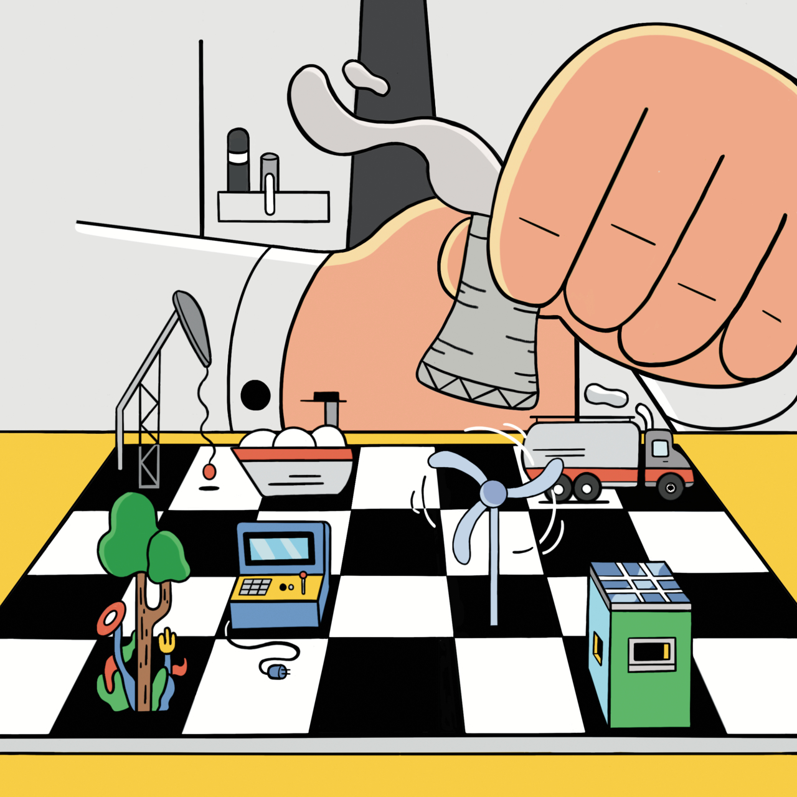
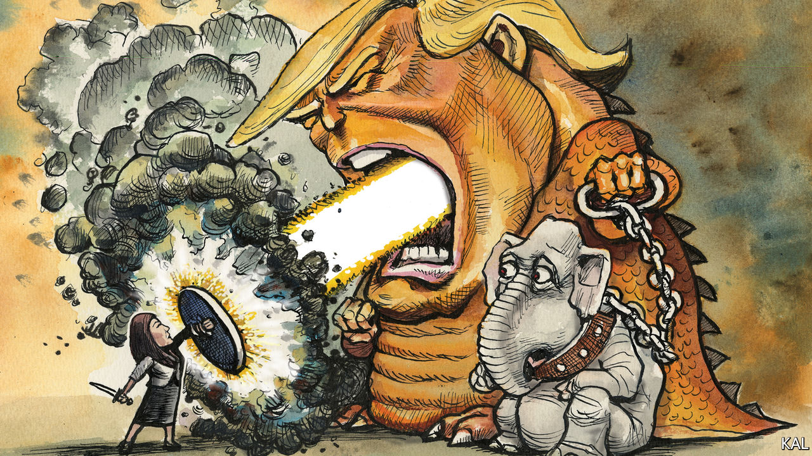
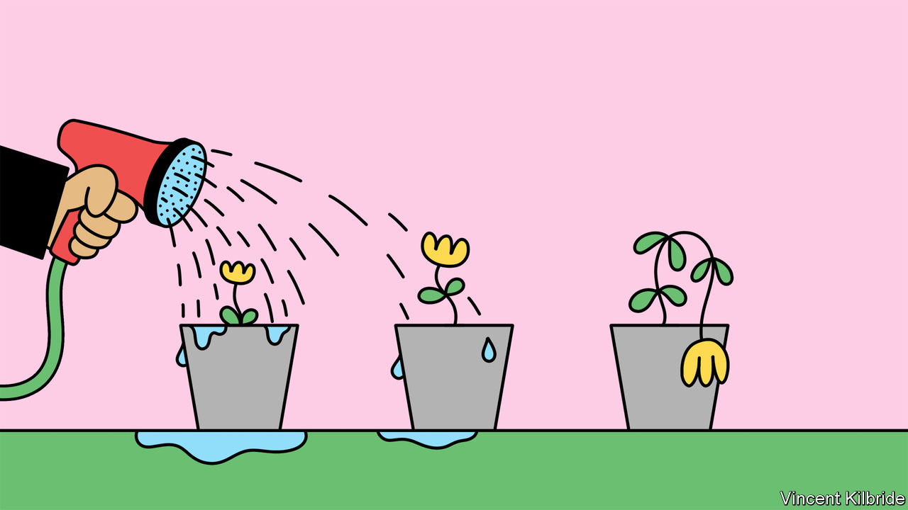
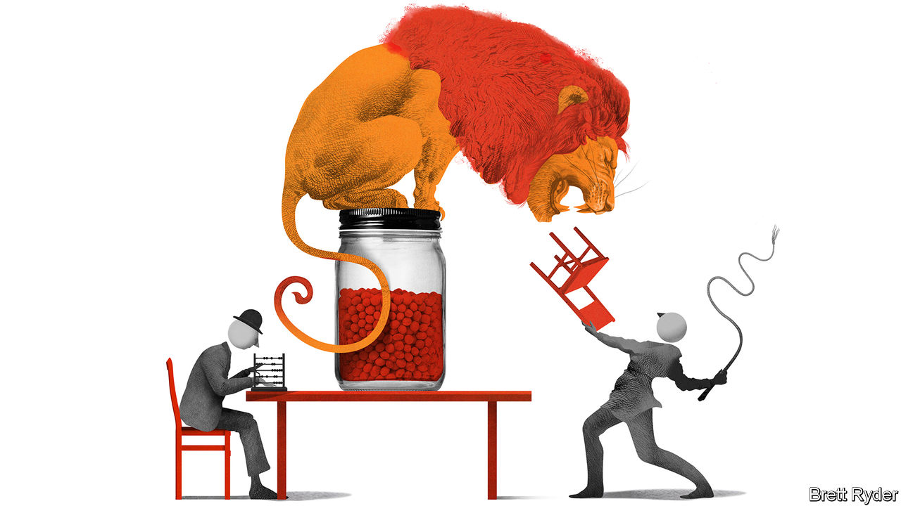
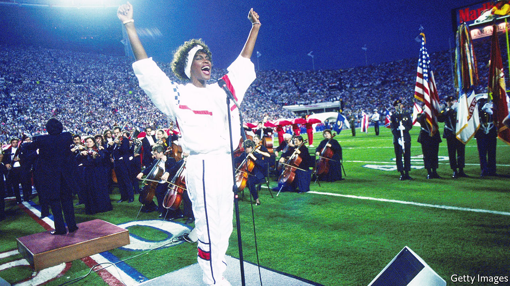

###### On pumped-storage hydropower, the Republicans, corporate governance, consultants, America’s national anthem, writing, moustaches

# Letters to the editor 

##### A selection of correspondence 

 

> Jul 14th 2022 


Pumped-storage hydropower

I was glad to see you note the vital role of long-duration energy storage (ldes) in decarbonising grids (, June 25th). I call this the ignored crisis within the crisis. As you say, almost all ldes globally is provided by one technology: pumped-storage hydropower (psh). When I was prime minister of Australia I commissioned the Snowy Hydro 2.0 Pumped Storage Facility to tackle blackouts in South Australia. I learned a lot about the technology, and I was surprised to read industry estimates of only a 50% increase in psh over the next decade. Happily, that is an underestimate. China alone has plans to quadruple its installed capacity, to 120 gigawatts by 2030.

Moreover, a study by the Australian National University identified up to 600,000 potential sites for off-river pumped-storage hydropower, which, as the name suggests, does not need an ongoing connection to a river system. It has the potential to provide up to 23,000 terawatt-hours of storage, more than enough to support a 100% renewable global electricity system.

The key barrier to its global deployment is a lack of appropriate market mechanisms of the type that have enabled wind and solar to be installed at scale. The truth is that we already have all the technologies we need to deliver 100% decarbonised grids. What we need is the political will.

malcolm turnbull

Board member

International Hydropower Association


 


Too little, too late

I appreciate that Lexington has at least gone so far as to admit that the Republican Party may be unreformable, but I must disagree that there is any real courage among those who finally testified before the January 6th committee (). Cassidy Hutchinson did not come forward voluntarily but was compelled by a subpoena like all the others who have testified. The kindest interpretation is that after her subpoena in November 2021, she at last decided to do her duty by the oath she took as a public employee. 

More realistically, she saw her choice as between resisting the subpoena, lying under oath or testifying, and decided that her former Trump- connected lawyers were ready to sacrifice her or take her down. A 25-year-old junior staffer should not be subjected to the same condemnation reserved for senior Republicans like Bill Barr and Bill Stepien; they knew where the administration was heading with the Big Lie, did not step up in public to stop it, and to this day continue to work for those who propagate it. But I’m sorry, there is no heroism here. Only two Republicans voted to have this committee and not one voted to protect federal elections from gerrymandering and state interference. The Republicans can no longer be trusted in power at any level.

richard smith


 


Early to bed…

Your correspondent reports that California has decided that public high schools should start 30 minutes later at 8.30am (“”, June 25th). Evidently this will lead to high-schoolers getting more sleep and being healthier. It would be simpler if teenagers went to bed earlier, and with their phones off.

TERENCE MILLS


 


Unravelling the code

Your leader on Britain’s growth crisis cited the country’s “baroque governance code” as an obstacle to growth in general (“”, June 25th). The uk Corporate Governance Code’s strictures probably do deter some listings on the London Stock Exchange, but it suffers from other serious shortcomings. Numerous measures duplicate requirements that are regulatorily mandated elsewhere, and others do little more than confirm corporate common sense. In addition, the code has increasingly taken on a misguided stakeholder focus. Compliance is contingent upon shareholder oversight and there is only so far that shareholders will go in promoting the interests of non-shareholder stakeholders. A strong case can be made for abolishing outright what was an innovative corporate-governance document. 

brian cheffins

Professor of corporate law

University of Cambridge

 


Accountants v consultants

Schumpeter wrote about the planned spin-off of ey’s consulting arm (). This has happened before. In 2000 Ernst &amp; Young (as it was known then) spun off its American consultants to Cap Gemini. The situation was similar in that consulting made up two-thirds of the firm’s profit then, too. 

The accounting partners remained partners with partner-level incomes. Meanwhile, virtually all of us in consulting were pushed out or left within four years as cost cutting by Cap Gemini reduced our salaries and opportunities substantially. The former consulting partners who received Cap Gemini stock grants as their pay-off had to pay tax bills based on 2000 stock valuations. Stock sales over the next five years were worth half what they were in 2000 because of a drop in the market. It was a windfall for the bean-counters paid for by the consultants who generated the windfall. This time will be no different.

stephen ruger


 


American vision song contest

Far from being “the perfect song for America”, “The Star-Spangled Banner” rankles as a war tune extolling destructive explosions at an obscure battle (“”, June 25th). A more appropriate song would be positive and constructive, such as “This Land is Your Land”. Or how about “America the Beautiful” or “America (My Country ‘Tis of Thee)”. Enough war, enough bursting bombs. 

professor emeritus leon kenman


 


The write stuff

The availability of writing material also played a part in the development of writing (, July 2nd). It is no accident that parts of the world with relatively abundant access to water, sand, rocks, or clay, and reeds, wood, or metal, lent themselves more to developing a lasting system of shared symbols. It is worth noting how the Germanic Runic script, carved on stone or wood, consists of arrangements of straight lines. They are necessarily hard cuts into hard materials. By contrast the Burmese script is entirely curved, as it relied on palm leaves or other, less durable material which could not handle straight cuts without breaking. Simon Ager runs an excellent, long-standing website called Omniglot.com that is a good compendium of the world’s writing systems. 

nareg seferian


There is another factor in the “everyday miracle” of writing. According to Walter Ong’s “Orality and Literacy”, before the Greeks written symbols corresponded directly to certain ideas and related sounds but reading required some interpolation of sounds between symbols. A person could not make up a new word and write symbols to represent it clearly. The Greeks introduced a direct correspondence between sounds, including vowels and symbols. A person could imagine a new word sound and write it down so that a reader who had not seen that written word before could pronounce it and use it. This gave philosophical writing and reflection great power.


FONS NOUWENS


 


A tash gives you panache

Certainly the moustache has been much loved in earlier times (“”, July 2nd). A colleague’s aunt said in the 1930s that kissing a man without a moustache was like eating an egg with no salt.

jeremy moon


