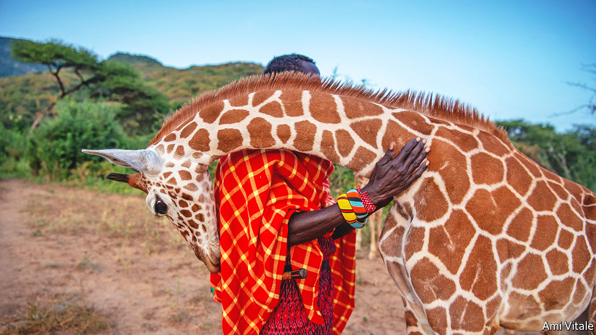
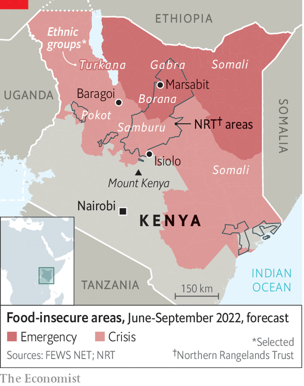

###### Kenya’s wild north

# Can elephants and rhinos coexist with livestock and their owners? 

##### A controversial model of wildlife conservancy seems to help 

 

> Jul 14th 2022 

The vast arid lands of northern Kenya are awash with guns. An ak-47 can be bought for two or three scrawny cows. Pay in cash and it might be as little as 5,000 shillings (a bit more than $40). By one estimate Kenya harbours 750,000 illegal guns, though no one really knows. What is certain is that many are owned by cattle- and camel-herders in the sparsely inhabited north, where guns have replaced the spears that would have been the main weapon just a couple of generations ago. As a result, skirmishes have become far deadlier; a dozen may die in a single raid. 

A former policeman who runs a peacemaking project reckons that in the past year more than 100 people, including women and children, have been killed in one northern county alone, Marsabit. In one raid more than 60 perished. “The government has lost control,” says a game ranger who hails from the Turkana people, who compete for grazing and water with the Samburu and others. The proliferation of firearms and the surging death toll have been exacerbated by civil strife across no fewer than four of Kenya’s porous borders(see map).

 


The most afflicted area lies to the north of an arc that starts midway along the border with Uganda and brushes the northern foothills of Mount Kenya before curving down to the Indian Ocean. The troubled region accounts for nearly two-thirds of Kenya’s territory but only 7m-8m or so of its 54m people. Long neglected by the government in Nairobi, the capital, they are among the roughest, toughest and poorest in the country. 

Much of the violence is sparked by the rustling of cattle and camels. This has long been endemic, but is aggravated by drought that pits herdsmen against one another, and is made more common by climate change. unicef, the un’s agency for children, reckons that a quarter of the children in Marsabit county are malnourished and 3.5m northern Kenyans are “acutely food insecure”. Competition for pasture and water has intensified as numbers of livestock have increased, not least because corrupt politicians launder their wealth through cattle. As a general and presidential election looms next month, unscrupulous candidates heighten ethnic tension.

The violence has permeated the dusty, scruffy towns as well as the savannah and semi-desert of the north. Near Marsabit town the Borana and the Gabra (both related to the Oromo, Ethiopia’s largest ethnic group) have been bloodily clashing. In Baragoi a faultline runs through the town between the Samburu and Turkana, who also sporadically do battle. In the unhappy town of Isiolo five rival ethnic groups jostle angrily for power and patronage. 

Apart from cattle, the most abundant resource in swathes of the north is wildlife: elephants, rhinos, lions, giraffes and an array of other fauna and flora that Western tourists and a growing number of prosperous Kenyans will pay good money to admire—provided they feel secure. Tourism, which generates 8-9% of Kenya’s gdp, has become vital to the poor north’s economy. 

But many locals, often with the connivance of politicians, have been lured into networks of poachers. This is hardly surprising, since a kilogram of elephant ivory has at times fetched as much as $2,000 on the global (black) market. The same weight of ground-up rhino horn, to which the credulous ascribe medical and aphrodisiac qualities, might sell for $70,000. A stockman working on a ranch, meanwhile, earns perhaps $75 a month. 

Starting in the 1970s, poaching led to a catastrophic tumble in the number of elephants and rhinos. According to one study, Kenya’s elephant population fell from at least 150,000 in the 1960s to as low as 16,000 by 1989. Rhinos, by one count, plummeted from 20,000 to 240. 

Finding a balance between protecting wildlife and preserving the livelihoods of poor nomadic herders has long tested the ingenuity of conservationists. The bluntest approach was to restrict the pastoralists’ right, as they saw it, to bring their livestock to graze wherever there was grass. Such curbs have sown enmity between competing tribes and also between herders, conservationists and white ranchers, some of whom still own vast tracts of land that pastoralists consider to have been stolen from them more than a century ago. Kuki Gallmann, an Italian who is also a best-selling author, has twice been shot and nearly killed by angry Pokot herders loth to remove their cattle from her nearly 40,000 hectares (100,000 acres). 

Born free, live happily together?

Is there a way for the pastoralists, wildlife and conservationists to coexist? Ian Craig, a 69-year-old third-generation white Kenyan who was formerly a rancher and big-game hunter, believes that there is. In 2004 he created the Northern Rangelands Trust (nrt). It now provides advice, security and fundraising for 40-odd conservancies, all owned by not-for-profit trusts and local communities, covering more than 10% of Kenya’s land. More than a hundred other conservancies have since emerged, following the nrt model. 

Each conservancy within the nrt family, usually hosted by one or two ethnic communities, is governed by a council of elders that oversees such ticklish issues as allocating grazing land, protecting wildlife, building clinics and schools, and distributing fees from tourist camps and facilities on their land. Most conservancies let cattle mix with wildlife, but sometimes restrict them in times of drought or make them graze in designated areas.

The nrt provides a robust service of wildlife rangers. These include rapid-response teams, each proudly consisting of several different ethnic groups, that have proved effective at catching poachers and rustlers. Mr Craig, among others, is widely credited with saving Kenya’s rhinos from near-extinction. Kenya’s rhino number has risen back to around 1,600; elephants are back up to nearly 40,000, a fraction of their old tally but no longer facing extinction.

The nrt also supports some 80 “peace ambassadors” who help settle differences between the competing ethnic groups. Mr Craig stresses that the nrt model is as much about development as about protecting wildlife. He has arranged for 14 of the nrt conservancies to be paid for carbon credits bought by international firms such as Netflix. “It’s holistic,” says Mr Craig.

The nrt has its critics. Some indigenous-rights lobbies denounce what they call “fortress conservation”, arguing that wildlife enthusiasts, especially those who emphasise security and anti-poaching, put the lives of animals above those of humans. A year ago the Oakland Institute, an indigenous-rights organisation in California, published a vituperative attack on the nrt, accusing its rangers of involvement in scores of murders. It charged the nrt with being a neocolonial scam to “green grab” land. And it accused conservation outfits such as the Nature Conservancy and the World Wildlife Fund, plus an array of aid agencies, of letting the nrt flout the herders’ rights by pushing them off their lands. Dr Mordecai Ogada, the fieriest critic of the nrt model, argued in a book titled “The Big Conservation Lie” that the conservationists’ agenda is “intertwined with colonialism, virulent racism, deliberate exclusion of the natives, veiled bribery and unsurpassed deceit”. 

The nrt rebutted all these accusations in its own counter-report. “No way does nrt grab land, restrict grazing—or kill people,” says Sam Lekimaroro, its head of security. But six of the trust’s biggest donors were rattled enough to commission an independent report by a Kenyan indigenous-rights expert, Dr Kanyinke Sena.

Last month he found them all baseless; Oakland called his verdict “a sham”. Dr Sena recognised “the valuable role and range of responsibilities that nrt fulfils for people and nature in northern Kenya”, adding that “its peacekeeping activities help reduce the intensity and impact of community violence and that its livestock recovery programme helps reduce conflict”. He concluded: “There is no question that we urge donors stay committed to supporting nrt programming and development.” 

Moreover, Dr Sena came to “the hard conclusion that Oakland researchers essentially parachuted into a highly complex situation and allowed themselves to be manipulated by a small group of politically motivated and self-interested nrt critics”. However, a prominent white rancher says that “in terms of the optics, white people and poncy celebrity conservationists have got to disappear” from so many grand leadership positions. 

So far no one has found persuasive alternatives to the nrt model of coexistence between wildlife, livestock and locals in conservancies backed by vigorous ranger teams. As Peter Martell puts it in “Flowers for Elephants”, a recent book that weighs the arguments over Kenya’s conservancy model, the embattled local people “had been confronted by an existential crisis” when poaching, habitat loss and lethal ethnic divisions had threatened their livelihoods. Thanks to the nrt’s promotion and protection of wildlife conservancies, he concludes, they “had peered into the abyss—and stepped back”. ■

