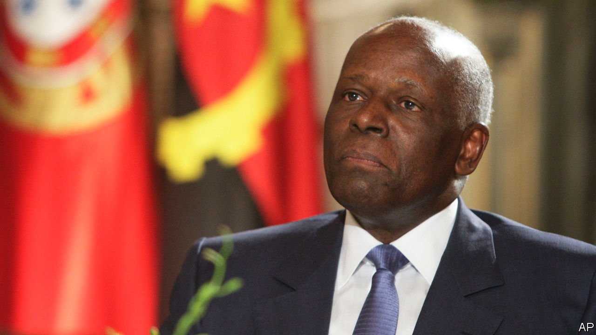

###### A legacy of looting

# José Eduardo dos Santos, who plundered Angola, has died 

##### But the former president’s corrupt legacy lives on 

 

> Jul 14th 2022 

AFRICA HAS endured more than its share of grotesque dictators. Mobutu Sese Seko guzzled pink champagne in a jungle Versailles built from his plundering of Congo. Sani Abacha, who looted Nigeria’s oil money, was allegedly poisoned while in the company of three prostitutes. Jean-Bédel Bokassa, the self-proclaimed Emperor of Central Africa, fed his opponents to animals. Robert Mugabe, reserved by comparison, dressed in Savile Row suits while decrying the perfidious British, and brought in North Koreans to train his soldiers to massacre his opponents.

José Eduardo dos Santos, who was announced dead in a Barcelona hospital on July 8th, ruled for longer than any of these men. He was president of Angola from 1979 to 2017. His manner was restrained, he rarely gave interviews, and when he did he said little of interest. He was also ruthless, repressive and staggeringly corrupt. He was arguably the master of the neo-patrimonial, or clientelistic, style of African politics that emerged after decolonisation, using vast oil rents to run his own dictatorship. Angola continues to suffer from his legacy, which it is struggling to shake off.

Born in Luanda, the capital, in 1942, while Angola was still under Portuguese rule, Mr dos Santos won a place at a school frequented by children of the colonial elite. Opposed to foreign rule, he joined the army of the People’s Movement for the Liberation of Angola (MPLA), a Soviet-style party founded by a small Luanda-based elite that would go on to rule the country uninterrupted after independence in 1975. After a stint in Baku, the capital of Azerbaijan, then part of the Soviet Union, where he trained as a petroleum engineer, he returned to jobs in the party. When Angola’s first president, Agostinho Neto, died from cancer in 1979, Mr dos Santos was seen by party bigwigs as a young, not especially clever, and pliable replacement. It was neither the first nor the last time he was misread. “He was chronically underestimated,” notes Ricardo de Soares Oliveira, a scholar of Angola based at Oxford University. 

By the time he became president Angola had been embroiled in conflict of one kind or another for almost two decades. The anti-colonial war against Portugal was followed by a conflict for control of the new country between the MPLA and its archrival, UNITA. It was an archetypal cold-war proxy battle, replete with the contradictions of the time. The MPLA side was bolstered by Soviet guns and Cuban fighters; UNITA by the Americans and apartheid South Africa. Yet, under Mr dos Santos, the MPLA established a parallel state based on revenues from offshore oil fields, which drew in American oil majors. Soon a Soviet-backed Leninist party fighting American and South African proxies was being bankrolled by selling hydrocarbons extracted by American oil firms to South Africa under sanctions. 

By the mid-1980s Mr dos Santos had used oil rents and astute patronage to achieve a strong grip over the MPLA and, thus, what amounted to the state. His tactics forged in those early years would continue throughout his reign. “He was very street smart,” says Mr de Soares Oliveira, “full of the knowledge of men”—often using spies to find out intimate details about potential rivals, so as to blackmail or bribe them later. In general, unlike Mobutu, he bought off competitors and opponents, rather than killing them. “He wouldn’t send you to Siberia or shoot you,” says the Oxford professor. “He would allow you to keep your money and make you Ambassador to Tokyo.”

An emollient approach to elite politics was not, however, extended to the majority of Angolans. In the 1990s the proxy war became a full-scale civil war—one that a UN diplomat called “the worst war in the world”. The tone was set in late 1992, after UNITA rejected the results of multi-party elections, when the MPLA unleashed a massacre of UNITA supporters on the streets of Luanda. Almost a decade of fighting followed—one side funded by oil, the other by trade in illegally mined diamonds—that caused millions to flee their homes and much of the country to be pockmarked with landmines. 

But unlike other African civil wars, such as Mozambique’s, Angola’s civil war ended in an all-out military victory for one side, after MPLA troops killed Jonas Savimbi, UNITA’s brutal leader, in 2002. The decision four years earlier to push for a complete triumph was to be Mr dos Santos’s “greatest contribution” to the country’s history, argues Alex Vines of Chatham House, a London-based think-tank.

Peace, more or less, followed (there was little punishment of vanquished UNITA leaders). But so did spectacular crony capitalism, as the MPLA swapped Vladimir Lenin for Louis Vuitton. Luanda became arguably the most expensive city in the world as oil money gushed through a capital that had to import almost everything. Sonangol, the state-owned oil firm that ended up controlling much of the economy, was at the heart of everything. MPLA elites, oil executives and Western facilitators chugged bottles of Pétrus and Johnnie Walker Blue at beach bars, and ate melons that cost $100 each. Angola became sub-Saharan Africa’s biggest oil exporter after Nigeria, and forged the continent’s closest relationship with , which bought much of the black stuff. Mr dos Santos saw himself as first among equals when it came to his relationship with Beijing; when China gathered all African leaders for a showpiece summit, he stayed at home, lest he be seen as just part of a pack. 

Mr dos Santos also used the MPLA’s oil wealth and military experience to project power in the region. He supported the armed wing of the African National Congress against the apartheid government and gave haven to Sam Nujoma, who would become the first president of neighbouring Namibia. Angola backed the effort to invade Congo that saw Mobutu replaced with Laurent-Désiré Kabila, then backed the new president’s war against the countries that installed him (chiefly Rwanda and Uganda).

The beginning of the end for Mr dos Santos came in 2014, when the . When there was less to grease the wheels of the graft machine, it exploded in his face. The MPLA became increasingly concerned that he was planning to install his daughter, Isabel, as his successor. That, and his fading health, caused the party to move against him, ousting him in favour of João Lourenço  in 2017. 

Upon taking power Mr Lourenço  about cleaning up corruption. Under Mr dos Santos the MPLA elites syphoned an estimated $24bn out of the country. Isabel dos Santos, who ran Sonangol, was  in 2020 with fraud, embezzlement and money-laundering. She is accused of using her family links to defraud the country by gaining sweetheart deals with various state-linked companies, stakes in which courts have ordered her to give up. Late last year she was placed on America’s sanctions list “for her involvement in significant corruption by misappropriating public funds for her personal benefit”. (The  in Africa denies the charges.) In 2020 her brother, José Filomeno de Sousa dos Santos, nicknamed Zenu, was jailed after he was found guilty of defrauding the central bank to the tune of $500m.

In recent years Mr Lourenço has softened his approach to tackling corruption. Ahead of elections next month, in which the MPLA is being challenged by a resurgent UNITA, the president has tried to bring his party together again. And Mr Lourenço, keen to show himself as the head of a unified party—and nation—would like Mr dos Santos back in Angola for a state funeral. His family is understood to be resisting such efforts.

The elite machinations around the funeral are in some ways fitting; it is just the sort of politicking that Mr dos Santos excelled at. The tragedy is that his skill in navigating patrimonial politics was used for such selfish ends. He grew astonishingly rich. War ravaged his country. Today about half of Angolans live on , while the MPLA elite continues to enjoy the high life. Mr dos Santos was good at the political game. But what a grim game it was. ■

