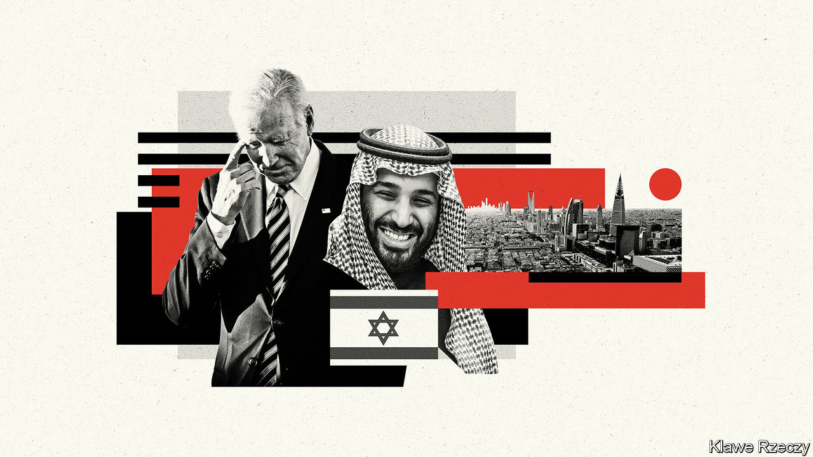

###### Voyage to nowhere

# What does the Middle East offer America? 

##### America’s president embarks on an aimless trip 

 

> Jul 12th 2022 

For decades American presidents have arrived in the Holy Land like earnest pilgrims searching for the Grail of a two-state solution. George W. Bush hoped to find it in 2003 with his “road map for peace”. Barack Obama came in 2013 when John Kerry, his secretary of state, was trying to restart Israeli-Palestinian talks. Even Donald Trump promised to “give it an absolute go”.

Joe Biden has lost the faith. His nearly 48-hour visit to Israel and Palestine, which began on July 13th, was designed to be an exercise in banality: shake a few hands, see a few sights, head back to the airport. No president in recent memory has arrived with so little to say about the region’s most intractable conflict.

It is hard to blame him. Both Israelis and Palestinians are in political turmoil. Even if Mr Biden wanted to wade into the peace-process swamp, there is no one to join him. And the conflict no longer seems as important as it once did. After decades of insisting that the status quo was not sustainable, America has decided it might be.

When the trip was planned, the hawkish Naftali Bennett was Israel’s prime minister. His  last month and an election, the fifth since 2019, is set for November. It was , the caretaker prime minister, who hosted Mr Biden. The president did make time—albeit just 15 minutes—for Binyamin Netanyahu, who hopes to make yet another comeback.

The Palestinians received far less attention, only a brief scheduled stop in Bethlehem to see Mahmoud Abbas, the 86-year-old president who governs the West Bank. Mr Biden was expected to pledge $100m in aid for hospitals in East Jerusalem that offer specialist care to Palestinians who cannot find it in the occupied territories, reversing a senselessly cruel cut Mr Trump ordered in 2018. It is a laudable step, but a paltry one, showing how hopelessly deadlocked it all is. Mr Lapid’s party supports the two-state solution in principle, but he may not have time as prime minister for real diplomacy with the Palestinians, who themselves remain utterly divided. Mr Biden offered the routine bromides on the peace process, but his heart was not in it. 

The real focus of Mr Biden’s trip would begin on July 15th with his arrival in Jeddah. Even Israelis acknowledge that they are a warm-up act. “He’s coming here first because it’s now clear to the Americans they can’t deal with their allies in the region separately, as we’re much better co-ordinated now,” says a minister.

The administration would like that co-ordination, long conducted in secret, to be more publicly acknowledged. Mr Biden will urge the Saudis to draw closer to Israel, and to pump more oil. He wants to avoid an American recession and a thumping for the Democrats in the mid-term elections.

The trip’s most fraught moment is a planned encounter with Muhammad bin Salman, the Saudi crown prince, a  for many Democrats because of his chummy ties with Mr Trump and his dismal human-rights record. Mr Biden had refused to talk to him since he took office.

For weeks the president insisted he was not going to Jeddah, the Saudis’ commercial capital, to meet Prince Muhammad. Instead he would attend a broader meeting with leaders of six Gulf countries, plus Egypt, Iraq and Jordan. If the  ruler of Saudi Arabia should happen by a diplomatic summit in Saudi Arabia, perhaps he would say hello. This was comical spin; that Mr Biden felt he had to offer it showed how controversial the trip was.

It would have been less controversial if it offered the promise of real achievements. It did not. Israeli officials play down talk of a breakthrough with Saudi Arabia, with good reason. The kingdom is in no rush to make a deal. It will settle for incremental steps: Mr Biden is expected to announce in Jeddah that more Israeli airliners will be allowed to fly over Saudi airspace. On oil, even if the Saudis agree to pump more, it is unclear how long they can run fields at full tilt, and whether the world has enough refining capacity to turn extra crude into fuel that can be gobbled up. 

In an unusual op-ed on July 9th, Mr Biden set out a pre-emptive defence of his trip, saying it would show off America’s “vital leadership role” in the region. It fell short. His hosts offered a friendly welcome, but they will probably send him home with little more than a few token souvenirs. ■

