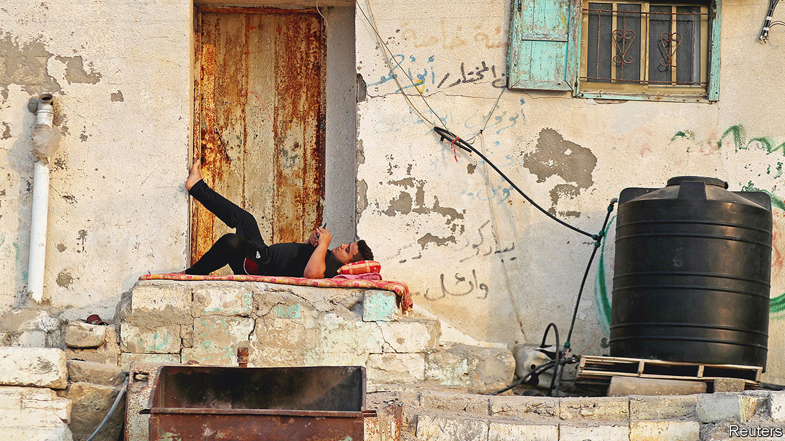

###### The blockade generation

# Young Palestinians in Gaza cannot find work and cannot leave 

##### They cannot afford to marry, either 

 

> Jul 14th 2022 

When amr masri started university a professor made a promise to his class: finish your studies and you’ll find a job. He finished in 2019 with a business degree. Three years later, on a sweltering July afternoon, he is standing on Gaza City’s main commercial strip. Next to him is a crate stacked with phone chargers and other gadgets, which he hawks to passers-by for ten or 12 hours a day, taking home 20 shekels ($6) for the effort. “I found a job,” he quips, pointing ruefully at the crate.

If he had grown up somewhere else, he says, he would look for work abroad. But he grew up in Gaza, which has been under Israeli and Egyptian blockade since 2007. Mr Masri has never left the tiny coastal enclave. Well-paying jobs in the Gulf might as well be on Mars. “The future? I’ve forgotten this word,” he says.

This summer marks 15 years of the blockade imposed after Hamas, a militant Islamist group, won a plurality in Palestinian legislative elections and took control of Gaza. It has since fought four wars with Israel and keeps a hidden arsenal of thousands of rockets. Israel and Egypt say the blockade is needed for security: if they opened Gaza to the world, Hamas would stockpile more and better weapons; if it laid them down, the siege could be lifted.

Some Palestinians in Gaza think Hamas should. Many do not. Their views are almost irrelevant. Two-thirds of Gaza’s 2.1m people are under 25. They were too young to vote in an election in 2006, and the incessant infighting of Palestinian politics has denied them a vote since.

They suffer the consequences of a blockade that punishes everyone. Like young people everywhere, they ought to be planning the future: school, work, family. But they live in a place that denies them any hope of one.

Some 15,000 to 18,000 Gazans graduate from university each year. No small feat: they study by candlelight amidst blackouts that average 11 hours a day. Sameer Abu Mudallala, an economics professor at Al-Azhar University, says many of his students ask to attend class just three days a week because they cannot afford transport.

They graduate into a job market where the unemployment rate is 47%, and 70% for young people. Those who do find work earn a median daily wage of just 33 shekels, one-third of that in the West Bank.

A young doctor might collect 1,200 shekels a month. Reem Khaled, a dentistry student, expects her starting salary to be no more than 700 shekels—little more than an unskilled labourer. That is if she finds a job: 74% of young graduates do not.

University was not an option for Ishaq Khalil. As a child, life was comfortable. His father worked on farms and construction sites in Israel, jobs that paid better than anything in Gaza. But he lost his Israeli work permit when the blockade was imposed. Mr Khalil had to start working as a teenager to support the family. There was a stint at a glass factory, until it went under (most businesses in Gaza cannot export goods outside the strip). He sold mobile phones in a shop until it was bombed by Israeli jets during the war of 2012. Then he sold them on the street, sneaking into Egypt via smuggling tunnels to buy his stock. That went on until the Egyptian army started flooding the tunnels. Such is life for many young Gazans: dead-end jobs cut short by politics and war.

Marriage can seem impossible. Ms Khaled would like to marry her college sweetheart, but they have no money for a wedding or a home. The engagement is not off, but neither is it on: they are in limbo. Mr Masri, the street vendor, paid for his wedding with a $3,500 loan, around two years’ salary. He worries every month that he will not earn enough to make a payment, because unpaid debts in Gaza are punished by a stint in jail.

A recent survey found that 37% of Gazans want to emigrate, versus 20% of West Bank Palestinians. But foreign jobs and visas are few. Students who win scholarships abroad sometimes cannot get there, as only around 500 Palestinians a day may leave through the Rafah crossing to Egypt, which requires a long wait or hefty bribe. Most young Gazans have never left.

Save the Children, a charity, says 77% of those under 17 are depressed and more than half have pondered suicide. Some have drowned trying to escape on rickety boats across the Mediterranean. Even getting high to forget your troubles is unaffordable: a single pill of tramadol, an opioid smuggled in from Egypt, costs three days’ wages.

Saeb Faraj was ten when the blockade was imposed. Back then he wanted to be a martial-arts fighter, but his family could not afford the training. He started toiling in construction at 16 and today works ten-hour shifts on the beach selling grilled corncobs tossed in , a spicy blend. On a good day, he takes home 30 shekels.

Everyone in Gaza is quick to insist someone else has it worse. Mr Faraj gestures sadly at a father of ten, collecting cans. When winter comes, Mr Faraj loses his seasonal job. He rarely leaves his family home in the rainy months, since even the simplest activities, like meeting friends for a cup of tea, cost money. “My life,” he says, “is like a tv screen with no picture.” ■

