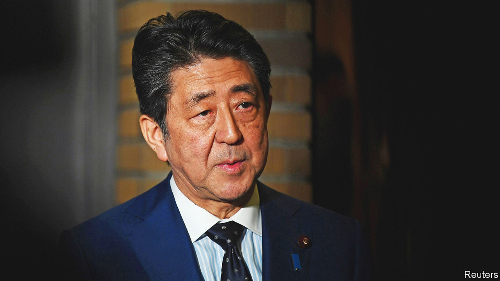

###### Tracking the samurai

# Abe Shinzo believed that Japan should assert itself in the world 

##### Japan’s longest-serving prime minister was assassinated on July 8th, aged 67 

 

> Jul 14th 2022 

Several years ago, when he was interviewed for , Abe Shinzo was asked whether he saw himself as a Choshu revolutionary. After all, he was from Yamaguchi, the prefecture in south-western Japan that covered the old Choshu domain; his father, once foreign minister, had represented the region, and after 1993 he had held that seat himself. It was the samurai of Choshu who, in the mid-19th century, realised that if Japan did not overhaul its institutions, its army and its economy, it would be swallowed up by the West. They helped both to bring down the weary Tokugawa shogunate and to push through the Meiji Restoration that transformed and modernised Japan. 

Did he see himself that way? He liked the question. He was proud of being from Choshu, and of what his forebears had done. Of course, they had wanted to keep foreigners out; but they were also people of wide horizons, who knew that Japan had to catch up, fast. They had risked their lives to achieve it. 

His grandfather, Kishi Nobusuke, had carried on the tradition when, as prime minister in 1960, he signed Japan’s security pact with the United States. As a small child, sitting on his grandfather’s lap, Shinzo had listened to the concerted screams of protest coming from outside. But Kishi believed the pact was necessary for peace and stability, so he faced his opponents down. 

A sense of mission ran in the family, as politics did, so that was his natural career. Friends thought him too gentle for it, but his parents had tipped him, not his elder brother, to carry on the family concern. Once there, he found it suited him well. His first administration was a failure, lasting barely a year in 2006-07; but in his second, running from 2012 to 2020, he found his Choshu voice. 

It was badly needed. His country was in the grip of severe deflation, with an overhang of old folk and the birth rate falling. Meanwhile, next door, China was on the rise. It was time—past time—to restore the spirit Japan had lost, both in defeat and in its post-war rush to become an industrial powerhouse. His plan was for a “beautiful” country: strong, moral and an example to the world. 

The shock the economy needed was delivered in the style of the  archer he was. He raised his bow to send “three arrows” humming towards the target: bold expansion of the money supply, fiscal stimulus and structural reform. The first shot landed well, the second too short, the third nowhere near, hitting long-entrenched labour-market obstacles; but Japan nonetheless recovered its vitality as a growing, job-creating economy. Eventually, his efforts even made him popular. 

His main concern, though, was that Japan should . For too long it had trod nervously, cringing in atonement for its crimes in the second world war, clinging to a constitution written by the American occupiers that required it to be pacifist and to rely for its defences on the United States. This would no longer do. Japan had to be a more equal partner and be prepared, too, to fight alongside allies overseas, like any other country. In the teeth of fierce opposition he therefore increased defence spending and reinterpreted Article 9 of the constitution, the clause that renounced war. He had no wish to wage one, only to lose a shackle on Japan’s freedom of action. 

Japan, he felt, also needed to retell its history. His opening act in 2006 was to pass a law revising school textbooks to play down atrocities and give the nationalist side. In that view, as in his, his grandfather was a reformer. To the rest of the world, however, he was a war criminal, a builder of Japan’s war machine. The Americans, needing him, never tried him, but put him in jail for three years. At school, his grandson was teased by other children over that. He wanted the mockery to stop. 

For him, too, the Yasukuni shrine to the war dead in Tokyo was a monument to brave fallen soldiers. To the rest of the world it was polluted with memorials to war criminals, and his appearance there as prime minister, in 2013, caused outrage in China and the Koreas. He wondered why. Surely it was normal for any national leader to pay such respects? He could not accept that Japan’s future generations, who had nothing to do with that war, should be destined forever to apologise, as if the world could not move on. 

Besides, where apologies were concerned, he felt some were owed to Japan. Childless himself, he fervently took up the cause of parents whose children had been abducted to North Korea to teach Japanese to spies. He particularly took to heart Yokota Megumi, at 13 the youngest abductee, seized as she walked home from badminton practice. In 2002, as part of a delegation headed by Koizumi Junichiro, then prime minister, he brought five abductees back. Megumi was not one of them. But he insisted in Pyongyang that Kim Jong Il, the supreme leader, should publicly apologise to the delegation, which he did; and to the end of his life he wore the small blue badge that held out hope for her and the others. 

He could be similarly assertive with other leaders, or he could turn on the charm. The point was to make Japan not only present, but prominent, on the world stage. When Donald Trump was elected he was the first foreign leader to meet him. His visits to Vladimir Putin were frequent and candid, even if he got nowhere in his bid to regain the disputed Northern Territories. After America withdrew from the Trans-Pacific Partnership in 2017, he took charge of it. When he met Xi Jinping, using his visit to end Japan’s no-longer-needed “atonement payments” for its brutal invasion of China in the 1930s, he greeted Xi’s sour expression with a smile. China might have overtaken Japan in the rankings of economic might; but Japan was the real role model in the region, confident, energetic, not to be swallowed up. 

The Meiji Restoration his forebears had championed had slid slowly into violent militarism. His critics saw shades of that in him. He saw only a patriotism and national self-confidence that were long overdue. The line between the two could be hard to draw, and he did not always try. His simplest wish was that Japan should no longer be haunted. He did not believe in ghosts. ■

