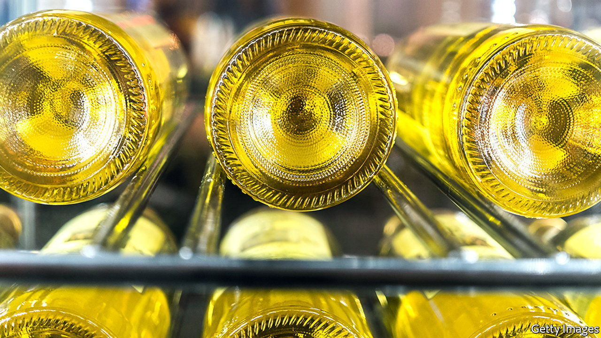

###### A pour decision

# Bottling white wine in clear glass is an error 

##### Unless it is a pudding wine, light will easily ruin it 

 

> Jul 13th 2022 

O enophiles may have noticed a disturbing recent trend. Whites, hitherto normally sold, like their , in green bottles, are now starting to appear in clear ones. This is reckoned to boost sales by showing off the liquid within. But, though it may entice the eye, such packaging gives the nose reason to despair. Light is a potent driver of chemical change. And a study by Silvia Carlin, Fulvio Mattivi and their colleagues at the Edmund Mach Foundation, in northern Italy, published in the , shows it is right to be concerned.

Lightstrike, known to the French as , occurs when incoming photons trigger undesirable photochemical reactions that leave  smelling of “boiled cabbage”, “wet dog” or () “Marmite”. Some are more susceptible than others. Reds are generally protected by their tannins and pigment molecules known as anthocyanins. Whites, less so. 

But even here there is variation. Pudding wines, often bottled in clear glass, are able to rely on their heavy aromatic profiles to hide any faults that develop. In more delicate tipples the damage can happen fast. Dr Carlin and Dr Mattivi found a mere week’s exposure to conditions like those on a supermarket shelf sufficient to ruin a wine’s aroma. 

They first studied nine bottles each of 20 white varieties. A third of these bottles were made of clear glass and kept in the open, in the sort of illumination found in a supermarket. Another third, similarly illuminated, were green. A third third, as it were, also made of clear glass, were kept inside cardboard boxes intended to exclude any light. After 60 days the researchers then assessed each bottle’s “smellprint”, using gas chromatography to extract and separate volatile compounds. 

As they expected, the smellprints clumped together based on both grape type and bottle. Chardonnay and pinot gris showed the biggest sensitivity to light. Stored in the open in clear bottles they eventually became indistinguishable.

Focusing on these two varieties permitted the researchers a closer look at how the wines’ smellprints changed over the course of 50 days. They identified which odiferous compounds were most light-sensitive and therefore most likely to play a role in lightstrike.

One that they found responded particularly badly was beta-damascenone. This gives notes of baked apple, quince or flowers. In a clear bottle, concentrations of this molecule decreased by 65% after a week. In a green one, even after 50 days it had fallen by only 40%. 

Another victim was geraniol. This contributes to the roselike, fruity or citrus aromas of some wines. In clear bottles its concentration fell 30-45% after 21 days. That compared with a decrease of 25% after 50 days in green bottles, and no decline in those in boxes. 

In addition to losing these desirable aromas, new foul-smelling ones emerged. For example, the quantity of 4-hepten-1-ol, reminiscent of fish and rancid oil, doubled in clear-bottled chardonnay and tripled in one type of pinot gris. It increased by only 10-20% in the green bottles. The result, then, is a big “thumbs down” to clear bottles. As is often the case, traditions are there for a reason. ■


