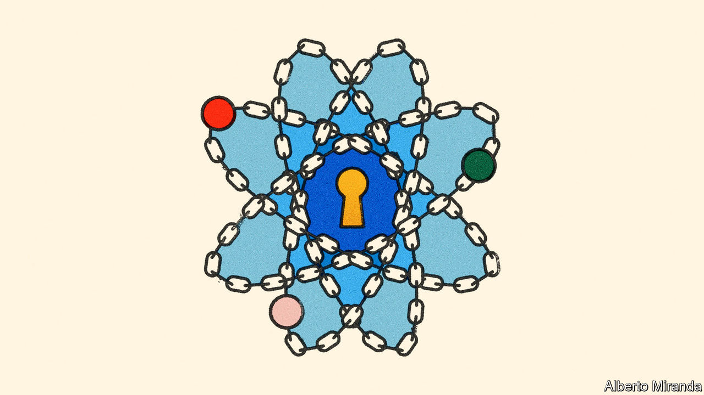

###### Cryptography and quantum computers

# How to preserve secrets in a quantum age 

##### You need new mathematical ideas, some of which have just been standardised 

 

> Jul 13th 2022 

It is not often that a bit of mind-bending mathematics can avert disaster. But researchers at America’s National Institute of Standards and Technology (nist) have done their bit: last week, after years of analysis, they gave their stamp of approval to some equations that might, in time, save untold petabytes of sensitive data from prying eyes.

The existing encryption standards that underpin just about every online exchange of information are a bit of gnarly mathematics designed to be well-nigh impossible for today’s computers to crack without just the right arithmetical key. But nist’s scientists have not been pondering today’s machines. They worry about a coming era of .

These exploit the weirdness of the quantum world to perform calculations in fundamentally different ways from those used by conventional computers. This confers an enormous theoretical advantage in a small number of problem types—including identifying a large number’s prime factors (numbers, divisible only by themselves and one, that can be multiplied together to obtain the number in question) and computing the properties of points on functions called elliptic curves. 

Both are used widely in cryptography. rsa, an algorithm based on factorisation, is employed alongside elliptic-curve cryptography in most internet connections, and in virtual private networks, messaging services including WhatsApp and Signal, and the anonymising web browser Tor. Yet both would crumble against a sufficiently advanced quantum computer running Shor’s algorithm, developed in 1995 by Peter Shor, an American mathematician.

Storing up trouble

Exactly when this threshold will be reached is an open question. But progress seems to be accelerating. Some of the world’s largest firms and a blossoming array of plucky startups and university spin-offs are working on the hardware (the actual computers), the error-correction (to provide fidelity) and the software (algorithms tuned to exploit quantum computers’ computational edge). The likelihood that building them will prove impossible, impractical or too expensive now seems small. That means a “cryptographically relevant” quantum machine is probably coming, and old defences will fall. A survey of experts, conducted in 2021, found a majority believed that by 2036, rsa-2048, an existing industry-standard encryption protocol that makes use of keys 2,048 bits long, could be broken within 24 hours. 

That means the future development of quantum computers has worrying implications today. The most pressing threats come from “harvest now, decrypt later” attacks, in which encrypted data are collected  for quantum decryption when technology permits. Though little of today’s internet chatter is likely to interest a hacker from, say, 2040, plenty of data—medical records, national-security communications or technical details of long-lived infrastructure—might retain their value until then. And data sent around willy-nilly today, on an assumption of impregnability, need not be strategically relevant to hackers for them to pose an embarrassment or risk to the businesses or officials who were doing the sending.

Colin Soutar, managing director at Deloitte Risk and Financial Advisory, a consulting firm, draws an analogy to the millennium bug. This was expected to cause chaos when computers with software that encoded years as two-digit values passed, at the turn of the millennium, from 99 to 00, and suddenly went back a century. Though it came to be viewed later as a tempest in a teacup, it was only diligent upgrading of the world’s software that prevented digital disasters.

The analogy is not perfect. In the build-up to y2k, as the millennium-bug scare was also known, the scale of the problem was unclear. But the timeline was certain. For y2q—as the quantum doomsday is sometimes called—the situation is reversed. In both cases, though, the message is the same: act now or pay later.

One path forward would be to use quantum-powered defences against a quantum-powered attack, deploying what is known as quantum-key distribution. That, though, requires expensive kit and dedicated connections. Governments and large companies might manage that, but smaller fry would find it hard. 

A more promising approach would be to identify new classes of mathematical problems that even quantum machines would struggle to crack. This was nist’s task. In 2016 it launched a competition to find worthy algorithms for “post-quantum cryptography” (pqc), receiving 82 submissions from 25 countries. After three rounds of sifting and valiant searches for vulnerabilities by independent cryptographers, four winning techniques and four backup approaches have emerged.

The winners were all developed by consortia of academic and commercial researchers and all, as you might expect, involve melon-twisting mathematics best left to the experts. One called Kyber, the brainchild of a group called crystals (Cryptographic Suite for Algebraic Lattices; the name refers to abstruse groupings in number theory), is for general encryption. The remaining three propose digital signatures, which will allow senders to verify their identity reliably. Two also use lattices: crystals-Dilithium and falcon (Fast Fourier Lattice-based Compact Signatures over ntru, an acronym that allegedly stands for Number Theorists “R” Us). 

The fourth winner was sphincs+. It won in part precisely because it does not use algebraic lattices and is therefore valuable if that approach should fail in the field. Its mode of encryption is based on hash functions, a mathematical technique often used in data compression. 

nist has four more options waiting in the wings that will be subject to a fourth round of examination; all of them use different mathematical concepts again to provide the uncrackability. 

Coding the winning algorithms into practical software is expected to take until 2024, according to Dustin Moody, who led the competition. Brian LaMacchia, head of the security and cryptography team at Microsoft Research, worries that people will not start the pqc transition early enough. The White House, though, issued a national-security memorandum in May, telling federal agencies to gird for a cryptographic transition and directing nist to encourage the private sector to do likewise. 

The sense of threat is rising. Mr Soutar says companies have already started approaching Deloitte with an eye to keeping themselves secure. ey, another consulting firm, also stresses that now is the time to move to pqc. To this end, both have formed partnerships with Sandboxaq, a spin-out from Alphabet, which hopes to commercialise post-quantum cryptography and is chaired by Eric Schmidt, one of Google’s former bosses. After five years in “stealth mode”, these partnerships were announced publicly in March. 

They are not alone. Mount Sinai Health System, a medical organisation in New York that runs eight hospitals and has 43,000 employees, is another of Sandboxaq’s clients. As Kirstin Myers, Mount Sinai’s chief information officer, observes, the release of confidential patient data held by the organisation would constitute an “existential event”. With Sandboxaq’s help, she hopes to avert that threat.

It is, of course, possible that some of the nist algorithms will, themselves, be cracked. But though the new post-quantum algorithms come with no guarantee, neither do today’s. Peter Schwabe, a cryptographer at Radboud University in the Netherlands who has been involved in developing both Kyber and sphincs+, therefore reckons the future lies in a hybrid approach. Rather than jettisoning existing encryption, he proposes retaining the algorithms currently in use and adding another post-quantum level: belt, then, as well as braces—always an advisable tactic if you do not want to get caught with your trousers down. ■


