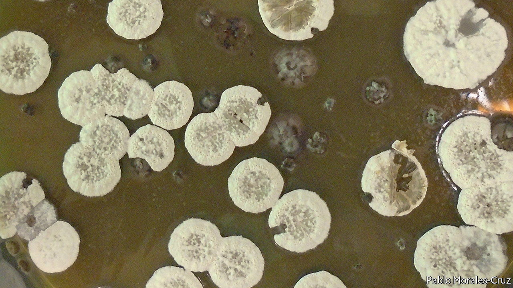

###### Green-sky thinking

# Modified bacterial fungicides may propel the planes of the future 

##### A novel approach to greening-up flying 

 

> Jul 13th 2022 

Aviation has a problem. Though, at 2.5% of anthropogenic greenhouse-gas emissions, it is not a huge contributor to global warming, it is a high-profile one forecast to get bigger.  are happening, including work towards using batteries or hydrogen for short-haul flights.  made from biomass and waste products is already being used by some airlines. But what would solve the matter at a stroke is an all-new fuel, high in both environmental credentials and in energy density.

The hunt is on, then, for ways to make such a thing cheaply and from green feedstocks. And a group from Lawrence Berkeley National Laboratory, in California, think they have one. As they write in , Pablo Cruz-Morales and Jay Keasling have worked out how to create cyclopropane (cp) rings, one of the energy-richest chemical structures found in hydrocarbons, using genetically engineered bacteria.

Atoms of carbon usually bond with up to four other atoms. When that happens these others arrange themselves at the vertices of a tetrahedron, meaning the angles between their bonds with the central carbon are 109.5°. cp rings, however, are composed of only three carbon atoms. That means the bond angles between those atoms are 60°. The acuteness of these angles puts great strain on the bonds. And strained bonds are energy-rich bonds.

Aeronautical engineers already know the value of cp rings. In the 1960s Soviet scientists used them in their design of Syntin, a rocket fuel that propelled the upper stages of Soyuz and Proton launchers. But making Syntin and other synthetic polycyclopropanated (pop) compounds remains hard and expensive—and usually involves a fossil-fuel feedstock. 

Dr Cruz-Morales, Dr Keasling and their colleagues, however, took inspiration from a substance called jawsamycin, an anti-fungal molecule produced by , a common soil bacterium. This is one of only two known natural pop compounds. It is chock-full of cp rings. Indeed, its name hints at the shark’s-tooth-like outlines of the cp triangles.

Dr Keasling is no stranger to co-opting single-celled organisms. Over a decade ago his laboratory engineered a biosynthetic pathway to produce artemisinin, an antimalarial drug hitherto obtained from a Chinese herb. Artemisinin-based therapies have since become the weapon of choice in many malarious countries. The team applied a similar approach, tweaking enzymes from a variety of sources to create an artificial metabolic pathway that starts with sugar and ends with the desired product—in this case one of a range of chemicals belonging to a group called pop fatty-acid methyl esters (pop-fames). 

These are powerful enough to fuel aircraft. Many have energy densities greater than 40 megajoules per litre, more potent than most widely used rocket and aviation fuels, which average 35mj/l. 

A good start, then. But if bio-pop-fames really are to replace existing jet fuel, they will have to be made cheaply. People will pay a premium for a life-saving drug; for jet fuel, not so much. And drugs do not need to be produced in quantity. Fuels do.

The researchers hope these problems are surmountable. Not that long ago, after all, solar cells were exotic products associated more with satellites than with Earthly power. Now they are as cheap as chips. 

One approach might be to involve America’s air force, which has expressed interest in green aviation fuel. A guaranteed market, unconstrained by commercial considerations, would allow scaling up without fear of being crushed by fossil-fuel-based competition. If that worked, then the big time would beckon. ■


