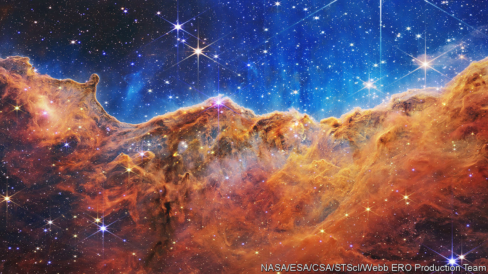
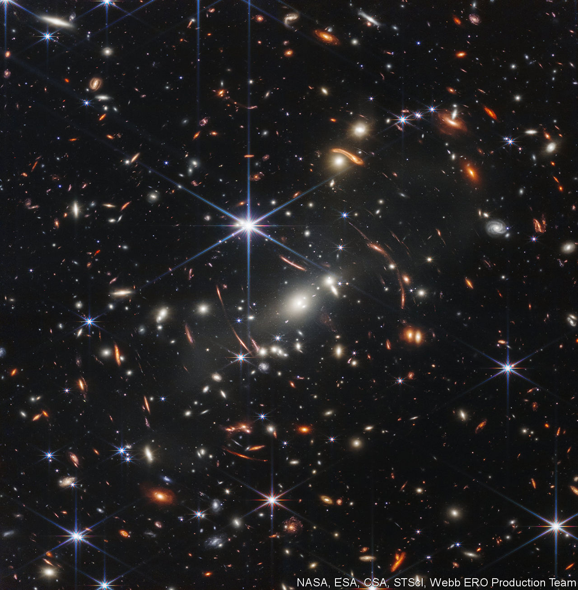
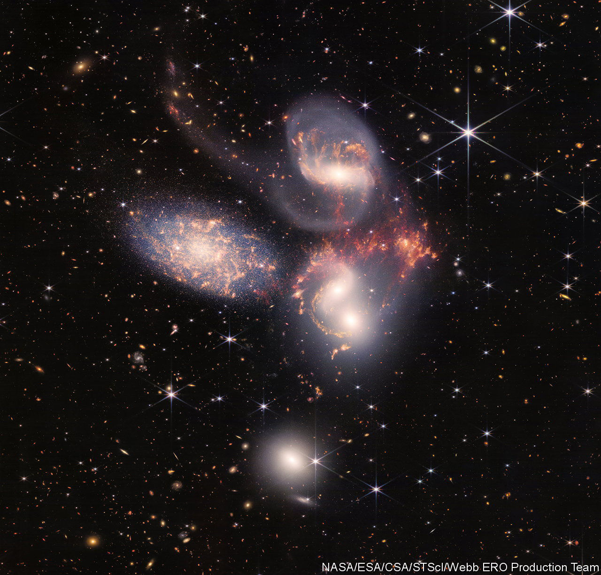
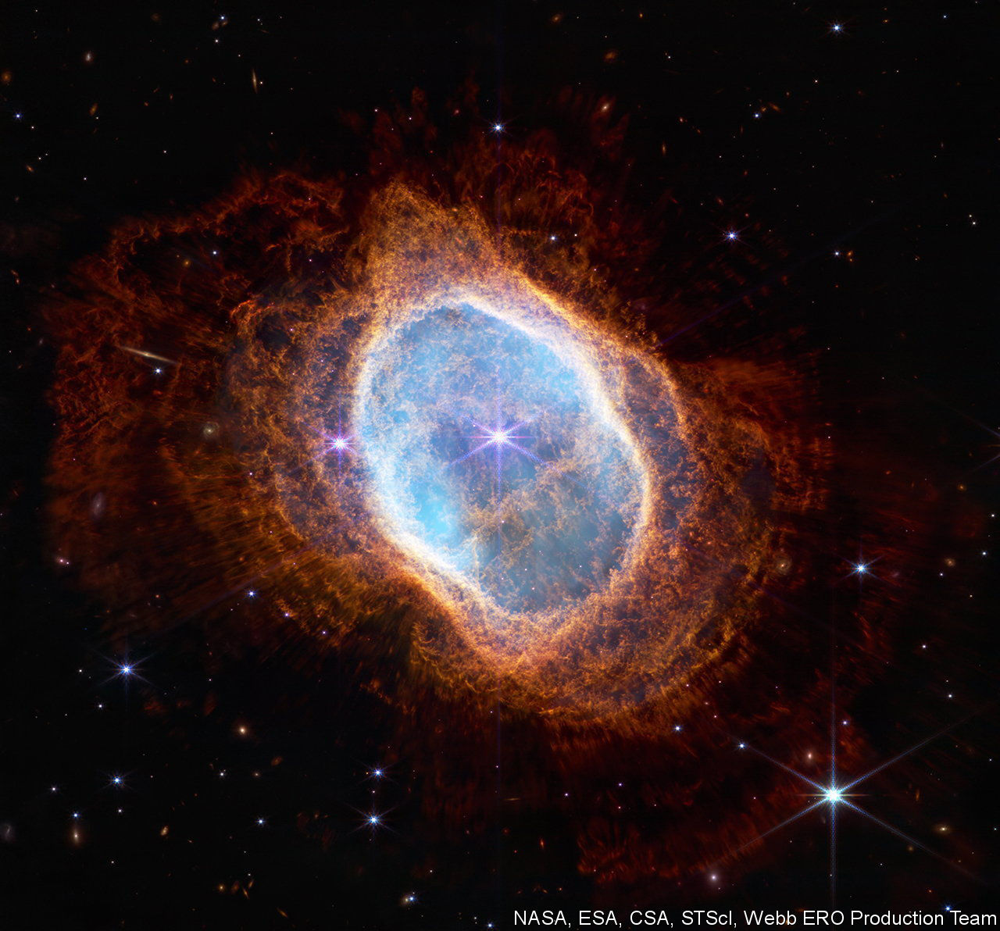
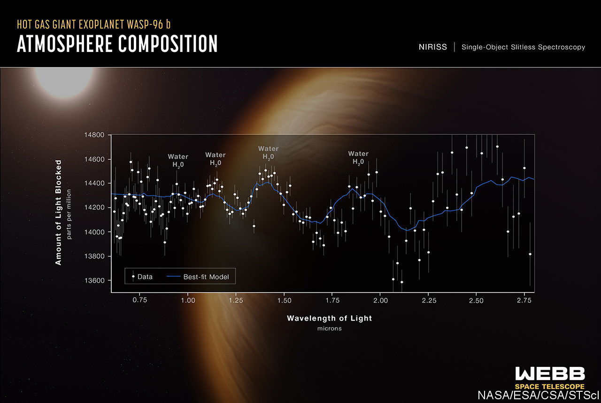

###### I’m in heaven

# The James Webb Space Telescope opens for business 

##### Astronomy will never be the same again 

 

> Jul 11th 2022 

As sites for celestial photoshoots go, the “Cosmic Cliffs” (above) were always going to be a safe bet. These stunning, textured peaks of dust and gas in the Carina nebula are light-years high. So the cliffs’ appearance this week at the release of the James Webb Space Telescope’s (jwst) first images was no great surprise. The jwst’s predecessor, the Hubble Space Telescope, snapped the same region in 2005. 

The difference between these vistas could not be more striking. The jwst, the largest space telescope ever built, has already spotted baby stars among the peaks that no previous observatory could manage. This week’s snaps give just a hint of the thrilling programme of science to come.

The telescope was launched, after 11 years of delays and at a cost of $9.7bn, on Christmas Day 2021. Its ballooning budget, even when split between nasa and the space agencies of Europe and Canada, almost got it cancelled. But it was too big to be sunk. Before lift-off, Thomas Zurbuchen, nasa’s head of science, told  that “The last thing we want to do is save a billion dollars and fail.” 

Seven months into the mission, every aspect of launch, deployment and performance seems to have gone according to plan, if not better. As a result, astronomers now have the most powerful tool yet given them to scan the cosmos in infrared frequencies of light. That will let them study many things they have struggled to examine in the past—in particular, the formation of stars and planets, from the universe’s youth to the present day.

Heat and dust

After its launch, the jwst manoeuvred its way to Lagrange 2, a point in space 1.5m km away where the gravitational fields of the Earth and the Sun conspire to create a gravity well. Here the alignment of the Earth and the Sun are such that the jwst’s shield can block illumination from both—a necessity, for the telescope’s infrared-detecting instruments need to be kept cold.


The jwst’s potential lies in a combination of its sheer size (its primary mirror, of gold-plated beryllium, is 6.8 metres across) and the cleverness of those four well-chilled detectors.

These are miri (which detects long infrared wavelengths), nirCam and nirSpec (which take images of and analyse short-wave infrared) and fgs/niriss (which studies bright targets such as nearby stars orbited by exoplanets). 

The wavelengths examined by miri correspond to objects such as exoplanets with no internal source of heat, and hotter but more distant bodies whose light has been stretched from visibility into the infrared by the expansion of the universe. 

 


Given that “farther away” also means “longer ago” in cosmic terms, this will enable it to spot signs of the cosmic dawn, the moment when the universe’s first stars ignited. A “deep-field” image also released this week (pictured above) is the first glimpse of that power; in it are features whose light set off more than 13bn years ago.

 


The infrared light that is the jwst‘s speciality penetrates dust clouds more successfully than visible light can, thus tearing away the veil from intriguing pockets of the sky where dust is coalescing into stars and planets—places such as the Cosmic Cliffs. 

 


The accuracy of the jwst’s launch meant midcourse corrections to put the telescope in orbit used less fuel than budgeted. That leaves more for the small adjustments needed to keep the instrument on station. Given that station-keeping is the main constraint on mission length, that matters. The initial goal was ten years, but nasa now reckons it can keep the telescope in place for 20. On top of this, all four instruments appear more sensitive than modelled, and thus capable of collecting 10-20% more photons than expected. 

 


The release of this week’s clutch of images marks the conclusion of the telescope’s commissioning, a lengthy process intended to make sure it is fit for purpose. It is. Management will now be transferred to the Space Telescope Science Institute in Baltimore, which will have the thankless task of allocating time on it to eager astronomers. The good news is that the new estimates of its working life mean many more requests will eventually be fulfilled. The bad is that there may be a long wait. ■


